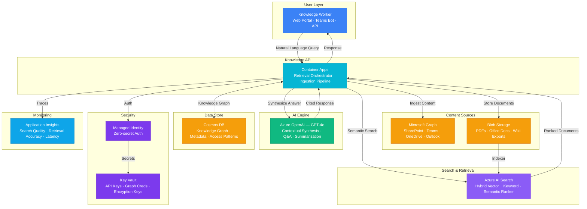

# Architecture — Play 67: AI Knowledge Management — Enterprise Contextual Retrieval

## Overview

Enterprise knowledge management platform that unifies organizational knowledge from SharePoint, Teams, OneDrive, wikis, and custom repositories into a single AI-powered search and retrieval system. The platform uses Azure AI Search for hybrid vector + keyword retrieval, Microsoft Graph for organizational content ingestion, and Azure OpenAI for contextual synthesis — enabling employees to ask natural language questions and receive accurate, cited answers drawn from the entire corporate knowledge base. Cosmos DB maintains the knowledge graph with relationships, access patterns, and version history.

## Architecture Diagram

## Data Flow

1. **Content Ingestion**: Microsoft Graph connectors pull content from SharePoint document libraries, Teams channels, OneDrive files, and Outlook shared mailboxes on a scheduled cadence → Raw documents stored in Blob Storage → Ingestion pipeline extracts text, metadata, and relationships → Content chunked with overlapping context windows (512 tokens, 50-token overlap) → Embeddings generated via Azure OpenAI text-embedding-3-large → Chunks indexed in Azure AI Search with vector + keyword fields
2. **Knowledge Graph Construction**: Cosmos DB stores document-level metadata, entity relationships, and access control mappings → Change feed triggers incremental re-indexing when content updates → Graph relationships track: document → topic → author → department → project → Access patterns inform relevance boosting — frequently accessed content ranked higher
3. **Contextual Retrieval**: User submits natural language query via web portal, Teams bot, or API → Query expanded with synonyms and organizational context → Azure AI Search performs hybrid retrieval: BM25 keyword + vector similarity + semantic reranking → Top-K results (k=8) retrieved with surrounding context chunks → Results filtered by user's access permissions (Entra ID group membership)
4. **AI Synthesis**: Retrieved chunks + user query sent to GPT-4o with system prompt enforcing citation requirements → GPT-4o synthesizes a coherent answer with inline source citations [1], [2] → Response includes confidence score and source document links → If confidence < 0.7, response includes "I'm not sure" disclaimer and suggests expert contacts
5. **Feedback & Improvement**: Users rate answer quality (thumbs up/down, comments) → Feedback stored in Cosmos DB linked to query + response → Low-rated answers flagged for knowledge gap analysis → Analytics dashboard tracks: search success rate, zero-result queries, popular topics, knowledge freshness

## Service Roles

| Service | Layer | Role |
|---------|-------|------|
| Container Apps | Compute | Knowledge API — ingestion pipeline, retrieval orchestrator, content enrichment |
| Azure OpenAI (GPT-4o) | Reasoning | Contextual synthesis, question answering, document summarization, query expansion |
| Azure AI Search | Retrieval | Hybrid vector + keyword search, semantic reranking, faceted navigation |
| Cosmos DB | Persistence | Knowledge graph, document metadata, access patterns, version history, feedback |
| Microsoft Graph | Integration | Organizational content ingestion from SharePoint, Teams, OneDrive, Outlook |
| Blob Storage | Storage | Raw document storage for PDFs, Office docs, wiki exports, media files |
| Key Vault | Security | API keys, Graph API credentials, content encryption keys |
| Application Insights | Monitoring | Search quality metrics, retrieval accuracy, query latency, knowledge freshness |

## Security Architecture

- **Managed Identity**: API-to-Search, Cosmos DB, Blob Storage, and OpenAI via managed identity — zero hardcoded credentials
- **Entra ID Integration**: User authentication via Microsoft Entra ID — SSO with existing organizational identity
- **Content ACLs**: Search results filtered by user's Entra ID group memberships — respects SharePoint/OneDrive permissions
- **Key Vault**: Graph API app registration secrets and encryption keys stored in Key Vault with automatic rotation
- **Data Classification**: Knowledge content tagged with sensitivity labels (public, internal, confidential, restricted)
- **Audit Trail**: All queries, retrievals, and content access logged for compliance — 90-day retention
- **PII Detection**: Ingestion pipeline scans for PII and applies masking before indexing sensitive fields

## Scaling

| Metric | Dev | Production | Enterprise |
|--------|-----|-----------|------------|
| Knowledge articles | 500 | 50,000 | 500,000+ |
| Concurrent users | 5 | 200 | 2,000+ |
| Queries/day | 50 | 5,000 | 50,000+ |
| Content sources | 2 | 10-20 | 50-100+ |
| Index refresh frequency | Manual | 15 min | 5 min |
| Container replicas | 1 | 2-3 | 5-10 |
| P95 query latency | 3s | 2s | 1.5s |
