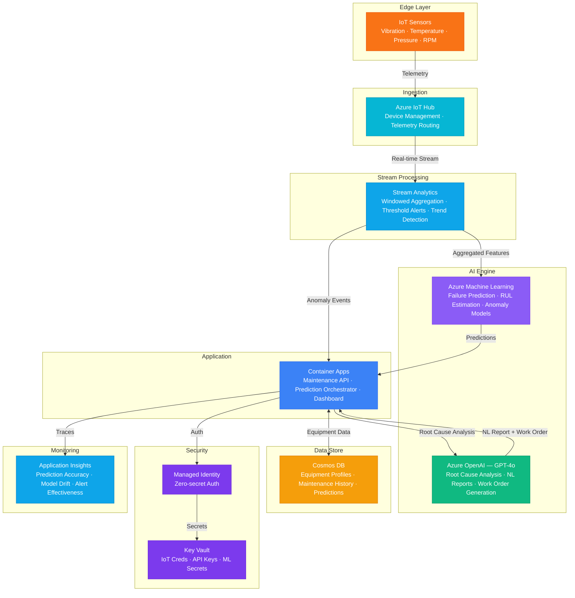

# Architecture — Play 68: Predictive Maintenance AI — IoT Sensor Analysis & Failure Prediction

## Overview

Predictive maintenance platform that ingests real-time sensor telemetry from industrial equipment via Azure IoT Hub, processes streams through Azure Stream Analytics for anomaly detection, and combines custom ML models with Azure OpenAI reasoning to predict equipment failures before they occur. The system generates automated work orders, provides natural language root cause analysis, and estimates remaining useful life (RUL) for critical assets. Cosmos DB tracks equipment profiles, maintenance history, and prediction accuracy for continuous model improvement.

## Architecture Diagram

## Data Flow

1. **Telemetry Ingestion**: IoT sensors on industrial equipment (motors, pumps, compressors, turbines) emit telemetry at 1-10 Hz — vibration, temperature, pressure, RPM, current draw → Azure IoT Hub ingests device-to-cloud messages with device identity and timestamps → IoT Hub message routing filters telemetry by device type and severity → High-priority alerts bypass stream processing and trigger immediate notification
2. **Stream Processing**: Azure Stream Analytics applies tumbling and sliding window aggregations (1-min, 5-min, 1-hour) → Real-time threshold detection: temperature > 95°C, vibration > 10mm/s RMS, pressure delta > 15% → Trend analysis identifies gradual degradation patterns (rolling 24-hour slope calculation) → Aggregated feature vectors output to ML models for batch prediction every 15 minutes
3. **Failure Prediction**: Azure ML models trained on historical failure data predict probability of failure within 7/14/30-day windows → Remaining useful life (RUL) estimated using LSTM/Transformer models on time-series data → Anomaly detection (Isolation Forest + Autoencoder) flags novel degradation patterns not seen in training data → Model outputs: failure probability (0-1), RUL estimate (hours), confidence interval, contributing sensor signals
4. **AI-Powered Analysis**: When failure probability > 0.7 or anomaly score > threshold, prediction context sent to GPT-4o → GPT-4o correlates sensor patterns with known failure modes from maintenance knowledge base → Generates: plain-English root cause hypothesis, recommended inspection actions, parts list, estimated repair time → Automated work order created in Cosmos DB with priority, assigned technician, and SLA deadline
5. **Continuous Learning**: Maintenance technicians confirm or correct AI predictions after inspection → Confirmed outcomes (true positive, false positive, missed failure) feedback into model retraining pipeline → Model drift monitored via Application Insights — accuracy, precision, recall tracked weekly → Retraining triggered when prediction accuracy drops below 85% threshold

## Service Roles

| Service | Layer | Role |
|---------|-------|------|
| Azure IoT Hub | Ingestion | Sensor telemetry ingestion, device management, message routing |
| Stream Analytics | Processing | Real-time aggregation, threshold alerts, trend detection, feature extraction |
| Azure Machine Learning | Prediction | Failure prediction models, RUL estimation, anomaly detection |
| Azure OpenAI (GPT-4o) | Reasoning | Root cause analysis, natural language reports, work order generation |
| Container Apps | Compute | Maintenance API — prediction orchestrator, dashboard backend, work orders |
| Cosmos DB | Persistence | Equipment profiles, maintenance history, predictions, work order tracking |
| Key Vault | Security | IoT device credentials, API keys, ML endpoint secrets |
| Application Insights | Monitoring | Prediction accuracy, model drift detection, alert effectiveness |

## Security Architecture

- **Managed Identity**: API-to-IoT Hub, ML, OpenAI, and Cosmos DB via managed identity — zero hardcoded credentials
- **IoT Device Security**: X.509 certificate-based device authentication — per-device identity, automatic rotation
- **Network Isolation**: IoT Hub and Stream Analytics in VNet with private endpoints — no public exposure
- **Key Vault**: ML endpoint keys and API secrets stored in Key Vault with automatic rotation policies
- **RBAC**: Operators get read-only access to predictions; maintenance leads can approve work orders; admins manage models
- **Data Encryption**: Telemetry encrypted in transit (TLS 1.2) and at rest (AES-256) — customer-managed keys for enterprise
- **Audit Trail**: All predictions, work orders, and technician actions logged for safety compliance and regulatory audit

## Scaling

| Metric | Dev | Production | Enterprise |
|--------|-----|-----------|------------|
| Connected devices | 10 | 500-2,000 | 10,000-50,000 |
| Telemetry messages/sec | 10 | 5,000 | 100,000+ |
| ML predictions/hour | 10 | 500 | 10,000+ |
| Equipment types | 2 | 10-20 | 50-100 |
| Work orders/day | 1-2 | 20-50 | 200-500 |
| Container replicas | 1 | 2-3 | 5-10 |
| P95 alert latency | 30s | 5s | 2s |
