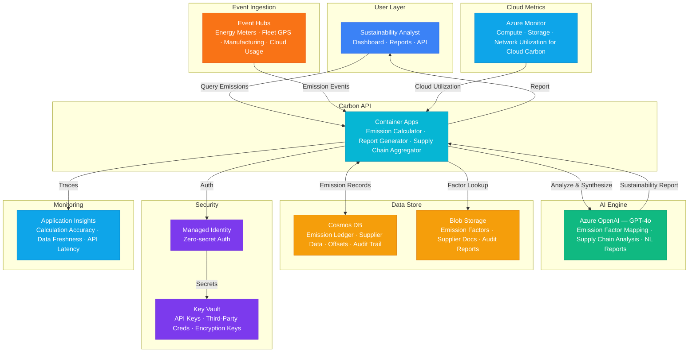

# Architecture — Play 69: Carbon Footprint Tracker — Real-Time Carbon Accounting

## Overview

Real-time carbon accounting platform that tracks greenhouse gas emissions across cloud infrastructure, supply chain operations, and organizational activities. The system ingests emission events from energy meters, fleet GPS, manufacturing sensors, and cloud usage data via Azure Event Hubs, processes them through a calculation engine aligned with GHG Protocol Scopes 1-3, and uses Azure OpenAI to generate natural language sustainability reports. Azure Monitor provides cloud resource utilization data for Scope 2/3 cloud emission calculations. Cosmos DB maintains the emission ledger with full audit trail for regulatory compliance and carbon offset tracking.

## Architecture Diagram

## Data Flow

1. **Emission Event Ingestion**: Energy meters, fleet telematics, manufacturing PLCs, and cloud usage APIs emit emission-related events → Azure Event Hubs ingests events with partitioning by source type (energy, transport, manufacturing, cloud) → Cloud carbon data pulled from Azure Monitor — CPU hours, storage GB, network egress mapped to regional emission factors → Events buffered and micro-batched for efficient processing (1-minute tumbling windows)
2. **Emission Calculation**: Carbon API applies GHG Protocol methodology for Scopes 1, 2, and 3 → Scope 1 (direct): fuel combustion, fleet emissions, refrigerant leaks — activity data × emission factor → Scope 2 (indirect energy): electricity consumption × regional grid emission factor (location-based and market-based) → Scope 3 (value chain): supplier data, business travel, employee commuting, cloud usage, purchased goods → Emission factors sourced from EPA, DEFRA, IEA databases cached in Blob Storage
3. **AI-Powered Analysis**: Aggregated emission data sent to GPT-4o for pattern analysis and reporting → GPT-4o identifies emission hotspots, reduction opportunities, and year-over-year trends → Generates executive sustainability reports in natural language with data visualizations → Supply chain analysis correlates supplier emission data with procurement decisions → Recommends carbon offset portfolio based on emission profile and budget
4. **Compliance Reporting**: Emission records stored in Cosmos DB with immutable audit trail (append-only, timestamped) → Automated report generation for CDP, GRI, TCFD, CSRD, and SEC climate disclosure frameworks → Data lineage tracked from source event to final reported figure for auditor verification → Carbon offset purchases and retirements recorded with registry serial numbers
5. **Continuous Improvement**: Dashboard tracks emission trends: daily, monthly, quarterly, annual by scope and category → Reduction targets monitored against Science Based Targets initiative (SBTi) commitments → Anomaly detection flags unusual emission spikes for investigation → Supplier engagement scores tracked — incentivize low-carbon procurement decisions

## Service Roles

| Service | Layer | Role |
|---------|-------|------|
| Container Apps | Compute | Carbon API — emission calculator, report generator, supply chain aggregator |
| Azure OpenAI (GPT-4o) | Reasoning | Emission analysis, supply chain insights, natural language sustainability reports |
| Event Hubs | Ingestion | Real-time emission event ingestion from energy, transport, manufacturing, cloud |
| Azure Monitor | Data Source | Cloud infrastructure utilization metrics for Scope 2/3 cloud carbon accounting |
| Cosmos DB | Persistence | Emission ledger, supplier carbon data, offset tracking, audit trail, baselines |
| Blob Storage | Storage | Emission factor databases, supplier documents, audit reports, data exports |
| Key Vault | Security | API keys, third-party emission API credentials, encryption keys |
| Application Insights | Monitoring | Calculation accuracy, data freshness, API latency, ingestion health |

## Security Architecture

- **Managed Identity**: API-to-Event Hubs, Cosmos DB, Monitor, and OpenAI via managed identity — zero hardcoded credentials
- **Immutable Audit Trail**: Emission records in Cosmos DB are append-only with versioning — no deletion or modification for compliance
- **Data Encryption**: All emission data encrypted in transit (TLS 1.2) and at rest (AES-256) — CMK for enterprise regulatory compliance
- **Key Vault**: Third-party emission API keys and supplier portal credentials stored in Key Vault with automatic rotation
- **RBAC**: Analysts can view and generate reports; sustainability leads can approve offsets; admins manage emission factors
- **Data Residency**: Emission data stays in designated Azure region to comply with local environmental reporting regulations
- **Supply Chain Privacy**: Supplier-specific emission data aggregated before sharing — no individual supplier data exposed externally

## Scaling

| Metric | Dev | Production | Enterprise |
|--------|-----|-----------|------------|
| Emission sources | 5 | 100-500 | 5,000-20,000 |
| Events/day | 100 | 50,000 | 1,000,000+ |
| Suppliers tracked | 5 | 50-200 | 1,000-5,000 |
| Scopes covered | 1-2 | 1-3 | 1-3 (full value chain) |
| Report frequency | Monthly | Weekly | Daily + real-time dashboard |
| Container replicas | 1 | 2-3 | 5-8 |
| P95 calculation latency | 5s | 2s | 1s |
