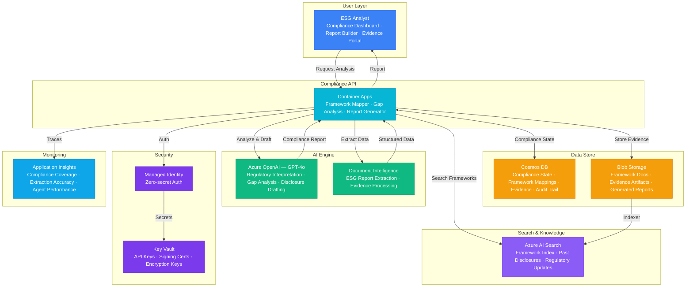

# Play 70 — ESG Compliance Agent 🌱

> AI ESG compliance — multi-framework scoring (GRI/SASB/CSRD/TCFD), evidence-based assessment, greenwashing detection, double materiality.

Build an ESG compliance agent. Score companies across GRI, SASB, CSRD, and TCFD frameworks, match evidence to requirements using AI Search + LLM evaluation, detect greenwashing with 5 indicator types, assess double materiality per CSRD mandate, and generate gap remediation priorities.

## Quick Start
```bash
cd solution-plays/70-esg-compliance-agent
az deployment group create -g $RG -f infra/main.bicep -p infra/parameters.json
code .
# Use @builder to implement, @reviewer to audit, @tuner to optimize
```

## Architecture
| Service | Purpose |
|---------|---------|
| Azure OpenAI (gpt-4o) | Evidence matching + greenwashing analysis |
| Azure AI Search | Sustainability report retrieval + evidence matching |
| Cosmos DB (Serverless) | Assessment history, framework requirements |
| Container Apps | ESG API + dashboard |



📐 [Full architecture details](architecture.md)

## Pre-Tuned Defaults
- Frameworks: CSRD + GRI + TCFD active · SASB optional · double materiality enabled
- Evidence: 0.7 confidence threshold · 12-month staleness limit · cross-reference optional
- Greenwashing: Medium sensitivity · 5 indicator types · quantification required
- Scoring: Mandatory 2.0× weight · A/B/C/D/F grade scale

## DevKit (AI-Assisted Development)
| Primitive | What It Does |
|-----------|-------------|
| `agent.md` | Root orchestrator with builder→reviewer→tuner handoffs |
| `copilot-instructions.md` | ESG domain (CSRD/GRI/SASB/TCFD, greenwashing, double materiality) |
| 3 agents | Builder (gpt-4o), Reviewer (gpt-4o-mini), Tuner (gpt-4o-mini) |
| 3 skills | Deploy (260 lines), Evaluate (113 lines), Tune (221 lines) |
| 4 prompts | `/deploy`, `/test`, `/review`, `/evaluate` with agent routing |

## Cost Estimate

| Service | Dev | Prod | Enterprise |
|---------|-----|------|------------|
| Azure OpenAI | $30 | $250 | $900 |
| Document Intelligence | $0 | $50 | $200 |
| Cosmos DB | $3 | $50 | $180 |
| Azure AI Search | $0 | $250 | $500 |
| Container Apps | $10 | $80 | $220 |
| Blob Storage | $2 | $20 | $60 |
| Key Vault | $1 | $3 | $10 |
| Application Insights | $0 | $20 | $70 |
| **Total** | **$46/mo** | **$723/mo** | **$2,140/mo** |

> Estimates based on Azure retail pricing. Actual costs vary by region, usage, and enterprise agreements.

💰 [Full cost breakdown](cost.json)

📖 [Full documentation](spec/README.md) · 🌐 [frootai.dev/solution-plays/70-esg-compliance-agent](https://frootai.dev/solution-plays/70-esg-compliance-agent) · 📦 [FAI Protocol](spec/fai-manifest.json)
