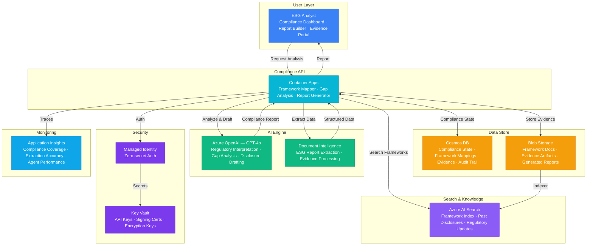

# Architecture — Play 70: ESG Compliance Agent — Multi-Framework Sustainability Reporting

## Overview

AI-powered ESG compliance agent that automates sustainability reporting across GRI (Global Reporting Initiative), SASB (Sustainability Accounting Standards Board), TCFD (Task Force on Climate-related Financial Disclosures), and CSRD (Corporate Sustainability Reporting Directive) frameworks. The agent uses Azure Document Intelligence to extract data from existing reports and evidence documents, Azure AI Search for semantic retrieval across regulatory frameworks, and Azure OpenAI for compliance gap analysis, framework cross-mapping, and automated disclosure generation. Cosmos DB maintains the compliance state machine tracking every disclosure requirement from data collection through board approval.

## Architecture Diagram

## Data Flow

1. **Framework Ingestion**: Regulatory framework documents (GRI Standards, SASB Industry Standards, TCFD Recommendations, CSRD ESRS) ingested and parsed → Document Intelligence extracts disclosure requirements, metrics definitions, and reporting criteria → Framework requirements indexed in Azure AI Search with vector embeddings for semantic matching → Cross-framework mapping tables built: GRI 302-1 ↔ SASB EM-EP-000.D ↔ TCFD Metrics → Mapping stored in Cosmos DB for instant cross-reference
2. **Evidence Collection**: ESG analyst uploads evidence documents — financial reports, environmental audits, social impact assessments → Document Intelligence extracts key metrics: emissions data, workforce statistics, governance structures → Extracted data validated against framework-specific requirements (data type, units, reporting period) → Evidence artifacts stored in Blob Storage with metadata linking to specific disclosure requirements → Gap analysis identifies missing evidence for each framework requirement
3. **Compliance Gap Analysis**: Agent compares collected evidence against framework requirements for each reporting standard → GPT-4o identifies gaps: missing data points, insufficient evidence, non-conforming metrics → For each gap, agent recommends: data source, collection method, responsible department, deadline → Compliance score calculated per framework: (fulfilled requirements / total requirements) × 100% → Priority matrix: critical gaps (mandatory disclosures), high (material topics), medium (recommended), low (voluntary)
4. **Automated Disclosure Drafting**: For requirements with sufficient evidence, GPT-4o drafts disclosure text aligned to framework language → Drafts include inline data citations, methodology descriptions, and year-over-year comparisons → Cross-framework alignment ensures consistent data across GRI, SASB, TCFD, and CSRD reports → Human reviewers approve, edit, or reject drafts via the compliance dashboard → Approved disclosures assembled into framework-specific report formats (PDF, XBRL for CSRD)
5. **Continuous Monitoring**: Regulatory update feed monitors for framework changes, new requirements, and guidance updates → Agent flags impacted disclosures when frameworks are updated → Annual reporting cycle tracked: data collection → draft → review → approval → filing → Audit trail in Cosmos DB captures every change with timestamp, author, and rationale → Compliance trend dashboard shows year-over-year improvement across all frameworks

## Service Roles

| Service | Layer | Role |
|---------|-------|------|
| Container Apps | Compute | Compliance API — framework mapping, gap analysis, report generation, evidence management |
| Azure OpenAI (GPT-4o) | Reasoning | Regulatory interpretation, compliance gap analysis, disclosure drafting, cross-framework mapping |
| Document Intelligence | Extraction | Structured data extraction from ESG reports, audit documents, regulatory filings |
| Azure AI Search | Retrieval | Semantic search across regulatory frameworks, past disclosures, compliance knowledge base |
| Cosmos DB | Persistence | Compliance state machine, framework mappings, evidence links, audit trail |
| Blob Storage | Storage | Framework documents, evidence artifacts, generated reports, audit archives |
| Key Vault | Security | API keys, report signing certificates, encryption keys for sensitive disclosures |
| Application Insights | Monitoring | Compliance coverage metrics, extraction accuracy, report generation latency |

## Security Architecture

- **Managed Identity**: API-to-Search, DocIntel, Cosmos DB, and OpenAI via managed identity — zero hardcoded credentials
- **Data Classification**: ESG data classified by sensitivity — public disclosures, board-only, auditor-restricted
- **Immutable Audit Trail**: All compliance state changes, approvals, and edits logged in Cosmos DB append-only containers
- **Key Vault**: Report signing certificates and encryption keys in Key Vault — HSM-backed for enterprise compliance
- **RBAC**: Analysts draft disclosures; ESG leads review and approve; board members and auditors have read-only access
- **Document Encryption**: Sensitive pre-publication disclosures encrypted at rest with customer-managed keys
- **Data Retention**: Compliance records retained for 7+ years per regulatory requirements — lifecycle policies enforce retention

## Scaling

| Metric | Dev | Production | Enterprise |
|--------|-----|-----------|------------|
| Frameworks tracked | 1 | 2-4 | 4-8+ (GRI, SASB, TCFD, CSRD, CDP, SEC) |
| Disclosure requirements | 20 | 200-500 | 1,000-2,000+ |
| Evidence documents | 10 | 200-500 | 2,000-5,000 |
| Reporting entities | 1 | 3-5 | 20-50 (subsidiaries) |
| Reports generated/year | 1 | 4-8 | 20-50 |
| Container replicas | 1 | 2-3 | 5-8 |
| P95 analysis latency | 10s | 5s | 3s |
