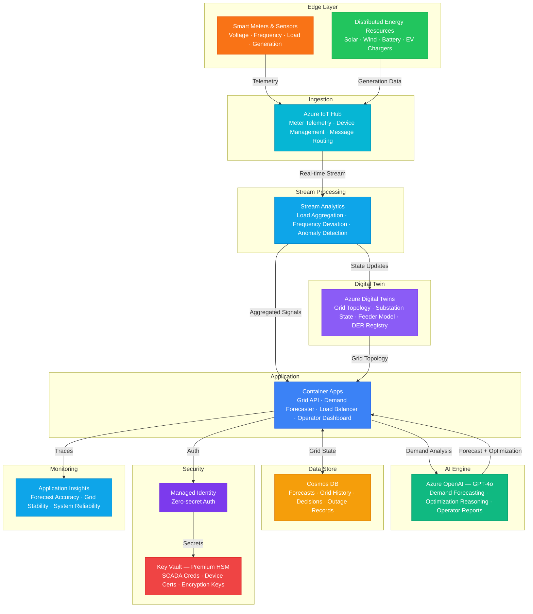

# Play 71 — Smart Energy Grid AI ⚡

> AI-powered grid intelligence — load forecasting, renewable dispatch, demand response, anomaly detection.

Build a smart energy grid management system. Time-series models forecast load (Prophet + LightGBM ensemble), IoT Hub ingests sensor data, and LLMs explain anomalies for grid operators.

## Quick Start
```bash
cd solution-plays/71-smart-energy-grid-ai
az deployment group create -g $RG -f infra/main.bicep -p infra/parameters.json
code .
# Use @builder to implement, @reviewer to audit, @tuner to optimize
```

## Architecture
| Service | Purpose |
|---------|---------|
| Azure IoT Hub | Grid sensor data ingestion (frequency, voltage, load) |
| Azure Data Explorer | Time-series storage + KQL analytics |
| Azure ML | Forecast model training (Prophet, LightGBM, LSTM) |
| Azure OpenAI (gpt-4o) | Anomaly explanation + demand response recommendations |
| Event Hubs | Real-time grid telemetry streaming |
| Container Apps | Grid dashboard API + forecast serving |



📐 [Full architecture details](architecture.md)

## Pre-Tuned Defaults
- Forecast: Ensemble (Prophet 30% + LightGBM 50% + LSTM 20%) · MAPE target < 5%
- Anomaly: Isolation Forest · contamination 0.02 · frequency ±0.2 Hz critical
- Dispatch: Solar → Wind → Battery → Hydro → Gas Peaker (last resort)
- Demand Response: 3-tier pricing · 30-min notification · 20% max curtailment

## DevKit (AI-Assisted Development)
| Primitive | What It Does |
|-----------|-------------|
| `agent.md` | Root orchestrator with builder→reviewer→tuner handoffs |
| `copilot-instructions.md` | Grid AI domain knowledge (forecasting, dispatch, demand response pitfalls) |
| 3 agents | Builder (gpt-4o), Reviewer (gpt-4o-mini), Tuner (gpt-4o-mini) |
| 3 skills | Deploy (170+ lines), Evaluate (130+ lines), Tune (200+ lines) |
| 4 prompts | `/deploy`, `/test`, `/review`, `/evaluate` with agent routing |

## Cost Estimate

| Service | Dev | Prod | Enterprise |
|---------|-----|------|------------|
| Azure IoT Hub | $0 | $250 | $2,500 |
| Azure OpenAI | $30 | $250 | $1,000 |
| Stream Analytics | $80 | $480 | $1,920 |
| Azure Digital Twins | $15 | $150 | $600 |
| Cosmos DB | $3 | $120 | $480 |
| Container Apps | $10 | $150 | $400 |
| Key Vault | $1 | $10 | $20 |
| Application Insights | $0 | $40 | $150 |
| **Total** | **$139/mo** | **$1,450/mo** | **$7,070/mo** |

> Estimates based on Azure retail pricing. Actual costs vary by region, usage, and enterprise agreements.

💰 [Full cost breakdown](cost.json)

## vs. Play 69 (Carbon Footprint Tracker)
| Aspect | Play 69 | Play 71 |
|--------|---------|---------|
| Focus | Scope 1/2/3 emissions tracking | Real-time grid operations |
| Data | Annual/quarterly reports | 15-min sensor telemetry |
| AI Role | Emission factor estimation | Load forecasting + anomaly detection |
| Infrastructure | Cosmos DB + Functions | IoT Hub + Data Explorer + ML |

📖 [Full documentation](spec/README.md) · 🌐 [frootai.dev/solution-plays/71-smart-energy-grid-ai](https://frootai.dev/solution-plays/71-smart-energy-grid-ai) · 📦 [FAI Protocol](spec/fai-manifest.json)
