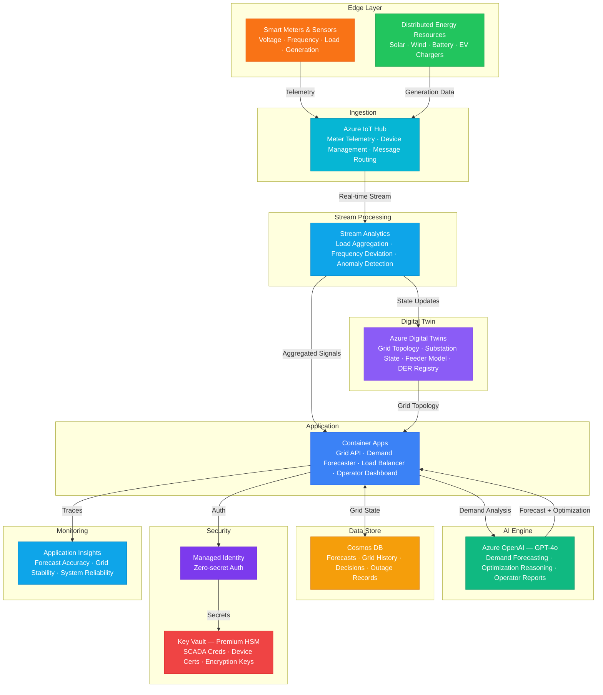

# Architecture — Play 71: Smart Energy Grid AI — Demand Prediction & Grid Balancing

## Overview

AI-powered smart energy grid platform that combines IoT sensor data from smart meters, substations, and distributed energy resources (DERs) with Azure Digital Twins for real-time grid topology modeling, Stream Analytics for sub-second telemetry processing, and Azure OpenAI for demand prediction and grid optimization reasoning. The system forecasts energy demand across grid zones, balances renewable intermittency with storage and dispatchable generation, detects anomalies and potential outages, and provides grid operators with natural language situation reports and optimization recommendations. Designed for utility-scale operations with NERC CIP compliance considerations.

## Architecture Diagram

## Data Flow

1. **Grid Telemetry Ingestion**: Smart meters emit consumption readings (15-min billing intervals, 1-sec during events) → Substation sensors report voltage, frequency, power factor, transformer load → DERs (solar panels, wind turbines, battery storage, EV chargers) report generation and state-of-charge → Azure IoT Hub ingests all telemetry with device identity, timestamp, and grid zone tagging → Message routing separates: billing data → cold path, real-time operations → hot path
2. **Stream Processing & Anomaly Detection**: Stream Analytics processes hot-path telemetry with sub-second latency → Windowed aggregations: 1-sec for frequency stability, 1-min for load balancing, 15-min for demand trending → Anomaly detection: voltage sag/swell > ±5%, frequency deviation > ±0.5 Hz, sudden load changes > 20% → Correlation analysis identifies cascading failures — substation overload → feeder trip → downstream outage → Processed signals update Azure Digital Twins grid state and forward to Grid API
3. **Digital Twin Grid Model**: Azure Digital Twins maintains a live model of the entire grid topology → Twin instances: substations, transformers, feeders, distribution lines, smart meters, DERs → Relationships encode: feeds, connects-to, protected-by, supplies → Real-time state: current load, capacity headroom, fault status, maintenance state → What-if simulations: "What happens if solar generation drops 40% in Zone A?" answered in milliseconds
4. **AI-Powered Demand Forecasting & Optimization**: Historical demand patterns + weather forecasts + event calendars → GPT-4o predicts demand for next 1-hour, 24-hour, and 7-day windows per grid zone → Optimization engine balances: minimize cost, maximize renewable utilization, maintain reliability margins → Dispatch recommendations: increase/decrease generation, charge/discharge batteries, curtail DERs → Natural language operator reports: "Zone B demand expected to peak at 145MW at 18:00 — recommend dispatching 20MW from battery storage and curtailing solar feed-in by 10%"
5. **Outage Management & Recovery**: When anomaly detection triggers, system localizes fault using Digital Twins topology → Affected customers identified via feeder → meter → customer mapping → GPT-4o generates root cause hypothesis based on sensor patterns and historical faults → Automated switching recommendations to isolate fault and restore service via alternate feeds → Post-restoration analysis: outage duration, customers affected, root cause, prevention recommendations

## Service Roles

| Service | Layer | Role |
|---------|-------|------|
| Azure IoT Hub | Ingestion | Smart meter and grid sensor telemetry, device management, message routing |
| Stream Analytics | Processing | Real-time load aggregation, frequency monitoring, anomaly detection, event correlation |
| Azure Digital Twins | Modeling | Grid topology digital twin — substations, feeders, DERs, real-time state synchronization |
| Azure OpenAI (GPT-4o) | Reasoning | Demand forecasting, optimization reasoning, outage root cause analysis, operator reports |
| Container Apps | Compute | Grid API — demand forecaster, load balancer, dispatch optimizer, operator dashboard |
| Cosmos DB | Persistence | Forecasts, grid state history, optimization decisions, outage records, maintenance logs |
| Key Vault (Premium HSM) | Security | SCADA credentials, device certificates, encryption keys — NERC CIP compliance |
| Application Insights | Monitoring | Forecast accuracy, grid stability metrics, system reliability, API performance |

## Security Architecture

- **Critical Infrastructure**: HSM-backed Key Vault for all SCADA and device credentials — meets NERC CIP-007 requirements
- **Managed Identity**: API-to-IoT Hub, Digital Twins, OpenAI, and Cosmos DB via managed identity — zero hardcoded credentials
- **Network Isolation**: IoT Hub, Stream Analytics, and Digital Twins in isolated VNet with private endpoints — no public exposure
- **Device Security**: X.509 certificate-based device authentication with per-device identity and automatic certificate rotation
- **Encryption**: All grid data encrypted in transit (TLS 1.2+) and at rest (AES-256) — customer-managed keys mandatory
- **RBAC**: Operators control dispatch; engineers manage topology; analysts view forecasts; administrators manage security
- **Audit & Compliance**: Every grid control action logged with operator identity, timestamp, and justification — NERC CIP audit ready
- **Air-Gap Readiness**: Core optimization logic can run disconnected from internet — OpenAI used for advisory only, not critical control

## Scaling

| Metric | Dev | Production | Enterprise |
|--------|-----|-----------|------------|
| Smart meters | 50 | 10,000-50,000 | 100,000-1,000,000 |
| Grid zones | 1 | 5-20 | 50-200 |
| Telemetry messages/sec | 10 | 10,000 | 500,000+ |
| DERs managed | 5 | 500-2,000 | 10,000-50,000 |
| Forecasts/hour | 2 | 12 | 60 (per-minute) |
| Digital Twin instances | 100 | 10,000 | 100,000+ |
| Container replicas | 1 | 3-5 | 10-20 |
| P95 dispatch latency | 10s | 2s | 500ms |
