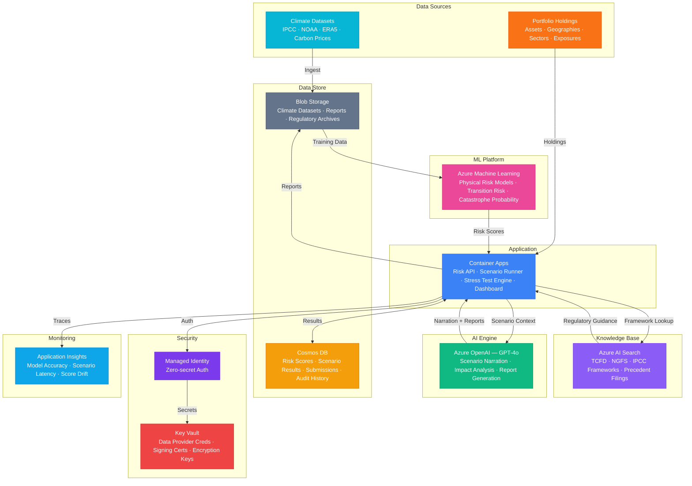

# Architecture — Play 72: Climate Risk Assessor — Financial Climate Scenario Modeling

## Overview

AI-powered climate risk assessment platform that combines Azure Machine Learning for physical and transition risk modeling with Azure OpenAI for scenario narration, portfolio impact analysis, and TCFD/NGFS-aligned regulatory report generation. The system ingests climate datasets (IPCC projections, NOAA observations, carbon price trajectories), maps them to financial portfolio holdings, runs stress tests across multiple climate scenarios (1.5°C, 2°C, 3°C+ pathways), and produces investor-ready risk disclosures with natural language explanations. Azure AI Search enables semantic retrieval across regulatory frameworks, research papers, and historical precedent filings. Designed for financial institutions subject to TCFD, NGFS, and EU Taxonomy reporting requirements.

## Architecture Diagram

## Data Flow

1. **Climate Data Ingestion**: IPCC scenario projections (SSP1-2.6, SSP2-4.5, SSP5-8.5), NOAA weather observations, ERA5 reanalysis, and carbon price curves are ingested into Blob Storage → Scheduled pipelines normalize and version-stamp datasets → Data catalog tracks lineage and freshness per source
2. **Risk Model Training & Inference**: Azure ML trains physical risk models (flood, wildfire, hurricane, sea-level rise probability per geography) and transition risk models (stranded asset exposure, carbon tax impact, technology disruption) → Models score portfolio holdings by geography-sector-timeframe → Ensemble approach combines multiple model outputs for robust risk estimates
3. **Portfolio Stress Testing**: Portfolio holdings are mapped to geographic coordinates and sector classifications → Scenario runner applies climate pathways (1.5°C orderly, 2°C disorderly, 3°C+ hot-house) to each holding → Physical risk scores combine with transition risk scores → Aggregation by sector, geography, asset class, and time horizon (2030, 2040, 2050)
4. **AI-Powered Analysis & Reporting**: GPT-4o interprets quantitative risk scores with natural language narration → AI Search retrieves relevant TCFD/NGFS disclosure requirements and peer comparisons → Scenario narratives explain key risk drivers, concentration exposures, and mitigation opportunities → Generated TCFD reports include executive summary, governance, strategy, risk management, and metrics sections
5. **Regulatory Submission**: Completed risk assessments stored in Cosmos DB with full audit trail → TCFD-aligned PDF reports generated and archived in Blob Storage with immutable retention → Historical comparison tracks risk score evolution across reporting periods → Dashboard provides interactive scenario exploration for board-level presentations

## Service Roles

| Service | Layer | Role |
|---------|-------|------|
| Azure Machine Learning | Risk Modeling | Physical and transition risk model training, scoring, and endpoint serving |
| Azure OpenAI (GPT-4o) | Reasoning | Scenario narration, portfolio impact explanation, TCFD report generation |
| Azure AI Search | Knowledge | Semantic search across regulatory frameworks, research papers, peer filings |
| Container Apps | Compute | Risk API — scenario runner, stress test engine, report generator, dashboard |
| Cosmos DB | Persistence | Risk scores, scenario results, regulatory submissions, audit history |
| Blob Storage | Storage | Climate datasets, generated reports, regulatory archives with immutable retention |
| Key Vault | Security | Data provider credentials, report signing certificates, encryption keys |
| Application Insights | Monitoring | Model accuracy, scenario latency, risk score drift, API performance |

## Security Architecture

- **Financial Regulatory**: HSM-backed Key Vault for report signing certificates — meets SOC 2 and financial regulator requirements
- **Managed Identity**: All service-to-service auth via managed identity — zero hardcoded credentials across ML, OpenAI, Search, Cosmos DB
- **Network Isolation**: All PaaS services deployed with private endpoints in dedicated VNet — no public internet exposure for data paths
- **Data Classification**: Climate data marked as confidential; portfolio data marked as restricted — separate access policies per classification
- **Encryption**: All data encrypted at rest (AES-256, customer-managed keys) and in transit (TLS 1.2+) — regulatory audit requirement
- **RBAC**: Risk analysts run scenarios; portfolio managers view results; compliance officers submit filings; administrators manage infrastructure
- **Audit Trail**: Every scenario execution, risk score change, and report generation logged with identity and timestamp — SOX-ready audit

## Scaling

| Metric | Dev | Production | Enterprise |
|--------|-----|-----------|------------|
| Portfolio holdings | 100 | 5,000-20,000 | 100,000-500,000 |
| Climate scenarios | 3 | 6-12 | 30+ custom |
| Risk model endpoints | 1 | 3-5 | 10+ ensemble |
| Stress tests/day | 2 | 50 | 500+ |
| Report generations/month | 5 | 100 | 1,000+ |
| AI Search index size | 50MB | 5GB | 50GB+ |
| Container replicas | 1 | 2-4 | 4-10 |
| P95 scenario latency | 30s | 10s | 5s |
