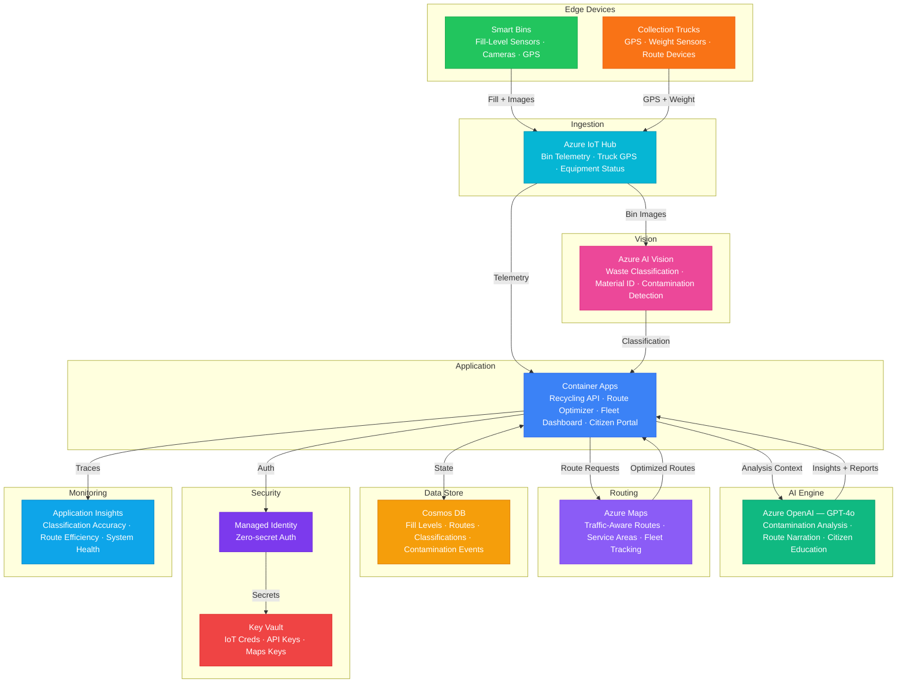

# Architecture — Play 73: Waste Recycling Optimizer — Classification, Routing & Contamination Detection

## Overview

AI-powered waste management platform that combines Azure AI Vision for automated waste classification (recyclable, contaminated, landfill, material type) with IoT-connected smart bins for real-time fill-level monitoring, Azure Maps for traffic-aware collection route optimization, and Azure OpenAI for contamination analysis reasoning, operational reporting, and citizen education. The system reduces collection costs through dynamic routing, improves recycling rates through accurate sorting, detects contamination before it reaches processing facilities, and provides municipal operators with actionable dashboards. Designed for city-scale waste management operations with fleet tracking and sustainability metrics.

## Architecture Diagram

## Data Flow

1. **Smart Bin Monitoring**: Fill-level sensors (ultrasonic/infrared) report capacity percentage at configurable intervals (15-min default, 5-min when >60% full) → Bin-mounted cameras capture images when lid opens for waste classification → GPS coordinates and bin metadata (type: recyclable, organic, general) sent to IoT Hub → Message routing separates: images → Vision API, telemetry → Container Apps
2. **Waste Classification & Contamination Detection**: Azure AI Vision processes bin images with custom-trained models → Multi-label classification: paper, plastic, glass, metal, organic, electronic, hazardous → Contamination detection flags recyclable bins containing non-recyclable waste (food waste in paper bin, batteries in glass bin) → Confidence scores below 85% trigger GPT-4o secondary analysis with image description for ambiguous items
3. **Route Optimization**: Dynamic route calculation triggered when bins cross fill thresholds (75% for scheduled, 90% for urgent) → Azure Maps calculates traffic-aware routes considering: bin priority, truck capacity, road restrictions, time windows → Route optimizer groups nearby bins to minimize deadhead miles → Fleet tracking provides real-time truck positions and ETA for citizen-facing status → Historical route data used to predict optimal collection schedules per zone
4. **Operational Intelligence**: GPT-4o generates contamination incident reports with root cause analysis (misplaced bin signage, residential education gaps) → Weekly zone reports summarize: recycling rates, contamination hotspots, route efficiency, cost savings → Citizen-facing portal provides recycling guidance and pickup schedules with natural language Q&A → Predictive analytics forecast fill rates by zone and season to pre-position resources
5. **Sustainability Metrics**: Recycling diversion rates tracked per zone, bin type, and time period → Carbon savings calculated from reduced truck miles and improved recycling rates → Contamination trend analysis identifies zones needing targeted education campaigns → Municipal dashboards show KPIs against sustainability targets with drill-down capability

## Service Roles

| Service | Layer | Role |
|---------|-------|------|
| Azure AI Vision | Classification | Waste material identification, contamination detection, image-based sorting |
| Azure OpenAI (GPT-4o) | Reasoning | Contamination analysis, operational reports, citizen education, route narration |
| Azure IoT Hub | Ingestion | Smart bin telemetry, truck GPS, equipment monitoring, message routing |
| Azure Maps | Routing | Traffic-aware route optimization, service area coverage, fleet tracking |
| Container Apps | Compute | Recycling API — classifier, route optimizer, fleet dashboard, citizen portal |
| Cosmos DB | Persistence | Fill levels, route history, classifications, contamination events, fleet telemetry |
| Key Vault | Security | IoT credentials, API keys, Maps subscription keys, encryption keys |
| Application Insights | Monitoring | Classification accuracy, route efficiency, contamination rates, system health |

## Security Architecture

- **Managed Identity**: All service-to-service auth via managed identity — API to IoT Hub, Vision, OpenAI, Cosmos DB, Maps
- **IoT Device Security**: Symmetric key or X.509 certificate per smart bin — device provisioning service for fleet management
- **Network Isolation**: Container Apps and Cosmos DB behind private endpoints — public access only for citizen portal via Front Door
- **Data Privacy**: Bin images processed and discarded after classification — no personally identifiable waste content stored
- **Encryption**: All data encrypted at rest (AES-256) and in transit (TLS 1.2+) — standard municipal data protection
- **RBAC**: Fleet operators manage routes; zone supervisors view contamination reports; administrators manage infrastructure
- **API Security**: Citizen portal uses rate limiting and API Management — prevents abuse of public-facing endpoints

## Scaling

| Metric | Dev | Production | Enterprise |
|--------|-----|-----------|------------|
| Smart bins | 20 | 2,000-10,000 | 50,000+ |
| Collection trucks | 2 | 20-50 | 200+ |
| Classifications/day | 50 | 10,000 | 100,000+ |
| Route calculations/day | 5 | 100 | 1,000+ |
| IoT messages/day | 500 | 200,000 | 5,000,000+ |
| Contamination alerts/day | 2 | 50 | 500+ |
| Container replicas | 1 | 2-3 | 4-8 |
| P95 classification latency | 5s | 2s | 1s |
