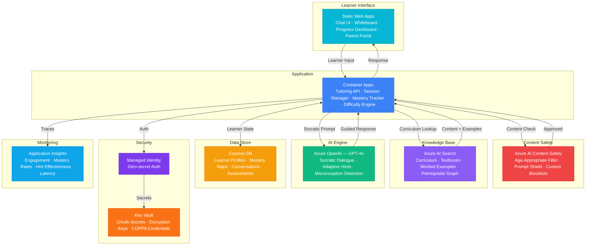

# Play 74 — AI Tutoring Agent 🎓

> Socratic AI tutor — adaptive difficulty, knowledge state tracking, misconception detection, personalized learning paths.

Build an intelligent tutoring agent that never gives direct answers. Uses Socratic questioning with 4-step hint progression, tracks student mastery via Bayesian Knowledge Tracing, detects and remediates misconceptions across sessions, and enforces strict content safety for minors.

## Quick Start
```bash
cd solution-plays/74-ai-tutoring-agent
az deployment group create -g $RG -f infra/main.bicep -p infra/parameters.json
code .
# Use @builder to implement, @reviewer to audit, @tuner to optimize
```

## Architecture



📐 [Full architecture details](architecture.md)

## Pre-Tuned Defaults
- Socratic: 4-step hint progression · 3 attempts before explanation · always check understanding
- Difficulty: 5 levels · advance after 3 correct streak · retreat on misconception
- Knowledge: Bayesian tracking · 0.80 mastery threshold · 14-day misconception decay
- Safety: All severity thresholds at 0 (zero tolerance for minors)

## DevKit (AI-Assisted Development)
| Primitive | What It Does |
|-----------|-------------|
| `agent.md` | Root orchestrator with builder→reviewer→tuner handoffs |
| `copilot-instructions.md` | Tutoring domain (Socratic method, misconception handling, difficulty curves) |
| 3 agents | Builder (gpt-4o), Reviewer (gpt-4o-mini), Tuner (gpt-4o-mini) |
| 3 skills | Deploy (175+ lines), Evaluate (120+ lines), Tune (230+ lines) |
| 4 prompts | `/deploy`, `/test`, `/review`, `/evaluate` with agent routing |

## Cost Estimate

| Service | Dev | Prod | Enterprise |
|---------|-----|------|------------|
| Azure OpenAI | $30 | $350 | $1,500 |
| Cosmos DB | $3 | $95 | $360 |
| Azure AI Search | $0 | $250 | $500 |
| Static Web Apps | $0 | $9 | $9 |
| Container Apps | $10 | $120 | $350 |
| Azure AI Content Safety | $0 | $40 | $120 |
| Key Vault | $1 | $3 | $10 |
| Application Insights | $0 | $30 | $100 |
| **Total** | **$44** | **$897** | **$2,949** |

💰 [Full cost breakdown](cost.json)

## vs. Play 65 (AI Training Curriculum)
| Aspect | Play 65 | Play 74 |
|--------|---------|---------|
| Focus | Curriculum design + dependency graphs | Real-time Socratic tutoring |
| Interaction | Self-paced modules | Multi-turn adaptive conversation |
| AI Role | Generate learning paths | Guide student reasoning |
| Safety | Standard content safety | Strict (minors-grade, zero tolerance) |

📖 [Full documentation](spec/README.md) · 🌐 [frootai.dev/solution-plays/74-ai-tutoring-agent](https://frootai.dev/solution-plays/74-ai-tutoring-agent) · 📦 [FAI Protocol](spec/fai-manifest.json)
