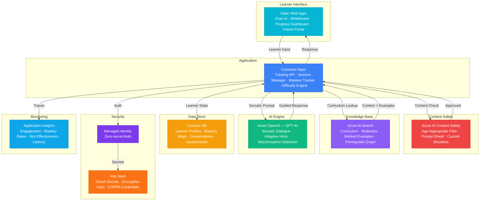

# Architecture — Play 74: AI Tutoring Agent — Personalized 1-on-1 Socratic Learning

## Overview

AI-powered personalized tutoring platform that delivers 1-on-1 learning experiences using the Socratic method, where Azure OpenAI guides learners through understanding via carefully scaffolded questions rather than direct answers. The system maintains per-learner mastery maps in Cosmos DB to track concept understanding across subjects, adaptively adjusts difficulty based on real-time performance, retrieves relevant curriculum content and worked examples from Azure AI Search, and provides progress dashboards for learners, parents, and teachers. Content Safety ensures age-appropriate interactions with robust prompt injection defense. Designed for K-12 and higher education with COPPA/FERPA compliance considerations.

## Architecture Diagram

## Data Flow

1. **Session Initialization**: Learner authenticates via parent-approved OAuth (Microsoft Entra ID or school SSO) → Learner profile loaded from Cosmos DB including mastery map, learning preferences, and session history → Adaptive difficulty engine selects starting level based on last session performance → System prompt configured with grade level, subject, pedagogical style (Socratic), and safety constraints
2. **Socratic Dialogue Loop**: Learner submits question or response → Content Safety screens for inappropriate content, prompt injection, and age violations → API retrieves relevant curriculum content and worked examples from AI Search → GPT-4o generates Socratic response: guiding questions, scaffolded hints, or follow-up probes rather than direct answers → Response sent through Content Safety output filter before delivery to learner
3. **Adaptive Difficulty & Mastery Tracking**: Each learner interaction updates the mastery map — concept-level scores on a 0-100 scale → Correct responses increase mastery; misconceptions trigger targeted remediation paths → Difficulty engine adjusts: struggling learners get simpler sub-problems and more hints; excelling learners get extension challenges → Prerequisites graph ensures foundational concepts are mastered before advancing (e.g., fractions before algebra)
4. **Misconception Detection & Remediation**: GPT-4o analyzes learner responses for common misconceptions (e.g., "multiplication always makes bigger") → Detected misconceptions logged with classification and trigger context → Targeted remediation: counter-examples, visual analogies, alternative explanations → Persistent misconceptions flagged for teacher review with conversation excerpts
5. **Progress Reporting**: Learner dashboard shows mastery progress per subject and concept with visual learning paths → Parent portal shows session summaries (duration, topics, mastery gains) without exposing raw conversations → Teacher dashboard aggregates class-level mastery distribution, common misconceptions, and at-risk learners → Analytics pipeline tracks engagement metrics (session length, return rate, mastery velocity) for pedagogical improvement

## Service Roles

| Service | Layer | Role |
|---------|-------|------|
| Azure OpenAI (GPT-4o) | Reasoning | Socratic dialogue generation, adaptive hints, misconception detection, progress feedback |
| Azure AI Search | Knowledge | Curriculum content retrieval, textbook passages, worked examples, prerequisite graph |
| Azure AI Content Safety | Safety | Age-appropriate filtering, prompt injection defense, custom blocklists for minors |
| Static Web Apps | Frontend | Learner chat interface, whiteboard, progress dashboard, parent/teacher portals |
| Container Apps | Compute | Tutoring API — session manager, mastery tracker, difficulty engine, dialogue orchestrator |
| Cosmos DB | Persistence | Learner profiles, mastery maps, conversation history, assessment results, analytics |
| Key Vault | Security | OAuth client secrets, encryption keys for learner PII, COPPA compliance credentials |
| Application Insights | Monitoring | Engagement rates, mastery progression, hint effectiveness, response latency |

## Security Architecture

- **Child Safety First**: Azure AI Content Safety on both input and output — blocks inappropriate content, prompt injection, and manipulation attempts
- **COPPA/FERPA Compliance**: Parental consent required for accounts under 13; no PII shared with third parties; data deletion on request
- **Managed Identity**: All service-to-service auth via managed identity — zero hardcoded credentials across OpenAI, Search, Cosmos DB
- **Data Encryption**: All learner data encrypted at rest (AES-256, customer-managed keys) and in transit (TLS 1.2+) — FERPA requirement
- **Authentication**: School SSO (Microsoft Entra ID) or parent-approved OAuth — no anonymous access to tutoring sessions
- **RBAC**: Learners access own sessions; parents access child's progress; teachers access class aggregates; administrators manage curriculum
- **Conversation Privacy**: Raw conversations stored encrypted with learner-specific keys — teachers see only mastery metrics and flagged misconceptions
- **Data Residency**: Deployment region matches school district jurisdiction — US data stays in US regions

## Scaling

| Metric | Dev | Production | Enterprise |
|--------|-----|-----------|------------|
| Concurrent learners | 5 | 500-2,000 | 10,000-50,000 |
| Sessions/day | 10 | 5,000 | 100,000+ |
| Subjects supported | 2 | 5-10 | 20+ |
| Curriculum items indexed | 100 | 10,000 | 100,000+ |
| Mastery updates/sec | 1 | 100 | 1,000+ |
| Content Safety checks/sec | 1 | 50 | 500+ |
| Container replicas | 1 | 3-5 | 6-15 |
| P95 response latency | 5s | 2s | 1.5s |
