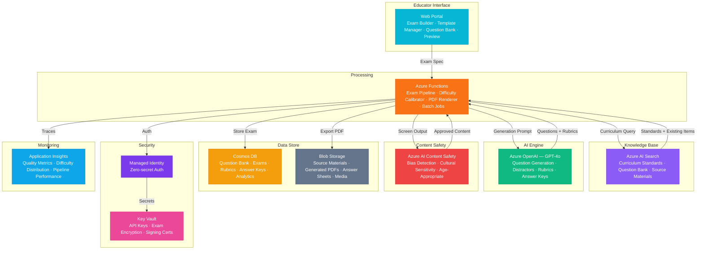

# Architecture — Play 75: Exam Generation Engine — Automated Exams with Difficulty Calibration

## Overview

AI-powered exam generation platform that automatically creates assessments with calibrated difficulty levels, detailed rubrics, and comprehensive answer keys. Azure OpenAI generates diverse question types (multiple choice, short answer, essay, problem-solving) aligned to curriculum standards retrieved from Azure AI Search. The system supports difficulty calibration using Bloom's taxonomy levels, generates plausible distractors for MCQs, creates rubrics with point allocations and sample answers, and produces multiple exam variants to prevent cheating. Azure Functions provides serverless batch processing for large-scale exam generation, while Content Safety screens all output for bias, cultural sensitivity, and age-appropriateness. Designed for K-12, higher education, and professional certification programs.

## Architecture Diagram

## Data Flow

1. **Exam Specification**: Educator defines exam parameters — subject, grade level, topic scope, question count, difficulty distribution (e.g., 30% easy, 50% medium, 20% hard), question types (MCQ, short answer, essay), time allocation, and learning objectives → System retrieves curriculum standards from AI Search to align questions with educational frameworks (Common Core, AP, IB, custom)
2. **Question Generation Pipeline**: Azure Functions orchestrates generation per question slot → GPT-4o generates questions at specified Bloom's taxonomy levels: Remember, Understand, Apply, Analyze, Evaluate, Create → For MCQs: stem, correct answer, and 3-4 plausible distractors with common misconception alignment → For essays: detailed prompt, word count guidance, and key concepts to address → Each question tagged with topic, difficulty, cognitive level, and estimated time
3. **Difficulty Calibration**: Generated questions scored against difficulty rubric — vocabulary complexity, number of reasoning steps, prerequisite knowledge depth → Statistical analysis ensures distribution matches target difficulty curve → Questions that deviate significantly from target are regenerated or adjusted → Item analysis metadata (predicted discrimination index, difficulty parameter) stored for psychometric tracking
4. **Rubric & Answer Key Generation**: GPT-4o generates detailed rubrics per question — point allocation, grading criteria, sample answers at each score level → MCQ answer key with rationale for correct answer and explanation of why each distractor is incorrect → Essay rubrics with holistic and analytic scoring dimensions → Short answer rubrics with acceptable answer variations and partial credit guidelines
5. **Quality Assurance & Export**: Content Safety screens all generated content for bias (gender, cultural, socioeconomic), inappropriate references, and age-appropriateness → Duplicate detection ensures no repeated questions within exam or across variants → Multiple exam variants generated with question reordering and parallel questions → Final output: exam PDF, answer key PDF, rubric document, machine-readable JSON → Stored in Cosmos DB (metadata + content) and Blob Storage (PDFs)

## Service Roles

| Service | Layer | Role |
|---------|-------|------|
| Azure OpenAI (GPT-4o) | Generation | Question creation, distractor generation, rubric authoring, answer key production |
| Azure AI Search | Knowledge | Curriculum standard retrieval, existing question bank search, source material lookup |
| Azure AI Content Safety | Quality | Bias detection, cultural sensitivity screening, age-appropriateness validation |
| Azure Functions | Processing | Exam generation pipeline, difficulty calibration, PDF rendering, batch processing |
| Cosmos DB | Persistence | Question bank, generated exams, rubrics, answer keys, difficulty metadata, analytics |
| Blob Storage | Storage | Source materials, generated PDFs, answer sheets, media assets |
| Key Vault | Security | API keys, exam content encryption keys, answer key signing certificates |
| Application Insights | Monitoring | Generation quality, difficulty distribution accuracy, pipeline performance |

## Security Architecture

- **Exam Integrity**: Answer keys and rubrics encrypted at rest with dedicated keys — separate from question content encryption
- **Managed Identity**: All service-to-service auth via managed identity — zero hardcoded credentials across OpenAI, Search, Cosmos DB
- **Access Control**: Educators create and view exams; department heads approve; students never access answer keys or rubrics pre-exam
- **Signing**: Generated answer keys digitally signed via Key Vault certificates — tamper-evident for academic integrity
- **Network Isolation**: Functions and Cosmos DB behind private endpoints — no public access to exam content databases
- **Data Encryption**: All exam content encrypted at rest (AES-256) and in transit (TLS 1.2+) — prevents pre-exam leakage
- **Audit Trail**: Every generation, modification, and access event logged with identity and timestamp — academic integrity compliance
- **FERPA Compliance**: Student assessment data handled per FERPA regulations — no PII in question generation prompts

## Scaling

| Metric | Dev | Production | Enterprise |
|--------|-----|-----------|------------|
| Exams generated/day | 5 | 200 | 5,000+ |
| Questions/exam (avg) | 20 | 30-50 | 100+ |
| Concurrent educators | 2 | 50 | 500+ |
| Question bank size | 200 | 20,000 | 500,000+ |
| Variants per exam | 1 | 2-4 | 10+ |
| PDF renders/hour | 5 | 100 | 2,000+ |
| Function instances | 1 | 5-10 | 50+ |
| P95 exam generation time | 60s | 30s | 15s |
