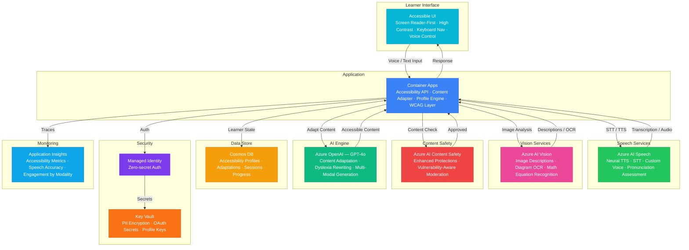

# Architecture — Play 76: Accessibility Learning Agent — Screen Reader-First Adaptive Learning

## Overview

AI-powered accessible learning platform designed screen reader-first for learners with visual impairments, dyslexia, motor disabilities, and cognitive differences. Azure AI Speech provides high-quality text-to-speech narration and speech-to-text voice input. Azure OpenAI adapts content to individual accessibility needs — simplifying language for dyslexia, providing verbose descriptions for visual impairments, adjusting pacing for cognitive differences, and generating multi-modal alternatives (audio, simplified text, structured descriptions) for complex content. Azure AI Vision generates descriptive alt-text for images, interprets diagrams, and performs math equation OCR. The system maintains per-learner accessibility profiles that evolve with usage and ensures WCAG 2.2 AAA compliance throughout. Designed for K-12 special education, university disability services, and workplace accommodation programs.

## Architecture Diagram

## Data Flow

1. **Accessibility Profile Initialization**: Learner or caregiver configures accessibility profile — primary disability type (visual, dyslexia, motor, cognitive), severity level, preferred modalities (audio-first, simplified text, large font), reading level, speech rate, and assistive technology in use → Profile stored in Cosmos DB with encryption for disability-related PII → System adapts all interactions to profile settings from first interaction → Profile evolves as system learns optimal adaptations through usage patterns
2. **Multi-Modal Content Ingestion**: Curriculum content uploaded by educators → Azure AI Vision processes all images: generates descriptive alt-text, interprets charts/diagrams in natural language, performs OCR on math equations and handwritten notes → Complex diagrams decomposed into sequential text descriptions suitable for screen reader narration → Content tagged with accessibility metadata: reading level, visual complexity, audio availability, interaction requirements
3. **Adaptive Content Delivery**: Learner requests content → API selects delivery modality based on accessibility profile → For visual impairments: TTS narration via Azure AI Speech with adjustable speed, verbose image descriptions, spatial layout descriptions ("the graph shows an upward trend from left to right") → For dyslexia: GPT-4o rewrites content with shorter sentences, simpler vocabulary, active voice, and OpenDyslexic-friendly formatting cues → For cognitive differences: content chunked into smaller segments with progress checks and repetition options
4. **Voice-First Interaction**: Azure AI Speech transcribes learner voice input with disability-aware error correction → Speech recognition tuned for articulation differences common with certain disabilities → GPT-4o interprets intent from imperfect transcriptions with higher error tolerance → Voice commands navigate content: "read again," "explain simpler," "skip to next section," "describe the image" → Pronunciation assessment provides gentle, encouraging feedback for speech therapy integration
5. **Progress & Adaptation Analytics**: Per-learner engagement tracked by modality — which adaptations are most effective for each disability type → Comprehension checks adapted to learner's input modality (voice, keyboard, switch access) → Analytics dashboard for educators shows class-level accessibility needs, content gaps, and accommodation effectiveness → System recommends accessibility profile adjustments based on observed patterns — e.g., "learner engages 40% longer when content is narrated at 0.8x speed"

## Service Roles

| Service | Layer | Role |
|---------|-------|------|
| Azure AI Speech | Voice | Neural TTS narration, STT voice input, custom voice for consistency, pronunciation assessment |
| Azure OpenAI (GPT-4o) | Adaptation | Content simplification, dyslexia-aware rewriting, multi-modal generation, pacing adjustment |
| Azure AI Vision | Visual | Image alt-text generation, diagram interpretation, math equation OCR, accessibility scanning |
| Azure AI Content Safety | Safety | Enhanced moderation for vulnerable population, disability-sensitive content filtering |
| Container Apps | Compute | Accessibility API — content adapter, speech pipeline, profile engine, WCAG compliance layer |
| Cosmos DB | Persistence | Accessibility profiles, adaptation history, session data, progress tracking, analytics |
| Key Vault | Security | Disability-related PII encryption, OAuth secrets, accessibility profile keys |
| Application Insights | Monitoring | Accessibility effectiveness, speech accuracy, adaptation quality, engagement by modality |

## Security Architecture

- **Disability PII Protection**: Accessibility profiles containing disability information encrypted with dedicated per-learner keys — highest sensitivity classification
- **ADA/IDEA Compliance**: System design meets ADA Section 508, IDEA Part B, and WCAG 2.2 AAA requirements for educational technology
- **Managed Identity**: All service-to-service auth via managed identity — zero credentials in code for Speech, Vision, OpenAI, Cosmos DB
- **Consent Management**: Explicit parental/guardian consent required for disability profile creation — granular control over what data is collected
- **Data Minimization**: Only necessary accessibility data stored — no medical records, diagnostic reports, or IEP content retained
- **RBAC**: Learners control own profiles; caregivers manage dependent profiles; educators view anonymized aggregates; administrators manage infrastructure
- **Encryption**: All data encrypted at rest (AES-256, customer-managed keys) and in transit (TLS 1.2+) — mandatory for disability data
- **Audit Trail**: Every profile access, adaptation, and data export logged with identity — compliance with disability rights regulations

## Scaling

| Metric | Dev | Production | Enterprise |
|--------|-----|-----------|------------|
| Concurrent learners | 5 | 500-2,000 | 5,000-20,000 |
| TTS characters/day | 10K | 2M | 20M+ |
| STT audio hours/day | 0.5 | 50 | 500+ |
| Image descriptions/day | 10 | 2,000 | 20,000+ |
| Accessibility profiles | 10 | 5,000 | 100,000+ |
| Content adaptations/day | 20 | 5,000 | 50,000+ |
| Container replicas | 1 | 3-5 | 6-12 |
| P95 response latency | 5s | 2s | 1.5s |
