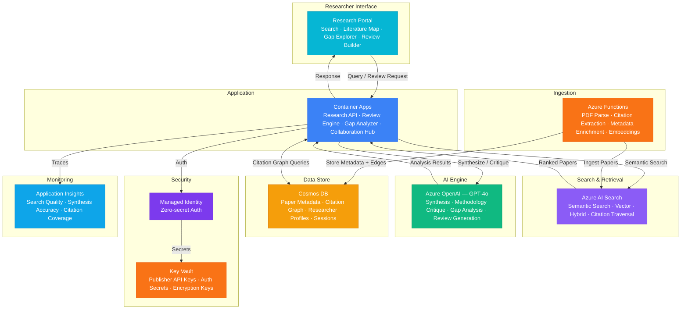

# Play 77 — Research Paper AI 📚

> AI research assistant — multi-source paper search, structured extraction, thematic literature review, citation network analysis, research gap identification.

Build an intelligent research assistant. Search across Semantic Scholar, arXiv, PubMed, and Crossref simultaneously, extract structured data (objective, methodology, findings, limitations), synthesize thematic literature reviews with verified citations, and identify research gaps grounded in paper limitations.

## Quick Start
```bash
cd solution-plays/77-research-paper-ai
az deployment group create -g $RG -f infra/main.bicep -p infra/parameters.json
code .
# Use @builder to implement, @reviewer to audit, @tuner to optimize
```

## Architecture



📐 [Full architecture details](architecture.md)

## Pre-Tuned Defaults
- Search: 4 sources · top 50 papers · relevance threshold 0.7 · dedup by DOI
- Extraction: 6 structured fields · full-text preferred · quantitative results included
- Synthesis: Thematic grouping · APA citations · 3000 max words · compare/contrast
- Gaps: 3-5 per review · evidence-required · 5 gap types

## DevKit (AI-Assisted Development)
| Primitive | What It Does |
|-----------|-------------|
| `agent.md` | Root orchestrator with builder→reviewer→tuner handoffs |
| `copilot-instructions.md` | Research domain (multi-source search, citation verification, thematic synthesis pitfalls) |
| 3 agents | Builder (gpt-4o), Reviewer (gpt-4o-mini), Tuner (gpt-4o-mini) |
| 3 skills | Deploy (200+ lines), Evaluate (125+ lines), Tune (230+ lines) |
| 4 prompts | `/deploy`, `/test`, `/review`, `/evaluate` with agent routing |

## Cost Estimate

| Service | Dev | Prod | Enterprise |
|---------|-----|------|------------|
| Azure OpenAI | $40 | $500 | $2,000 |
| Azure AI Search | $0 | $250 | $1,000 |
| Cosmos DB | $3 | $90 | $350 |
| Azure Functions | $0 | $40 | $200 |
| Container Apps | $10 | $150 | $400 |
| Key Vault | $1 | $5 | $15 |
| Application Insights | $0 | $30 | $100 |
| **Total** | **$54** | **$1,065** | **$4,065** |

💰 [Full cost breakdown](cost.json)

## vs. Play 01 (Enterprise RAG)
| Aspect | Play 01 | Play 77 |
|--------|---------|---------|
| Focus | Enterprise document Q&A | Academic paper research |
| Data Source | Internal documents | Semantic Scholar, arXiv, PubMed |
| Output | Single answer with citations | Literature review + gap analysis |
| Citation | Internal document references | DOI-verified academic citations |

📖 [Full documentation](spec/README.md) · 🌐 [frootai.dev/solution-plays/77-research-paper-ai](https://frootai.dev/solution-plays/77-research-paper-ai) · 📦 [FAI Protocol](spec/fai-manifest.json)
