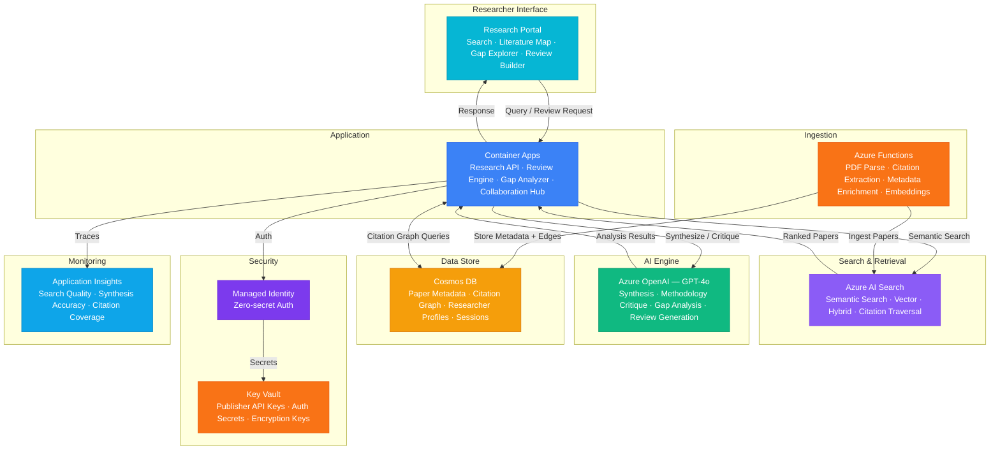

# Architecture — Play 77: Research Paper AI — Literature Review, Citation Network & Gap Analysis

## Overview

AI-powered research assistant for academic and industry researchers that automates literature review, builds citation network graphs, performs methodology critique, and identifies research gaps across disciplines. Azure OpenAI (GPT-4o) synthesizes findings from large paper corpora — summarizing abstracts, comparing methodologies, identifying contradictory findings, and generating structured literature reviews with proper citations. Azure AI Search provides semantic search over millions of papers with hybrid retrieval (keyword + vector) for cross-discipline discovery. Cosmos DB stores paper metadata and citation relationships as a graph, enabling traversal queries like "find all papers that cite Paper A and are cited by Paper B" and influence scoring. Azure Functions handle asynchronous paper ingestion — PDF parsing, citation extraction, metadata enrichment, and embedding generation. Designed for university research groups, R&D labs, systematic review teams, and grant-writing workflows.

## Architecture Diagram

## Data Flow

1. **Paper Corpus Ingestion**: Research papers uploaded or harvested from publisher APIs (arXiv, PubMed, Semantic Scholar) → Azure Functions parse PDF full-text, extract structured sections (abstract, methodology, results, references) → Citation references resolved to DOIs and linked as graph edges in Cosmos DB → Embeddings generated for abstract + key sections and indexed in AI Search → Metadata enriched with author affiliations, publication venue, impact metrics, and discipline tags
2. **Semantic Literature Search**: Researcher queries by natural language ("deep learning approaches for protein folding since 2022") → AI Search performs hybrid retrieval: keyword matching on titles/abstracts + vector similarity on embeddings + semantic ranking → Results enriched with citation count, influence score, and graph centrality from Cosmos DB → GPT-4o generates a synthesis paragraph summarizing the top results, highlighting consensus and contradictions → Related papers surfaced via citation graph: "Papers that cite these results" and "Seminal works in this cluster"
3. **Citation Network Analysis**: Researcher selects a seed paper → Cosmos DB Gremlin API traverses citation graph outward: direct citations, co-citations, bibliographic coupling → GPT-4o analyzes the network: identifies schools of thought, methodological lineages, and paradigm shifts → Visualization generated showing citation clusters, bridge papers connecting subfields, and temporal evolution → Influence scoring highlights high-impact papers that may be underrepresented in simple citation counts
4. **Methodology Critique & Gap Analysis**: Researcher submits a set of papers for systematic review → GPT-4o extracts methodology details from each paper: study design, sample size, variables, statistical methods, limitations → Cross-paper comparison identifies inconsistencies: conflicting findings with similar methods, untested variable combinations, underrepresented populations → Research gaps synthesized as structured recommendations: "No study has examined X in the context of Y using Z methodology" → Output formatted as a literature review section with proper citations and gap justification
5. **Collaborative Review Building**: Multiple researchers collaborate on a literature review → System maintains a living bibliography with per-section ownership and annotation threads → GPT-4o suggests additional papers when new sections are added ("Based on your methodology section, consider including these 5 papers on X") → Automated consistency checking: duplicate citations, citation style compliance, section balance, and argument flow → Export to LaTeX, Word, or BibTeX with properly formatted references

## Service Roles

| Service | Layer | Role |
|---------|-------|------|
| Azure OpenAI (GPT-4o) | Intelligence | Literature synthesis, methodology critique, gap identification, review generation, citation context analysis |
| Azure AI Search | Retrieval | Semantic search over paper corpus, hybrid retrieval, vector similarity, cross-discipline discovery |
| Cosmos DB | Persistence | Paper metadata, citation graph (Gremlin API), researcher profiles, review sessions, annotations |
| Azure Functions | Ingestion | PDF parsing, citation extraction, metadata enrichment, embedding generation, graph edge creation |
| Container Apps | Compute | Research API — review engine, gap analyzer, citation explorer, collaboration hub |
| Key Vault | Security | Publisher API credentials, institutional auth secrets, encryption keys |
| Application Insights | Monitoring | Search quality, synthesis accuracy, citation coverage, researcher engagement |

## Security Architecture

- **Institutional Authentication**: Integration with university SSO (SAML/OIDC) for researcher identity — institutional licensing verified per publisher API
- **Copyright Compliance**: Full-text stored only where publisher agreements permit; otherwise only metadata, abstracts, and embeddings retained
- **Managed Identity**: All service-to-service auth via managed identity — zero credentials in code for OpenAI, AI Search, Cosmos DB, Functions
- **Data Access Control**: Researchers see only papers within their institutional subscription; private annotations visible only to author and collaborators
- **RBAC**: Researchers manage own reviews; lab leads manage group reviews; administrators manage corpus and publisher integrations
- **Encryption**: All data encrypted at rest (AES-256) and in transit (TLS 1.2+) — publisher agreements may require additional controls
- **API Rate Limiting**: Per-researcher and per-institution quotas for AI synthesis calls — prevents abuse and controls costs
- **Audit Trail**: All paper access, synthesis requests, and export operations logged for institutional compliance

## Scaling

| Metric | Dev | Production | Enterprise |
|--------|-----|-----------|------------|
| Paper corpus size | 1K | 500K-2M | 10M+ |
| Concurrent researchers | 5 | 200-1,000 | 5,000-20,000 |
| Search queries/day | 50 | 10,000 | 100,000+ |
| Synthesis requests/day | 20 | 2,000 | 20,000+ |
| Citation graph edges | 5K | 5M | 100M+ |
| Papers ingested/day | 10 | 1,000 | 10,000+ |
| Container replicas | 1 | 3-5 | 6-12 |
| P95 search latency | 3s | 1.5s | 1s |
