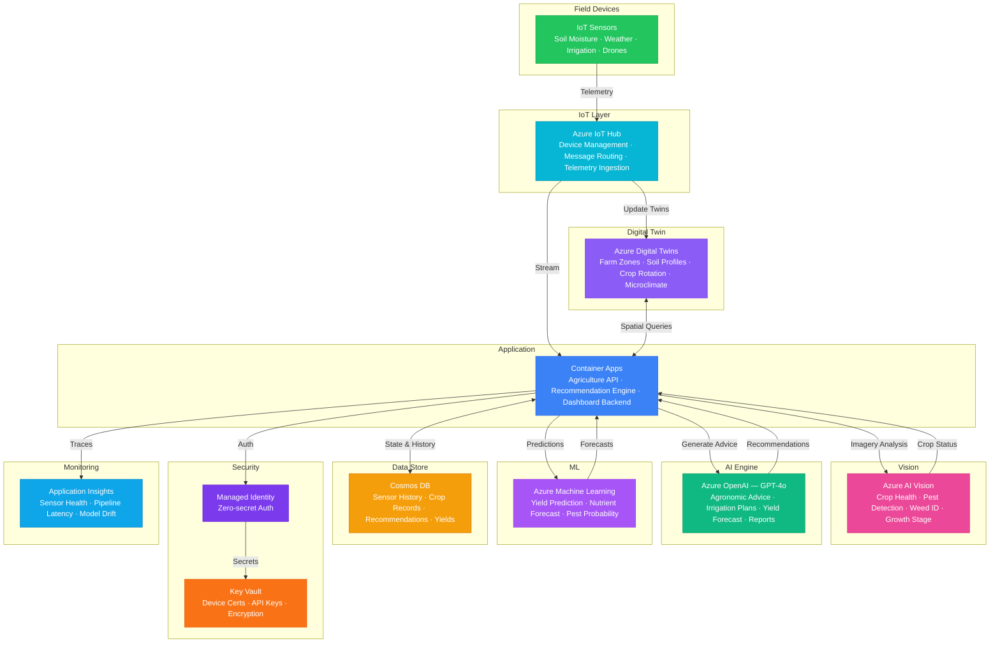

# Play 78 — Precision Agriculture Agent 🌾

> AI farming intelligence — NDVI crop monitoring, pest/disease detection, irrigation optimization, yield prediction, variable-rate prescriptions.

Build a precision agriculture system. Sentinel-2 multispectral imagery calculates NDVI/NDWI/EVI vegetation indices, Custom Vision classifies stress causes (drought, pest, disease, nutrient), IoT soil sensors feed irrigation optimization, and ML models predict yield by growth stage.

## Quick Start
```bash
cd solution-plays/78-precision-agriculture-agent
az deployment group create -g $RG -f infra/main.bicep -p infra/parameters.json
code .
# Use @builder to implement, @reviewer to audit, @tuner to optimize
```

## Architecture



📐 [Full architecture details](architecture.md)

## Pre-Tuned Defaults
- NDVI: Stress < 0.3 · Healthy > 0.5 · Weekly delta alert -0.15
- Stress: 5 types (drought, pest, disease, nutrient, waterlogging) · ensemble classification
- Irrigation: Variable-rate · 30m zones · 65% moisture target · rain forecast 3-day discount
- Yield: Gradient boosting · weekly NDVI + weather + soil features · < 15% MAPE

## DevKit (AI-Assisted Development)
| Primitive | What It Does |
|-----------|-------------|
| `agent.md` | Root orchestrator with builder→reviewer→tuner handoffs |
| `copilot-instructions.md` | Agriculture domain (spectral bands, NDVI interpretation, crop water needs) |
| 3 agents | Builder (gpt-4o), Reviewer (gpt-4o-mini), Tuner (gpt-4o-mini) |
| 3 skills | Deploy (195+ lines), Evaluate (120+ lines), Tune (225+ lines) |
| 4 prompts | `/deploy`, `/test`, `/review`, `/evaluate` with agent routing |

## Cost Estimate

| Service | Dev | Prod | Enterprise |
|---------|-----|------|------------|
| Azure IoT Hub | $0 | $25 | $2,500 |
| Azure AI Vision | $0 | $150 | $500 |
| Azure OpenAI | $30 | $400 | $1,500 |
| Azure Digital Twins | $5 | $100 | $400 |
| Azure Machine Learning | $0 | $200 | $800 |
| Container Apps | $10 | $150 | $400 |
| Cosmos DB | $3 | $90 | $450 |
| Key Vault | $1 | $5 | $15 |
| Application Insights | $0 | $40 | $120 |
| **Total** | **$49** | **$1,160** | **$6,685** |

💰 [Full cost breakdown](cost.json)

## vs. Play 71 (Smart Energy Grid AI)
| Aspect | Play 71 | Play 78 |
|--------|---------|---------|
| Focus | Energy grid operations | Crop management |
| Sensors | Frequency/voltage/load | Soil moisture/pH/nutrients |
| Imagery | N/A | Satellite + drone (NDVI, NIR, SWIR) |
| AI Role | Load forecasting + anomaly | Stress detection + yield prediction |

📖 [Full documentation](spec/README.md) · 🌐 [frootai.dev/solution-plays/78-precision-agriculture-agent](https://frootai.dev/solution-plays/78-precision-agriculture-agent) · 📦 [FAI Protocol](spec/fai-manifest.json)
