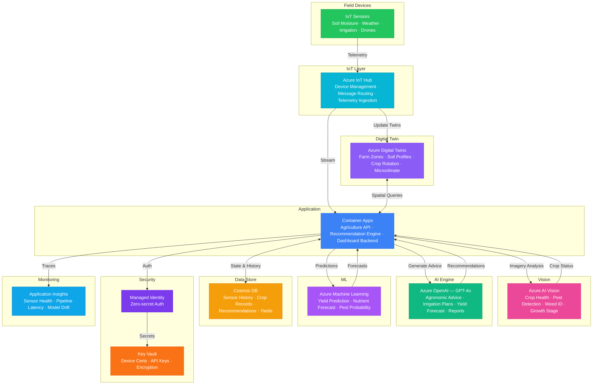

# Architecture — Play 78: Precision Agriculture Agent — Satellite Imagery & IoT Sensor Fusion

## Overview

AI-powered precision agriculture platform that fuses satellite imagery, drone photography, and IoT sensor data to optimize crop health monitoring, irrigation scheduling, fertilization planning, and pest management. Azure IoT Hub ingests real-time telemetry from soil moisture sensors, weather stations, and irrigation controllers across farm zones. Azure AI Vision analyzes satellite and drone imagery for crop health classification, pest detection, weed identification, and growth stage assessment. Azure OpenAI (GPT-4o) generates actionable agronomic recommendations by synthesizing sensor data, imagery analysis, weather forecasts, and historical yield data into natural-language farm reports. Azure Digital Twins maintains spatial digital models of farm zones — soil profiles, crop rotation history, irrigation network topology, and microclimate patterns. Azure Machine Learning trains custom models for yield prediction, nutrient forecasting, and pest outbreak probability. Designed for commercial farms, agricultural cooperatives, precision agriculture consultants, and food supply chain operators.

## Architecture Diagram

## Data Flow

1. **IoT Sensor Ingestion**: Soil moisture probes, weather stations, leaf wetness sensors, and irrigation flow meters transmit telemetry every 5-15 minutes → Azure IoT Hub routes messages by device type and priority: critical alerts (frost warning, pump failure) to real-time processing, routine readings to batch → Digital Twins updated with latest sensor values per farm zone — spatial model reflects real-time field conditions → Cosmos DB stores time-series history for trend analysis and ML training
2. **Satellite & Drone Imagery Analysis**: Satellite imagery (multispectral NDVI) received daily per farm zone; drone flights captured weekly for high-resolution field scans → Azure AI Vision processes imagery with custom crop models: NDVI-based health classification (healthy/stressed/dead), pest/disease pattern recognition, weed density mapping, growth stage identification → Results overlaid on Digital Twin spatial model — each zone annotated with health score, stress indicators, and change-since-last-scan → Anomaly zones flagged for drone re-inspection or ground scouting
3. **Agronomic Recommendation Generation**: API aggregates sensor data (soil moisture, temperature, humidity), imagery analysis (crop health, pest presence), weather forecast (7-day outlook), and historical yield data for a farm zone → GPT-4o synthesizes multi-source data into actionable recommendations: "Zone B3 soil moisture at 18% (threshold 22%) with no rain forecast for 5 days — recommend irrigation cycle of 25mm within 48 hours" → Recommendations categorized: irrigation scheduling, fertilization timing/dosage, pest treatment windows, harvest readiness → Natural-language farm report generated daily summarizing all zones with priority actions
4. **Predictive Analytics**: Azure ML models trained on historical sensor + yield data: yield prediction (bushels/acre by zone), nutrient depletion forecasting (NPK levels over growing season), pest outbreak probability (weather + historical patterns) → Models retrained monthly with new season data; drift detection alerts when prediction accuracy degrades → Predictions feed into GPT-4o recommendations — e.g., "ML model predicts 15% yield drop in Zone A2 if nitrogen not applied by April 15th" → What-if scenarios: "If we irrigate Zone C1 now, predicted yield improves by X%"
5. **Farm Dashboard & Alerts**: Real-time dashboard shows per-zone status: sensor readings, crop health map, active recommendations, weather overlay → Push alerts for critical events: frost warning, pest outbreak detected, irrigation system failure, drought threshold reached → Historical analytics: yield trends by zone, input costs vs. yield correlation, crop rotation optimization → Export compliance reports for organic certification, water usage reporting, and sustainability metrics

## Service Roles

| Service | Layer | Role |
|---------|-------|------|
| Azure IoT Hub | Ingestion | Device management, telemetry routing, sensor provisioning, edge connectivity |
| Azure AI Vision | Analysis | Crop health classification, pest/disease detection, weed mapping, growth staging |
| Azure OpenAI (GPT-4o) | Intelligence | Agronomic recommendations, natural language reports, multi-source synthesis |
| Azure Digital Twins | Modeling | Spatial farm models, zone topology, soil profiles, crop rotation, microclimate |
| Azure Machine Learning | Prediction | Yield forecasting, nutrient depletion, pest probability, what-if scenarios |
| Container Apps | Compute | Agriculture API — sensor processing, recommendation engine, dashboard backend |
| Cosmos DB | Persistence | Time-series sensor data, crop records, recommendations, yield history |
| Key Vault | Security | IoT device certificates, API keys, satellite provider credentials |
| Application Insights | Monitoring | Sensor health, pipeline latency, recommendation accuracy, model drift |

## Security Architecture

- **IoT Device Security**: X.509 certificate-based device authentication — certificates stored in Key Vault with automated rotation; compromised devices remotely disabled via IoT Hub
- **Edge-to-Cloud Encryption**: All sensor telemetry encrypted in transit (TLS 1.2+) — edge devices use IoT Hub SDK with built-in encryption
- **Managed Identity**: All service-to-service auth via managed identity — zero credentials in code for OpenAI, Vision, Cosmos DB, Digital Twins
- **Data Sovereignty**: Farm data stored in region-appropriate Azure regions — compliance with agricultural data privacy regulations per jurisdiction
- **RBAC**: Farm operators manage own zones; agronomists access advisory functions; cooperative administrators see aggregated analytics; equipment vendors access only device telemetry
- **Encryption**: All data encrypted at rest (AES-256) and in transit (TLS 1.2+) — proprietary crop data protected with customer-managed keys
- **Network Isolation**: IoT Hub and backend services in VNET with private endpoints — satellite imagery providers access via service endpoints only
- **Audit Trail**: All recommendations, irrigation commands, and chemical application advisories logged for traceability and regulatory compliance

## Scaling

| Metric | Dev | Production | Enterprise |
|--------|-----|-----------|------------|
| IoT sensors | 10 | 500-2,000 | 10,000-50,000 |
| Farm zones monitored | 5 | 100-500 | 2,000-10,000 |
| Satellite images/day | 2 | 100 | 1,000+ |
| Drone images/day | 5 | 200 | 2,000+ |
| Recommendations/day | 10 | 500 | 5,000+ |
| ML predictions/day | 20 | 1,000 | 10,000+ |
| Digital Twin operations/day | 100 | 100K | 1M+ |
| Container replicas | 1 | 3-5 | 6-12 |
| P95 recommendation latency | 5s | 3s | 2s |
