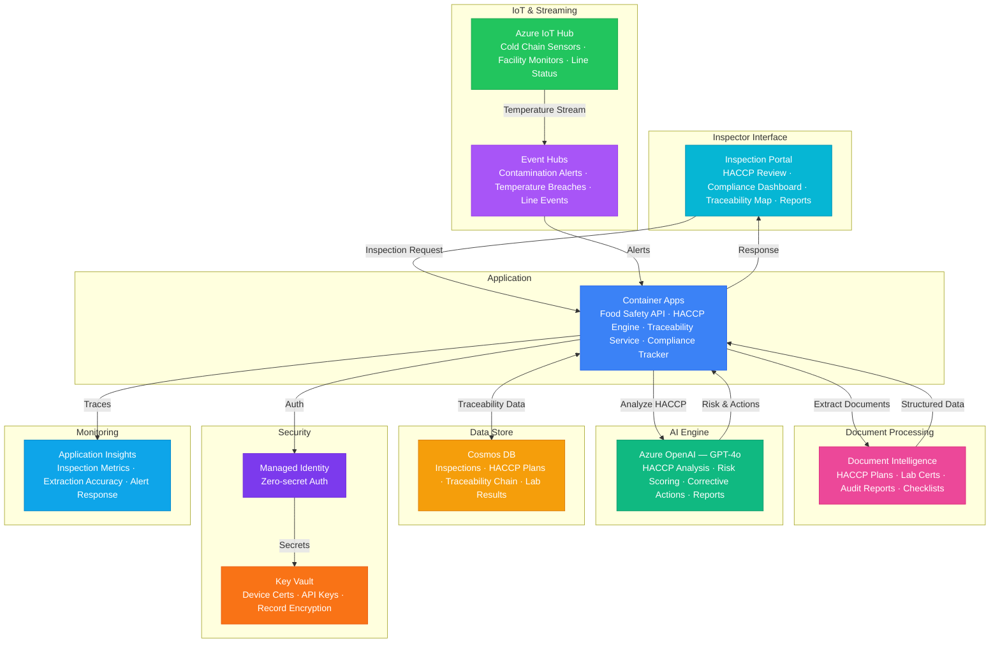

# Architecture — Play 79: Food Safety Inspector AI — HACCP Compliance & Farm-to-Fork Traceability

## Overview

AI-powered food safety inspection platform that automates HACCP compliance verification, contamination risk detection, and farm-to-fork traceability across the food supply chain. Azure Document Intelligence extracts structured data from HACCP plans, inspection reports, lab certificates, supplier audit documents, and regulatory forms — converting paper-heavy compliance workflows into structured digital records. Azure OpenAI (GPT-4o) performs intelligent HACCP analysis: identifying control point gaps, scoring contamination risk, generating corrective actions, and drafting inspection reports aligned to FDA/USDA/EU regulations. Azure IoT Hub ingests cold chain temperature data from transport and storage sensors, with Event Hubs streaming processing-line alerts for real-time contamination response. Cosmos DB maintains the complete traceability chain — from farm origin through processing, transport, and retail — enabling instant recall tracing when contamination is detected. Designed for food manufacturers, processing plants, cold chain logistics, regulatory inspectors, and restaurant chains.

## Architecture Diagram

## Data Flow

1. **HACCP Plan Digitization**: Food facilities upload HACCP plans, SOPs, and prerequisite programs → Document Intelligence extracts critical control points (CCPs), critical limits, monitoring procedures, corrective actions, and verification schedules from multi-format documents → Structured data stored in Cosmos DB with version history — each CCP linked to its monitoring requirements and responsible personnel → GPT-4o validates completeness against regulatory templates: identifies missing CCPs, inadequate critical limits, or gaps in monitoring frequency
2. **Inspection Workflow**: Inspector initiates facility inspection via mobile portal → System pre-loads facility's HACCP plan, previous inspection findings, corrective action status, and supplier compliance history from Cosmos DB → Inspector records observations per CCP: temperature readings, sanitation conditions, employee practices, pest evidence → GPT-4o compares observations against HACCP critical limits in real-time: "CCP-3 cooking temperature recorded at 155°F — critical limit is 165°F for poultry — CRITICAL DEVIATION" → Corrective actions auto-generated with regulatory citations and deadline recommendations
3. **Cold Chain Monitoring**: IoT temperature sensors in refrigerated trucks, warehouses, and display cases report every 60 seconds → IoT Hub routes to Event Hubs for stream processing → Temperature breaches trigger immediate alerts: severity scored based on duration, magnitude, and product type (e.g., raw poultry vs. canned goods) → GPT-4o assesses food safety impact: "Temperature excursion of 8°F above limit for 45 minutes on raw chicken lot #2847 — recommend product hold and pathogen testing per FDA guidelines" → All temperature data linked to lot/batch for traceability
4. **Farm-to-Fork Traceability**: Each product lot tracked from farm origin through processing, packaging, transport, distribution, and retail → Cosmos DB maintains directed graph of supply chain relationships: farm → processor → distributor → retailer → consumer → When contamination detected (lab positive, consumer complaint, recall notice), system traces affected lots forward and backward: "Lot #2847 originated from Farm X on March 5, processed at Plant Y, distributed to 47 retail locations in 3 states" → Recall scope automatically calculated with affected product list, quantities, and retail locations
5. **Compliance Reporting & Analytics**: Automated compliance reports generated per facility, region, or product category → Trend analysis: recurring violations by CCP type, seasonal contamination patterns, supplier risk scoring → Regulatory submission drafts aligned to FDA FSMA, USDA FSIS, EU Regulation 852/2004, and Codex Alimentarius → Predictive risk scoring: facilities with deteriorating trends flagged for priority inspection → Benchmarking across facilities within a company or industry segment

## Service Roles

| Service | Layer | Role |
|---------|-------|------|
| Document Intelligence | Extraction | HACCP plan parsing, lab certificate extraction, audit report digitization, checklist OCR |
| Azure OpenAI (GPT-4o) | Intelligence | HACCP gap analysis, contamination risk scoring, corrective actions, report generation |
| Azure IoT Hub | Ingestion | Cold chain sensor management, facility environment monitoring, device provisioning |
| Azure Event Hubs | Streaming | Real-time temperature breach alerts, processing line events, contamination notifications |
| Container Apps | Compute | Food safety API — inspection workflow, HACCP engine, traceability service, compliance tracker |
| Cosmos DB | Persistence | Inspection records, HACCP versions, traceability chain, lab results, supplier history |
| Key Vault | Security | IoT device certificates, API keys, regulatory system credentials, record encryption |
| Application Insights | Monitoring | Inspection pipeline latency, extraction accuracy, compliance trends, alert response times |

## Security Architecture

- **Tamper-Evident Records**: Inspection records and HACCP findings immutable once submitted — versioned with cryptographic hashing for regulatory audit trails
- **Regulatory Data Protection**: Inspection data handled per FDA 21 CFR Part 11 requirements — electronic signatures, access controls, and audit trails for regulated records
- **Managed Identity**: All service-to-service auth via managed identity — zero credentials in code for OpenAI, Document Intelligence, Cosmos DB, IoT Hub
- **IoT Device Security**: X.509 certificates for sensor authentication — compromised devices remotely disabled; certificate rotation automated via Key Vault
- **RBAC**: Inspectors access assigned facilities; facility operators view own compliance data; regulators access jurisdiction-level reports; administrators manage system configuration
- **Encryption**: All data encrypted at rest (AES-256, customer-managed keys) and in transit (TLS 1.2+) — critical for protecting pre-publication inspection findings
- **Network Isolation**: Backend services in VNET with private endpoints — IoT Hub accessible only from registered device networks
- **Data Retention**: Inspection records retained per regulatory requirements (typically 2-7 years) — automated archival to cold storage after active retention period

## Scaling

| Metric | Dev | Production | Enterprise |
|--------|-----|-----------|------------|
| Facilities monitored | 3 | 50-200 | 1,000-5,000 |
| IoT sensors (cold chain) | 10 | 500 | 5,000-20,000 |
| Inspections/day | 2 | 50-200 | 1,000+ |
| Documents processed/day | 10 | 500 | 5,000+ |
| Traceability lots tracked | 50 | 10,000 | 500,000+ |
| Temperature events/day | 1K | 500K | 10M+ |
| Concurrent inspectors | 2 | 50-100 | 500-2,000 |
| Container replicas | 1 | 3-5 | 6-12 |
| P95 alert latency | 10s | 3s | 1s |
