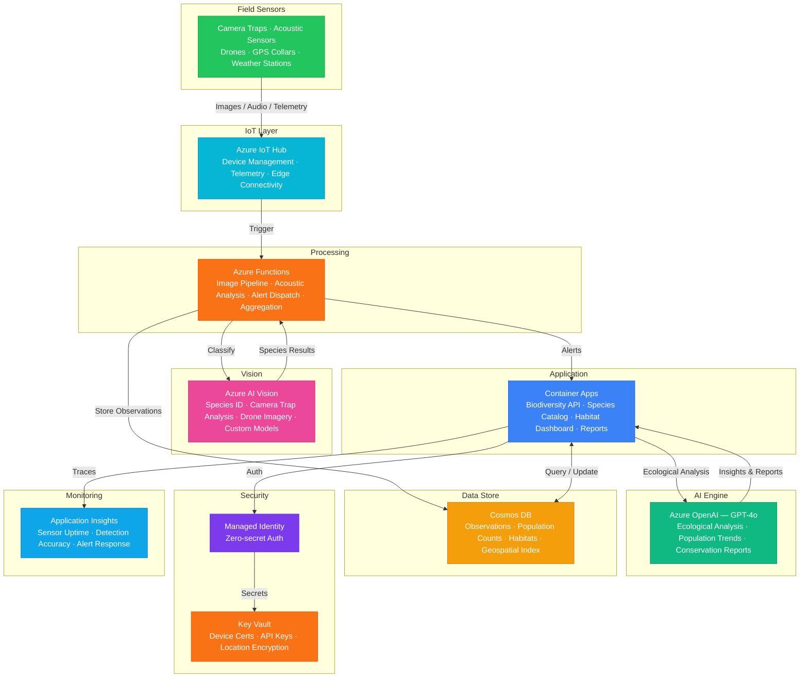

# Play 80 — Biodiversity Monitor 🦎

> AI biodiversity monitoring — multi-modal species identification (camera+audio), population tracking, invasive species alerting, conservation scoring.

Build an intelligent biodiversity monitoring system. Camera traps auto-classify species via Custom Vision, bioacoustic recorders identify birds/amphibians/bats by call, occupancy models estimate populations from repeated surveys, and invasive species trigger alerts to conservation authorities.

## Quick Start
```bash
cd solution-plays/80-biodiversity-monitor
az deployment group create -g $RG -f infra/main.bicep -p infra/parameters.json
code .
# Use @builder to implement, @reviewer to audit, @tuner to optimize
```

## Architecture



📐 [Full architecture details](architecture.md)

## Pre-Tuned Defaults
- Image: 0.75 confidence · empty frame filter 0.90 · ONNX batch processing
- Audio: 22050 Hz · 5s windows · SNR > 6dB · dawn chorus priority 04:00-08:00
- Population: Single-season occupancy · ≥5 surveys · 3-year trend minimum
- Invasive: IUCN watchlist · 0.60 confidence (lower = cautious) · photo verification

## DevKit (AI-Assisted Development)
| Primitive | What It Does |
|-----------|-------------|
| `agent.md` | Root orchestrator with builder→reviewer→tuner handoffs |
| `copilot-instructions.md` | Biodiversity domain (multi-modal ID, occupancy modeling, invasive alerting) |
| 3 agents | Builder (gpt-4o), Reviewer (gpt-4o-mini), Tuner (gpt-4o-mini) |
| 3 skills | Deploy (225+ lines), Evaluate (125+ lines), Tune (230+ lines) |
| 4 prompts | `/deploy`, `/test`, `/review`, `/evaluate` with agent routing |

## Cost Estimate

| Service | Dev | Prod | Enterprise |
|---------|-----|------|------------|
| Azure AI Vision | $0 | $200 | $600 |
| Azure OpenAI | $25 | $300 | $1,200 |
| Azure IoT Hub | $0 | $25 | $250 |
| Cosmos DB | $3 | $75 | $300 |
| Azure Functions | $0 | $30 | $180 |
| Container Apps | $10 | $120 | $350 |
| Key Vault | $1 | $5 | $15 |
| Application Insights | $0 | $30 | $100 |
| **Total** | **$39** | **$785** | **$2,995** |

💰 [Full cost breakdown](cost.json)

## vs. Play 78 (Precision Agriculture Agent)
| Aspect | Play 78 | Play 80 |
|--------|---------|---------|
| Focus | Crop health + yield | Wildlife species + populations |
| Imagery | Satellite NDVI | Camera traps + audio |
| AI Role | Stress detection + recommendations | Species ID + conservation scoring |
| Sensors | Soil moisture/pH | Motion cameras + audio recorders |

📖 [Full documentation](spec/README.md) · 🌐 [frootai.dev/solution-plays/80-biodiversity-monitor](https://frootai.dev/solution-plays/80-biodiversity-monitor) · 📦 [FAI Protocol](spec/fai-manifest.json)
