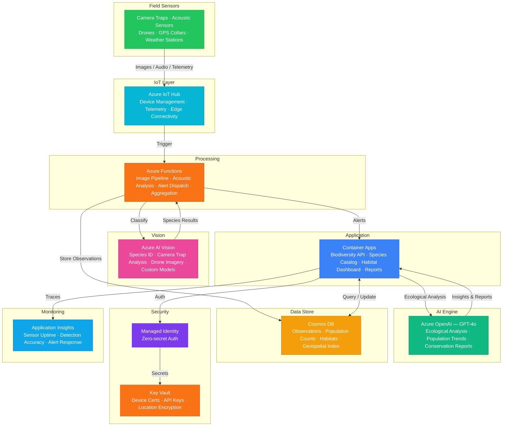

# Architecture — Play 80: Biodiversity Monitor — Species Identification & Conservation Alerts

## Overview

AI-powered biodiversity monitoring platform that identifies species from camera trap images, drone aerial surveys, and acoustic sensor recordings, with automated conservation alerts for endangered species sightings and habitat degradation. Azure AI Vision performs species identification using custom models trained on regional fauna — classifying animals from camera trap photos, identifying bird species from drone footage, and detecting marine life from underwater cameras. Azure OpenAI (GPT-4o) provides ecological analysis: interpreting population trends, assessing habitat health from multi-source data, scoring conservation priorities, and generating natural-language survey reports for stakeholders. Azure IoT Hub manages distributed sensor networks across reserves — camera traps, acoustic recorders, weather stations, water quality monitors, and GPS wildlife collars. Azure Functions process incoming sensor data asynchronously: triggering species classification on new camera trap images, analyzing acoustic files for species calls, and dispatching conservation alerts. Cosmos DB stores all observation records with geospatial indexing for species distribution mapping. Designed for national parks, wildlife reserves, conservation NGOs, ecological research stations, and environmental compliance monitoring.

## Architecture Diagram

## Data Flow

1. **Sensor Data Collection**: Camera traps triggered by motion capture wildlife images with metadata (timestamp, GPS, temperature, moon phase) → Acoustic sensors record ambient audio in configurable windows (e.g., dawn chorus 5-7am) → Drones capture aerial survey imagery on scheduled flight paths → GPS collars transmit animal location pings every 15-60 minutes → All data ingested via Azure IoT Hub with device-level authentication and satellite/cellular connectivity from remote locations
2. **Species Identification Pipeline**: Azure Functions triggered by new camera trap images in IoT Hub → Azure AI Vision classifies species using custom models trained on regional fauna: species name, confidence score, individual count, behavior tags (feeding, nesting, traveling) → For low-confidence classifications, image queued for expert review with AI-suggested species → Acoustic files analyzed for species-specific vocalizations: bird calls, frog choruses, bat echolocation, whale songs → All observations recorded in Cosmos DB with geospatial coordinates and taxonomic classification
3. **Conservation Alert System**: Endangered species detection triggers priority alerts: IUCN Red List species sighted, species seen outside known range, unusual aggregation patterns → Habitat degradation alerts: water quality sensors detecting pollution, deforestation detected in drone imagery, invasive species presence → Poaching indicators: camera traps capturing human presence in restricted zones, GPS collar signal loss (potential collar removal), gunshot acoustic signatures → Alerts dispatched to park rangers, conservation teams, and law enforcement with location, evidence images, and recommended response
4. **Ecological Analysis & Reporting**: GPT-4o analyzes aggregated observation data: population trends by species over time, seasonal migration patterns, habitat utilization maps, predator-prey ratio changes → Cross-source correlation: weather patterns vs. species activity, water quality vs. aquatic species counts, vegetation health (drone NDVI) vs. herbivore populations → Natural-language survey reports generated for stakeholders: "Black rhino sightings increased 12% in Q1 vs. previous year, concentrated in Zone C — consistent with improved water availability and anti-poaching patrol expansion" → IUCN reporting templates auto-populated with observation data
5. **Conservation Planning**: Historical data enables predictive modeling: seasonal movement predictions for ranger patrol planning, habitat connectivity analysis for corridor design → Species distribution maps updated continuously as new observations arrive — heat maps show abundance, range changes, and critical habitat zones → Impact assessment support: proposed development overlaid with species data to predict ecological impact → Long-term biodiversity indices calculated per reserve: Shannon diversity index, species richness, evenness, and trends compared against regional baselines

## Service Roles

| Service | Layer | Role |
|---------|-------|------|
| Azure AI Vision | Identification | Species classification from camera traps, drone imagery, underwater cameras — custom regional models |
| Azure OpenAI (GPT-4o) | Intelligence | Ecological analysis, population trend interpretation, conservation reporting, habitat assessment |
| Azure IoT Hub | Ingestion | Camera trap, acoustic sensor, GPS collar, and weather station device management and telemetry |
| Azure Functions | Processing | Image classification pipeline, acoustic analysis trigger, alert dispatch, data aggregation |
| Container Apps | Compute | Biodiversity API — species catalog, population analytics, habitat dashboard, reporting engine |
| Cosmos DB | Persistence | Species observations, population counts, habitat assessments, geospatial sighting data |
| Key Vault | Security | IoT device certificates, API keys, endangered species location encryption |
| Application Insights | Monitoring | Sensor uptime, detection accuracy, camera trap battery levels, alert response times |

## Security Architecture

- **Endangered Species Location Protection**: GPS coordinates of critically endangered species encrypted with dedicated keys — access restricted to authorized conservation personnel to prevent poaching
- **Anti-Poaching Data Isolation**: Human detection images and poaching evidence stored in separate, access-controlled container with forensic chain-of-custody metadata
- **Managed Identity**: All service-to-service auth via managed identity — zero credentials in code for OpenAI, Vision, Cosmos DB, IoT Hub
- **IoT Device Security**: Camera traps and sensors authenticated via X.509 certificates — tamper detection triggers device lockout; satellite uplinks encrypted
- **RBAC**: Field researchers access observation data; rangers access alerts and location data; conservation managers access analytics; administrators manage sensors and system config
- **Encryption**: All data encrypted at rest (AES-256) and in transit (TLS 1.2+) — mandatory for endangered species location data
- **Network Isolation**: Backend services in VNET — IoT Hub accessible only from registered device networks and authorized research stations
- **Data Sharing**: Observation data shareable with GBIF, iNaturalist, and IUCN via standardized Darwin Core format — sensitive location data obfuscated for public sharing

## Scaling

| Metric | Dev | Production | Enterprise |
|--------|-----|-----------|------------|
| Camera traps | 5 | 100-500 | 2,000-10,000 |
| Acoustic sensors | 3 | 50-200 | 500-2,000 |
| Species in catalog | 20 | 500-2,000 | 10,000+ |
| Images processed/day | 50 | 5,000-20,000 | 100,000+ |
| Acoustic hours/day | 2 | 200 | 2,000+ |
| Observations stored | 500 | 500K | 10M+ |
| Reserves monitored | 1 | 5-20 | 50-200 |
| Container replicas | 1 | 2-4 | 6-12 |
| P95 alert latency | 30s | 10s | 5s |
