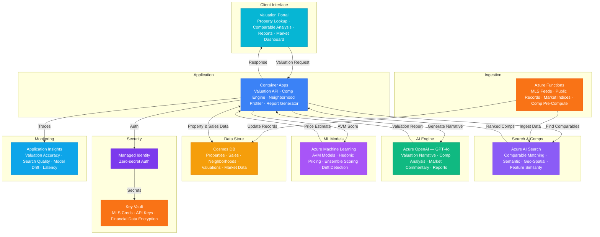

# Play 81 — Property Valuation AI 🏠

> Automated property appraisal — comparable sales analysis, ML valuation model, adjustment engine, bias testing, regulatory-compliant reports.

Build an automated valuation model (AVM). AI Search finds geospatially-filtered comparable sales, paired-sales-derived adjustment factors normalize for differences (sqft, condition, features), gradient boosting predicts value with confidence intervals, and LLM generates professional appraisal narratives.

## Quick Start
```bash
cd solution-plays/81-property-valuation-ai
az deployment group create -g $RG -f infra/main.bicep -p infra/parameters.json
code .
# Use @builder to implement, @reviewer to audit, @tuner to optimize
```

## Architecture



📐 [Full architecture details](architecture.md)

## Pre-Tuned Defaults
- Comp search: 2km radius · 6 months recency · ±20% sqft · top 5 comps
- Adjustments: $/sqft, bedrooms, bathrooms, condition, features · USPAP net <25%
- Confidence: ±8% default · widens for few/old/distant comps
- Bias: ECOA compliance · disparate impact 0.80-1.25 · no protected features

## DevKit (AI-Assisted Development)
| Primitive | What It Does |
|-----------|-------------|
| `agent.md` | Root orchestrator with builder→reviewer→tuner handoffs |
| `copilot-instructions.md` | Valuation domain (AVM, comps, adjustments, fair lending pitfalls) |
| 3 agents | Builder (gpt-4o), Reviewer (gpt-4o-mini), Tuner (gpt-4o-mini) |
| 3 skills | Deploy (205+ lines), Evaluate (125+ lines), Tune (230+ lines) |
| 4 prompts | `/deploy`, `/test`, `/review`, `/evaluate` with agent routing |

## Cost Estimate

| Service | Dev | Prod | Enterprise |
|---------|-----|------|------------|
| Azure OpenAI | $30 | $400 | $1,500 |
| Azure AI Search | $0 | $250 | $1,000 |
| Cosmos DB | $3 | $90 | $350 |
| Azure Machine Learning | $0 | $200 | $700 |
| Azure Functions | $0 | $35 | $200 |
| Container Apps | $10 | $150 | $400 |
| Key Vault | $1 | $5 | $15 |
| Application Insights | $0 | $30 | $100 |
| **Total** | **$44** | **$1,160** | **$4,265** |

💰 [Full cost breakdown](cost.json)

## vs. Play 72 (Climate Risk Assessor)
| Aspect | Play 72 | Play 81 |
|--------|---------|---------|
| Focus | Climate physical/transition risk | Property value estimation |
| Model | NGFS scenario projection | Gradient boosting on comp data |
| Bias Concern | Greenwashing detection | Fair lending / disparate impact |
| Regulation | TCFD | USPAP, ECOA, Fair Housing Act |

📖 [Full documentation](spec/README.md) · 🌐 [frootai.dev/solution-plays/81-property-valuation-ai](https://frootai.dev/solution-plays/81-property-valuation-ai) · 📦 [FAI Protocol](spec/fai-manifest.json)
