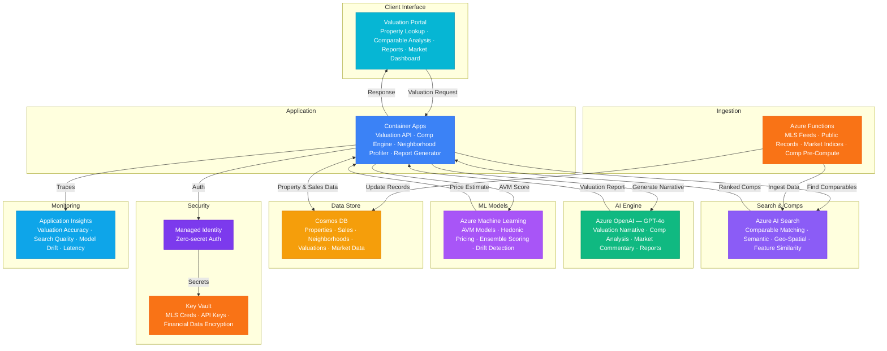

# Architecture — Play 81: Property Valuation AI — Automated Appraisal & Market Analysis

## Overview

AI-powered property valuation platform that automates residential and commercial appraisals through comparable sales analysis, automated valuation models (AVM), neighborhood scoring, and market trend interpretation. Azure OpenAI (GPT-4o) generates professional valuation narratives — analyzing comparable sales with adjustment reasoning, interpreting market conditions, and drafting compliant appraisal report sections that mirror licensed appraiser methodology. Azure AI Search provides semantic comparable property matching: finding properties similar in features, condition, location, and sale recency using hybrid search with geo-spatial filtering. Azure Machine Learning trains and serves AVM models — hedonic pricing, gradient boosting regressors, and neural network ensembles trained on historical sales, property features, and market indices. Cosmos DB stores the property universe: sales records, listing data, neighborhood scores, tax assessments, and valuation history with geospatial indexing. Azure Functions handle data pipelines: MLS feed ingestion, public records import, market index calculations, and nightly comparable pre-computation. Designed for appraisal management companies, mortgage lenders, real estate brokerages, property tax assessors, and institutional investors.

## Architecture Diagram

## Data Flow

1. **Property Data Ingestion**: MLS feeds provide active listings, pending sales, and closed transactions updated daily → Public records import: tax assessments, deed transfers, building permits, zoning changes → Azure Functions process and normalize data: standardize property features (bed/bath/sqft/lot/year), geocode addresses, calculate derived features (price-per-sqft, days-on-market) → Enriched records indexed in AI Search with vector embeddings for semantic matching and geo-spatial coordinates → Neighborhood scores computed nightly: school ratings, crime indices, amenity proximity, walkability, transit access, demographic trends
2. **Comparable Property Selection**: Appraiser or automated system submits subject property for valuation → AI Search performs multi-criteria comparable retrieval: geo-spatial radius filter (0.5-3 miles), property type match, size range (±20%), age range (±10 years), sale recency (last 12 months) → Semantic ranker scores candidates on overall similarity: adjusting for condition, upgrades, view, lot characteristics → Top 10-15 candidates returned with similarity scores → GPT-4o narrates why each comparable was selected and quantifies adjustments: "Comp 2 adjusted +$15,000 for superior kitchen renovation (granite vs. laminate countertops)"
3. **Automated Valuation Model (AVM) Scoring**: Azure ML serves ensemble AVM: hedonic pricing model (feature-based regression), gradient boosting model (XGBoost on 50+ features), and neural network model → Each model produces an independent estimate with confidence interval → Ensemble combines predictions weighted by per-model historical accuracy in the subject's micro-market → Output: point estimate, confidence range (10th-90th percentile), and model agreement score → Low-agreement flag triggers human appraiser review — models diverging suggests unusual property or thin comparable market
4. **Valuation Report Generation**: GPT-4o drafts professional appraisal report sections aligned to USPAP (Uniform Standards of Professional Appraisal Practice) → Neighborhood description: market conditions, price trends, supply/demand balance, economic drivers → Comparable analysis grid with line-item adjustments: location, condition, size, age, features, date-of-sale → Reconciliation narrative: weighing AVM estimate, comparable-adjusted values, and market conditions to arrive at final opinion of value → Report formatted per lender requirements (FNMA 1004, FHA) with all required fields populated → Human appraiser reviews, adjusts, and certifies before submission
5. **Market Analytics & Portfolio Valuation**: Market dashboard shows price trends by neighborhood, property type, and price tier → Absorption rate analysis: months of inventory, price reductions, days-on-market trends → Portfolio batch valuation: lenders submit portfolios of 100-10,000 properties for mark-to-market updates → AVM models score each property; outliers flagged for individual review → Risk metrics: properties with declining values, markets with negative trends, concentration risk by geography → Export to loan origination systems, risk platforms, and regulatory reporting

## Service Roles

| Service | Layer | Role |
|---------|-------|------|
| Azure OpenAI (GPT-4o) | Intelligence | Valuation narratives, comparable analysis, market commentary, appraisal report generation |
| Azure AI Search | Retrieval | Comparable property matching — semantic, geo-spatial, feature similarity, market report search |
| Azure Machine Learning | Prediction | AVM models — hedonic pricing, gradient boosting, neural network ensemble, confidence intervals |
| Cosmos DB | Persistence | Property records, sales history, neighborhood scores, valuations, market indices |
| Azure Functions | Ingestion | MLS feed processing, public records import, market calculations, comparable pre-computation |
| Container Apps | Compute | Valuation API — comp engine, neighborhood profiler, report generator, client portal backend |
| Key Vault | Security | MLS credentials, API keys, financial data encryption keys |
| Application Insights | Monitoring | Valuation accuracy, search quality, model drift, API latency |

## Security Architecture

- **Financial Data Protection**: Property valuations and financial data encrypted with customer-managed keys — compliance with GLBA (Gramm-Leach-Bliley Act) for financial information
- **USPAP Compliance**: Valuation records retained per USPAP requirements (minimum 5 years) with immutable audit trail — electronic workfile standards maintained
- **Managed Identity**: All service-to-service auth via managed identity — zero credentials in code for OpenAI, AI Search, Cosmos DB, ML endpoints
- **MLS Data Governance**: MLS data handled per IDX/RETS licensing agreements — display rules, data retention limits, and attribution requirements enforced programmatically
- **RBAC**: Appraisers access full valuation tools; lenders access reports and AVM scores; agents access market analytics; administrators manage data feeds and models
- **Encryption**: All data encrypted at rest (AES-256) and in transit (TLS 1.2+) — mandatory for consumer financial information
- **Fair Lending Compliance**: AVM models audited for fair lending compliance — no prohibited factors (race, ethnicity, religion) used directly or as proxy; disparate impact testing performed quarterly
- **Audit Trail**: Every valuation, comparable selection, adjustment, and model score logged with timestamps and user identity for regulatory examination

## Scaling

| Metric | Dev | Production | Enterprise |
|--------|-----|-----------|------------|
| Properties in index | 5K | 500K-2M | 10M+ |
| Valuations/day | 10 | 500-2,000 | 10,000-50,000 |
| Comparable searches/day | 20 | 2,000 | 50,000+ |
| AVM batch scores/day | 50 | 5,000 | 100,000+ |
| MLS records ingested/day | 100 | 10,000 | 100,000+ |
| Concurrent users | 3 | 50-200 | 1,000-5,000 |
| Container replicas | 1 | 3-5 | 6-12 |
| P95 valuation latency | 8s | 4s | 2s |
