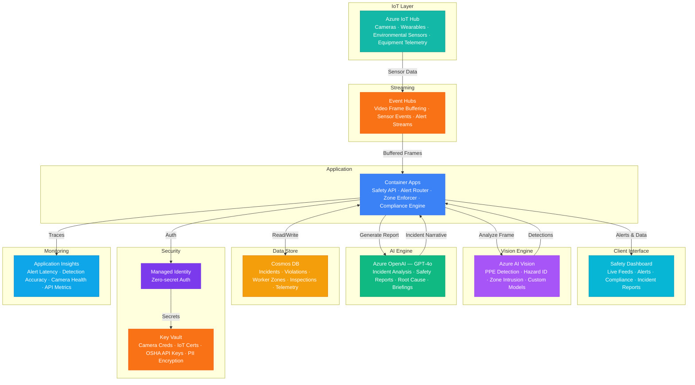

# Architecture — Play 82: Construction Safety AI — Real-Time Site Monitoring

## Overview

AI-powered construction site safety monitoring platform that provides real-time PPE compliance detection, hazard identification, and unauthorized zone alerts. Azure AI Vision runs custom models trained on construction-specific PPE (hard hats, high-visibility vests, safety glasses, gloves, harnesses) and site hazards (unsecured scaffolding, missing guardrails, improper material storage). Azure IoT Hub ingests data from site cameras, wearable sensors (worker GPS, fall detection accelerometers), and environmental monitors (dust particulate, noise decibels, gas levels). Azure OpenAI (GPT-4o) generates incident analysis narratives — correlating multiple violations into root cause reports, drafting OSHA-compliant safety summaries, and producing natural language safety briefings for site supervisors. Event Hubs buffer high-throughput camera frame streams for ordered, real-time processing. Container Apps hosts the safety monitoring API — orchestrating frame analysis, alert routing, zone enforcement, and compliance dashboard. Cosmos DB stores incident records, violation history, worker zone tracking, and inspection logs with geospatial indexing. Designed for general contractors, safety directors, insurance underwriters, and regulatory compliance teams on commercial and infrastructure construction projects.

## Architecture Diagram

## Data Flow

1. **Sensor & Camera Ingestion**: Site cameras (PTZ, fixed, drone-mounted) stream video frames at 1-2 FPS to Azure IoT Hub → Wearable sensors report worker GPS coordinates, fall-detection accelerometer events, and proximity-to-hazard distances every 5 seconds → Environmental sensors transmit dust particulate (PM2.5/PM10), noise decibels, temperature, and gas concentrations (CO, H2S, methane) at 30-second intervals → IoT Hub routes high-priority streams (fall alerts, gas alarms) directly to Container Apps; bulk data flows through Event Hubs for ordered batch processing
2. **PPE Compliance Detection**: Container Apps extracts video frames from Event Hubs and sends to Azure AI Vision → Custom-trained PPE models detect presence/absence of: hard hats, high-visibility vests, safety glasses, gloves, fall harnesses, and steel-toe indicators → Each detection returns bounding boxes with confidence scores — violations flagged when required PPE is missing for the detected zone classification → Repeat offenders tracked via face-region hashing (privacy-preserving, no facial recognition) correlated with wearable GPS zones → Real-time alerts pushed to site safety supervisor dashboard and mobile app within 3 seconds of detection
3. **Hazard & Zone Monitoring**: Vision models scan for environmental hazards: unsecured scaffolding, missing guardrails, improper material stacking, trip hazards, open excavations without barriers → Geo-fenced zones (crane swing radius, active demolition, confined spaces) enforced via wearable GPS — workers entering unauthorized zones trigger immediate audio/visual alerts on their wearable and supervisor dashboard → Equipment proximity detection: workers too close to active heavy equipment flagged based on combined camera vision and wearable GPS triangulation → Night-shift monitoring uses thermal camera feeds with adapted detection models
4. **Incident Analysis & Reporting**: When violations accumulate or a safety event occurs, GPT-4o generates structured incident analysis: correlating multiple simultaneous violations (e.g., missing hard hat + active overhead crane = critical risk), identifying patterns across shifts and zones, and recommending corrective actions → Daily safety briefings auto-generated: summarizing violation counts by zone, trending hazards, weather-related risks, and equipment inspection due dates → Weekly OSHA-format compliance reports drafted with violation categories, corrective actions taken, and abatement verification status → Monthly trend analysis: violation frequency heatmaps, repeat-offender patterns, zone-specific risk scores, and predictive safety indicators
5. **Compliance Dashboard & Analytics**: Real-time dashboard shows live camera feeds with AI overlay (bounding boxes on detected PPE/hazards), active alerts, zone occupancy, and environmental readings → Compliance scorecard: site-level safety rating updated hourly based on violation rates, response times, and corrective action completion → Insurance integration: anonymized safety metrics shared with underwriters for experience modification rate (EMR) calculation and premium adjustment → Historical analysis: compare safety performance across projects, seasons, subcontractor teams, and construction phases → Export to OSHA 300 logs, client safety reports, and insurance claims documentation

## Service Roles

| Service | Layer | Role |
|---------|-------|------|
| Azure AI Vision | Detection | PPE compliance verification, hazard identification, zone intrusion detection — custom models trained on construction environments |
| Azure IoT Hub | Ingestion | Camera streams, wearable sensor data, environmental monitors, equipment telemetry — device management and message routing |
| Event Hubs | Streaming | High-throughput video frame buffering with ordered partitioning by site zone — decouples ingestion from analysis |
| Azure OpenAI (GPT-4o) | Intelligence | Incident root cause narratives, OSHA-format safety reports, daily briefings, trend analysis, corrective action recommendations |
| Container Apps | Compute | Safety monitoring API — frame analysis orchestration, alert routing, zone enforcement, compliance scoring, dashboard backend |
| Cosmos DB | Persistence | Incident records, PPE violation history, worker zone tracking, inspection logs, environmental readings, compliance audit trail |
| Key Vault | Security | Camera credentials, IoT device certificates, OSHA reporting API keys, worker PII encryption keys |
| Application Insights | Monitoring | Alert latency (target <3s), detection accuracy, camera feed health, false-positive rates, API throughput |

## Security Architecture

- **Worker Privacy**: No facial recognition used — PPE detection uses body-region analysis and wearable correlation; worker identification via badge/wearable ID only, never biometrics
- **OSHA Compliance**: Incident records retained per OSHA recordkeeping requirements (5 years minimum) with immutable audit trail — electronic 300 log standards maintained
- **Managed Identity**: All service-to-service auth via managed identity — zero credentials in code for Vision, OpenAI, IoT Hub, Cosmos DB, Event Hubs
- **Data Sovereignty**: All video frames processed in-region and not stored beyond analysis window (frames deleted after 24 hours; only metadata and detections retained)
- **RBAC**: Safety directors access full analytics and reporting; site supervisors access zone-specific alerts and daily summaries; workers access personal compliance history only
- **Encryption**: All data encrypted at rest (AES-256) and in transit (TLS 1.2+) — mandatory for worker safety records
- **IoT Security**: Device provisioning via DPS with X.509 certificates — revocation capability for compromised cameras or sensors
- **Audit Trail**: Every detection, alert, acknowledgment, and corrective action logged with timestamps and user identity for regulatory examination

## Scaling

| Metric | Dev | Production | Enterprise |
|--------|-----|-----------|------------|
| Cameras monitored | 3-5 | 20-50 | 200-1,000 |
| Frames analyzed/day | 5K | 250K-500K | 2M-5M |
| Workers tracked | 10 | 100-500 | 2,000-10,000 |
| Safety alerts/day | 5 | 100-500 | 2,000-10,000 |
| Sites monitored | 1 | 3-10 | 50-200 |
| Concurrent dashboard users | 3 | 20-50 | 200-500 |
| Container replicas | 1 | 3-5 | 8-16 |
| P95 alert latency | 10s | 3s | 1.5s |
