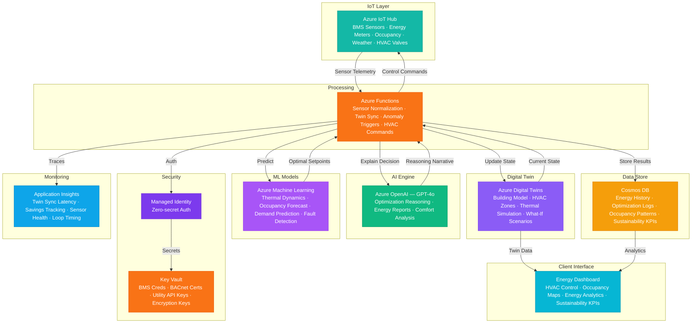

# Architecture — Play 83: Building Energy Optimizer — Digital Twin HVAC & Lighting Optimization

## Overview

AI-powered building energy optimization platform leveraging Azure Digital Twins to model HVAC zones, lighting circuits, occupancy patterns, and thermal dynamics for real-time simulation and predictive control — targeting 20-40% energy reduction while maintaining occupant comfort. Azure IoT Hub ingests data from building management system (BMS) sensors: temperature, humidity, CO2 concentration, occupancy counters, energy meters, HVAC valve positions, lighting levels, and weather station feeds. Azure Machine Learning trains and serves predictive models for thermal dynamics, occupancy forecasting, energy demand prediction, and optimal setpoint calculation. Azure OpenAI (GPT-4o) provides reasoning over optimization decisions — explaining HVAC schedule recommendations in natural language, analyzing comfort-versus-efficiency trade-offs, and generating sustainability reports for building owners. Azure Functions handle high-frequency sensor normalization, digital twin state updates, anomaly detection triggers, and HVAC/lighting control commands via BACnet/Modbus gateways. Cosmos DB stores energy consumption history, optimization decisions, occupancy patterns, and sustainability KPIs. Designed for commercial real estate operators, facility managers, smart building integrators, and corporate sustainability teams pursuing LEED, WELL, or Energy Star certifications.

## Architecture Diagram

## Data Flow

1. **Building Sensor Ingestion**: BMS sensors stream data to Azure IoT Hub: zone temperatures (every 30s), humidity (every 60s), CO2 levels (every 60s), occupancy counters (every 15s), energy sub-meters (every 60s), HVAC valve positions and fan speeds (every 30s), lighting dimmer levels (every 60s) → External weather API provides current conditions and 48-hour forecast (temperature, solar radiation, wind, cloud cover) → Azure Functions normalize, validate, and aggregate sensor readings — converting raw BACnet/Modbus values to standard units, detecting sensor drift, and flagging failed devices → Processed telemetry routed to Digital Twins for state synchronization and Cosmos DB for historical storage
2. **Digital Twin Synchronization**: Azure Digital Twins maintains a live model of the building: floors → zones → rooms → equipment (AHUs, VAVs, chillers, boilers, lighting panels) → Each twin instance updated with current sensor readings, creating a real-time digital replica of physical state → Thermal relationships modeled: how adjacent zones influence each other, how solar gain affects south-facing rooms, how elevator shafts create stack effects → What-if simulation capability: test proposed setpoint changes before physical execution — "If we raise cooling setpoint from 72°F to 74°F in Zone 3, what's the predicted temperature in 30 minutes?" → Anomaly detection: twins compare predicted state versus actual — divergence triggers fault investigation (stuck VAV damper, refrigerant leak, sensor calibration drift)
3. **Predictive Optimization Loop**: Every 15 minutes, Azure Functions trigger the optimization cycle → Azure ML occupancy prediction model forecasts next-2-hour zone occupancy based on historical patterns, calendar events, and real-time badge swipe data → Thermal dynamics model predicts zone temperatures under candidate setpoint scenarios, incorporating weather forecast, solar position, internal heat gains, and zone coupling → Energy demand model estimates utility cost for each scenario using time-of-use tariff schedules and demand charge thresholds → Optimizer selects setpoints that minimize energy cost while maintaining comfort constraints: PMV/PPD thermal comfort model (ISO 7730), CO2 below 800ppm, illuminance per IES standards → Selected setpoints sent as control commands via IoT Hub to BMS controllers
4. **AI-Powered Insights & Reporting**: GPT-4o generates natural language explanations for optimization decisions: "Zone 3 cooling pre-cooled 30 minutes early today because weather forecast shows 95°F peak at 2pm, and Tuesday occupancy is typically 85% versus Monday's 60%" → Weekly energy report: consumption breakdown by end-use (HVAC, lighting, plug loads), comparison to baseline, weather-normalized savings, and carbon emission reduction → Comfort complaints analyzed: when occupants report discomfort, GPT-4o correlates with zone conditions, identifies root cause (sensor placement issue, insufficient airflow, solar gain not compensated), and recommends corrective action → Sustainability dashboards: Energy Star score projection, LEED energy credit tracking, carbon intensity per square foot, renewable energy offset recommendations
5. **Continuous Learning & Calibration**: ML models retrained daily with latest sensor data, improving thermal dynamics accuracy as seasonal patterns emerge → Digital twin thermal coefficients auto-calibrated: compare predicted versus actual temperatures to refine wall insulation, window SHGC, and infiltration parameters → Energy savings validated using IPMVP (International Performance Measurement and Verification Protocol) methodology: baseline model compared to actual consumption with weather normalization → Fault detection model improves with each confirmed fault: building a site-specific library of failure signatures for predictive maintenance → Occupancy patterns adapted automatically for schedule changes, tenant moves, and seasonal attendance shifts

## Service Roles

| Service | Layer | Role |
|---------|-------|------|
| Azure Digital Twins | Simulation | Live building model — HVAC zones, thermal relationships, what-if scenarios, anomaly detection via predicted-vs-actual state |
| Azure IoT Hub | Ingestion | BMS sensor telemetry, weather feeds, occupancy counters, energy meters — bidirectional for control commands to HVAC/lighting |
| Azure Machine Learning | Prediction | Thermal dynamics, occupancy forecasting, energy demand prediction, HVAC fault detection, optimal setpoint calculation |
| Azure OpenAI (GPT-4o) | Intelligence | Optimization reasoning narratives, energy reports, comfort analysis, fault explanation, sustainability recommendations |
| Azure Functions | Processing | Sensor normalization, twin state sync, optimization trigger, anomaly detection, HVAC/lighting control command dispatch |
| Cosmos DB | Persistence | Energy consumption history, optimization decision logs, occupancy patterns, comfort scores, sustainability KPIs |
| Key Vault | Security | BMS integration credentials, BACnet gateway certificates, utility API keys, energy data encryption keys |
| Application Insights | Monitoring | Twin sync latency, optimization loop timing, sensor health, energy savings tracking, HVAC command success rates |

## Security Architecture

- **BMS Network Isolation**: IoT Hub connects to BMS via IoT Edge gateway in a DMZ — building operational technology (OT) network never directly exposed to internet
- **Control Command Authentication**: HVAC setpoint changes require digitally signed commands — preventing unauthorized temperature or schedule modifications
- **Managed Identity**: All service-to-service auth via managed identity — zero credentials in code for Digital Twins, OpenAI, IoT Hub, Cosmos DB, ML endpoints
- **Tenant Data Isolation**: Multi-building deployments use per-building Cosmos DB partition keys and Digital Twins namespaces — no cross-tenant data leakage
- **RBAC**: Facility managers access full optimization controls; sustainability teams access reports and KPIs; tenants access zone comfort settings within allowed ranges; engineers access system diagnostics
- **Encryption**: All data encrypted at rest (AES-256) and in transit (TLS 1.2+) — utility billing data treated as confidential business information
- **Audit Trail**: Every control command, setpoint change, and optimization decision logged with timestamps, reasoning, and authorization chain
- **Safety Limits**: Hard safety bounds enforced at IoT Edge level — optimization can never set heating below 55°F, cooling above 85°F, or ventilation below code minimum, regardless of AI recommendation

## Scaling

| Metric | Dev | Production | Enterprise |
|--------|-----|-----------|------------|
| Buildings managed | 1 | 5-20 | 50-500 |
| Sensor points/building | 50 | 500-2,000 | 5,000-20,000 |
| Digital twin instances | 20 | 500-2,000 | 10,000-100,000 |
| Optimization cycles/day | 10 | 96 (every 15 min) | 96 per building |
| Sensor messages/day | 5K | 2M-10M | 50M-500M |
| Energy savings target | Baseline | 20-30% | 30-40% |
| Concurrent dashboard users | 3 | 20-50 | 200-1,000 |
| P95 optimization loop time | 30s | 15s | 10s |
