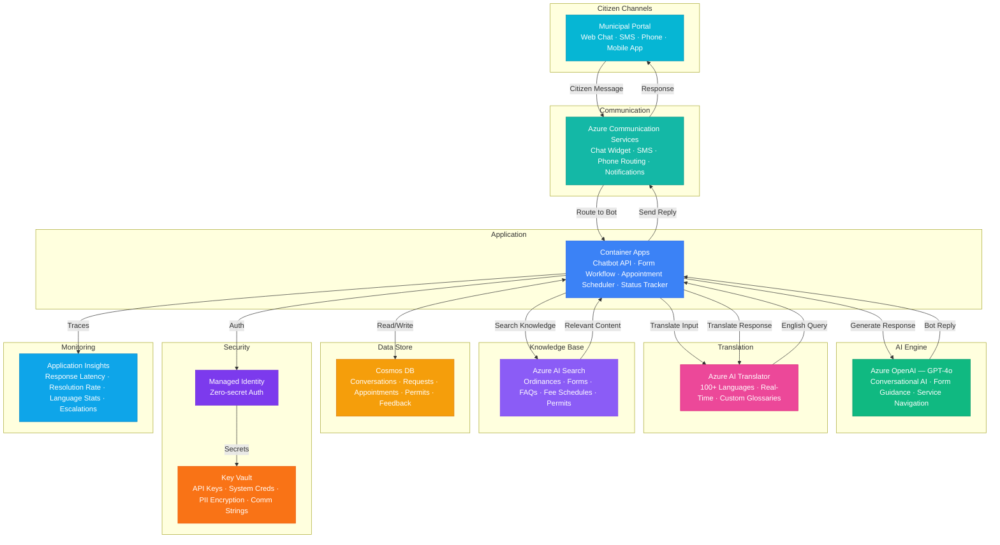

# Play 84 — Citizen Services Chatbot 🏛️

> Government AI chatbot — multi-lingual citizen support, WCAG-compliant, form assistance, permit tracking, complaint routing with human escalation.

Build a government citizen services chatbot. Temperature-zero responses ensure factual accuracy, Azure Translator provides 10+ language support, WCAG 2.2 AA accessibility is built-in, complaint routing classifies and tickets to correct departments, and human escalation is always one click away.

## Quick Start
```bash
cd solution-plays/84-citizen-services-chatbot
az deployment group create -g $RG -f infra/main.bicep -p infra/parameters.json
code .
# Use @builder to implement, @reviewer to audit, @tuner to optimize
```

## Architecture



📐 [Full architecture details](architecture.md)

## Pre-Tuned Defaults
- Language: Grade 8 reading level · 20 max words/sentence · jargon replacement
- Multi-lingual: 10 languages · auto-detect · custom government glossaries
- Privacy: No PII in chat · 30-day retention · no behavioral tracking · AI disclosure
- Routing: 7 departments · confidence 0.80 · escalation after 2 failed attempts

## DevKit (AI-Assisted Development)
| Primitive | What It Does |
|-----------|-------------|
| `agent.md` | Root orchestrator with builder→reviewer→tuner handoffs |
| `copilot-instructions.md` | Government domain (non-partisan, plain language, WCAG, privacy) |
| 3 agents | Builder (gpt-4o), Reviewer (gpt-4o-mini), Tuner (gpt-4o-mini) |
| 3 skills | Deploy (210+ lines), Evaluate (120+ lines), Tune (230+ lines) |
| 4 prompts | `/deploy`, `/test`, `/review`, `/evaluate` with agent routing |

## Cost Estimate

| Service | Dev/Test | Production | Enterprise |
|---------|----------|------------|------------|
| Azure OpenAI | $15 (PAYG) | $200 (PAYG) | $800 (PTU Reserved) |
| Azure AI Translator | $0 (Free) | $50 (PAYG) | $200 (PAYG) |
| Azure Communication Services | $5 (PAYG) | $80 (PAYG) | $300 (PAYG) |
| Azure AI Search | $0 (Free) | $250 (Standard S1) | $500 (Standard S2) |
| Cosmos DB | $3 (Serverless) | $60 (1000 RU/s) | $250 (4000 RU/s) |
| Container Apps | $10 (Consumption) | $120 (Dedicated) | $350 (Dedicated HA) |
| Key Vault | $1 (Standard) | $5 (Standard) | $15 (Premium HSM) |
| Application Insights | $0 (Free) | $25 (Pay-per-GB) | $80 (Pay-per-GB) |
| **Total** | **$34/mo** | **$790/mo** | **$2,495/mo** |

💰 [Full cost breakdown](cost.json)

## vs. Play 08 (Copilot Studio Bot)
| Aspect | Play 08 | Play 84 |
|--------|---------|---------|
| Focus | Enterprise internal bot (M365) | Government citizen-facing bot |
| Language | English (enterprise) | 10+ languages mandatory |
| Privacy | Internal RBAC | GDPR/CCPA, no behavioral tracking |
| Tone | Professional | Plain language (grade 8), non-partisan |
| Escalation | Help desk tickets | Human agent always available |

📖 [Full documentation](spec/README.md) · 🌐 [frootai.dev/solution-plays/84-citizen-services-chatbot](https://frootai.dev/solution-plays/84-citizen-services-chatbot) · 📦 [FAI Protocol](spec/fai-manifest.json)
