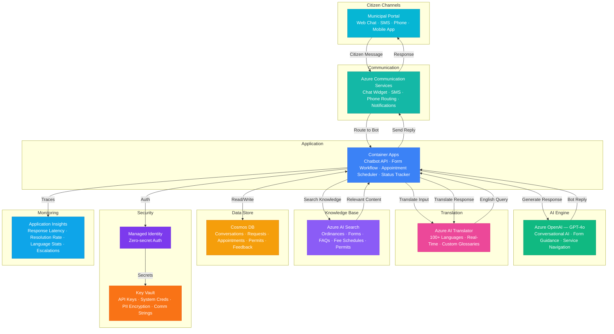

# Architecture — Play 84: Citizen Services Chatbot — Multi-Language Municipal AI Assistant

## Overview

Multi-language AI-powered chatbot that helps citizens navigate municipal services — guiding form completion, scheduling appointments, checking permit status, answering FAQs about city ordinances, and routing complex requests to appropriate departments. Azure OpenAI (GPT-4o) powers conversational understanding and multi-turn guidance: walking citizens through complex processes like building permit applications, business license renewals, and utility service changes step-by-step with contextual help. Azure AI Translator provides real-time multilingual support across 100+ languages, ensuring equitable access for diverse municipal populations including immigrant communities and non-English speakers. Azure Communication Services enables multi-channel engagement: web chat widgets on municipal websites, SMS appointment reminders, and phone routing for live agent escalation. Azure AI Search provides semantic retrieval over the municipal knowledge base — ordinances, service descriptions, form instructions, fee schedules, and departmental procedures. Cosmos DB stores conversation history, service requests, appointment bookings, and citizen feedback. Designed for city and county governments, municipal IT departments, 311 call centers, and citizen engagement teams.

## Architecture Diagram

## Data Flow

1. **Citizen Engagement**: Citizen initiates conversation via web chat widget on the municipal website, SMS text to a city number, phone call to 311, or mobile app → Azure Communication Services receives the message and routes to Container Apps chatbot API → If the message is in a non-English language, Azure AI Translator detects the language and translates to English for processing → Conversation session created in Cosmos DB with language preference, channel, timestamp, and anonymized session ID
2. **Knowledge Retrieval & Response Generation**: Chatbot API formulates a search query from the citizen's intent and sends to Azure AI Search → Semantic search retrieves relevant content from the municipal knowledge base: matching ordinance sections, form instructions, fee schedules, permit requirements, service hours, and departmental contacts → GPT-4o generates a conversational response grounded in retrieved content: answering the question, providing step-by-step guidance, or asking clarifying questions to narrow the service need → Response translated back to citizen's language via AI Translator and returned through the originating channel → Citations included: "According to Municipal Code §15.2.3..." or "Per the Building Department fee schedule..."
3. **Form Filling & Guided Workflows**: For complex service requests (building permits, business licenses, utility connections), GPT-4o enters guided workflow mode → Bot asks structured questions one at a time, validating responses against form field requirements: address validation, date formatting, document requirements, fee calculation → Pre-fills form fields from conversation context and previous citizen interactions (with consent) → At workflow completion, generates a pre-populated PDF form or submits digitally to the relevant department system → Citizen receives confirmation number via SMS or email with next steps and expected timeline
4. **Appointment Scheduling & Status Tracking**: For services requiring in-person visits, bot checks department calendar availability and offers time slots → Citizen selects preferred date/time; appointment confirmed in Cosmos DB and synced to department scheduling system → Automated SMS reminders sent 24 hours and 1 hour before appointment via Communication Services → Permit and service request status inquiries: bot queries Cosmos DB and department backend systems, returning current status, next steps, and estimated completion → Proactive notifications: status changes trigger automated SMS/email updates to citizen without requiring them to check
5. **Escalation & Analytics**: When bot confidence is low (<70%), citizen explicitly requests human help, or the query involves sensitive matters (code enforcement complaints, legal questions), conversation escalates to live agent → Full conversation history transferred to agent's interface for seamless handoff — no citizen repeating information → Analytics dashboard tracks: resolution rate (target >80% self-service), average conversation duration, language distribution, top query categories, escalation reasons, and citizen satisfaction scores (post-interaction survey) → Insights feed back to knowledge base improvements: frequently asked but poorly answered questions flagged for content team to add or improve FAQ articles

## Service Roles

| Service | Layer | Role |
|---------|-------|------|
| Azure OpenAI (GPT-4o) | Intelligence | Conversational citizen assistance, form filling guidance, multi-turn service navigation, FAQ answering, response generation |
| Azure AI Translator | Translation | Real-time multilingual support — 100+ languages, custom terminology glossaries for municipal jargon, bidirectional translation |
| Azure Communication Services | Channels | Web chat widget, SMS notifications, phone call routing, appointment reminders, proactive status updates |
| Azure AI Search | Retrieval | Semantic search over municipal knowledge base — ordinances, forms, FAQs, fee schedules, permits, service descriptions |
| Cosmos DB | Persistence | Conversation history, service requests, appointment bookings, permit status, form submissions, citizen feedback |
| Container Apps | Compute | Chatbot API — conversation orchestration, form workflow engine, appointment scheduler, translation middleware, status tracker |
| Key Vault | Security | Municipal system credentials, API keys, citizen PII encryption keys, Communication Services connection strings |
| Application Insights | Monitoring | Response latency, resolution rates, language distribution, escalation frequency, citizen satisfaction scores |

## Security Architecture

- **Citizen Privacy**: PII minimized in conversation logs — names, addresses, and SSNs masked after session completion; only anonymized analytics retained
- **ADA/Section 508 Compliance**: Chat interface meets WCAG 2.1 AA standards; SMS channel provides text-based accessibility; screen reader compatible responses
- **Managed Identity**: All service-to-service auth via managed identity — zero credentials in code for OpenAI, AI Search, Translator, Cosmos DB, Communication Services
- **Data Residency**: All citizen data processed and stored in government-approved Azure regions — compliance with state and local data residency requirements
- **RBAC**: Citizens access self-service only; department agents access escalated conversations for their department; administrators manage knowledge base and bot configuration; IT staff access analytics
- **Encryption**: All data encrypted at rest (AES-256) and in transit (TLS 1.2+) — citizen PII treated as sensitive government data
- **CJIS/FedRAMP Alignment**: For municipalities requiring criminal justice information compliance, deployment uses Azure Government regions with appropriate certifications
- **Audit Trail**: Every citizen interaction, form submission, appointment booking, and escalation logged with timestamps for public records compliance and FOIA readiness

## Scaling

| Metric | Dev | Production | Enterprise |
|--------|-----|-----------|------------|
| Concurrent conversations | 5 | 100-500 | 2,000-10,000 |
| Messages/day | 50 | 5,000-20,000 | 100,000-500,000 |
| Languages supported | 3 | 15-30 | 100+ |
| Knowledge base articles | 50 | 500-2,000 | 5,000-20,000 |
| Appointments booked/day | 5 | 100-500 | 2,000-10,000 |
| Self-service resolution rate | — | 75-85% | 85-95% |
| Container replicas | 1 | 2-4 | 6-12 |
| P95 response latency | 5s | 2.5s | 1.5s |
