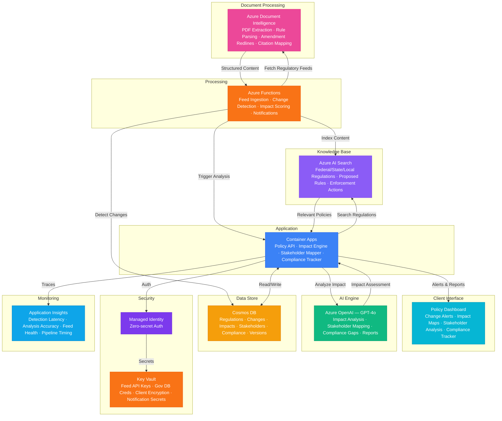

# Play 85 — Policy Impact Analyzer 📊

> AI policy analysis — provision extraction, stakeholder impact scoring, cost-benefit modeling, public comment analysis, evidence-based recommendations.

Build an evidence-based policy impact analyzer. Extract provisions from regulatory documents, score impacts per stakeholder group with uncertainty ranges, analyze public comments with campaign detection, and generate balanced recommendations presenting arguments for AND against with cited evidence.

## Quick Start
```bash
cd solution-plays/85-policy-impact-analyzer
az deployment group create -g $RG -f infra/main.bicep -p infra/parameters.json
code .
# Use @builder to implement, @reviewer to audit, @tuner to optimize
```

## Architecture



📐 [Full architecture details](architecture.md)

## Pre-Tuned Defaults
- Provisions: Structured extraction with 8 fields · zero temperature for legal accuracy
- Stakeholders: 4-category taxonomy · always assess vulnerable groups · evidence-grounded ranges
- Comments: 0.85 similarity deduplication · campaign detection · representation gap analysis
- Evidence: Ranges not points · confidence levels · precedent search · non-partisan enforcement

## DevKit (AI-Assisted Development)
| Primitive | What It Does |
|-----------|-------------|
| `agent.md` | Root orchestrator with builder→reviewer→tuner handoffs |
| `copilot-instructions.md` | Policy domain (impact assessment, non-partisanship, evidence standards) |
| 3 agents | Builder (gpt-4o), Reviewer (gpt-4o-mini), Tuner (gpt-4o-mini) |
| 3 skills | Deploy (220+ lines), Evaluate (115+ lines), Tune (230+ lines) |
| 4 prompts | `/deploy`, `/test`, `/review`, `/evaluate` with agent routing |

## Cost Estimate

| Service | Dev/Test | Production | Enterprise |
|---------|----------|------------|------------|
| Azure OpenAI | $25 (PAYG) | $350 (PAYG) | $1,200 (PTU Reserved) |
| Azure AI Search | $0 (Free) | $500 (Standard S2) | $1,000 (Standard S3) |
| Azure Document Intelligence | $0 (Free) | $150 (Standard S0) | $500 (Standard S0) |
| Cosmos DB | $3 (Serverless) | $90 (1500 RU/s) | $350 (6000 RU/s) |
| Azure Functions | $0 (Consumption) | $180 (Premium EP2) | $450 (Premium EP3) |
| Container Apps | $10 (Consumption) | $120 (Dedicated) | $350 (Dedicated HA) |
| Key Vault | $1 (Standard) | $5 (Standard) | $15 (Premium HSM) |
| Application Insights | $0 (Free) | $30 (Pay-per-GB) | $100 (Pay-per-GB) |
| **Total** | **$39/mo** | **$1,425/mo** | **$3,965/mo** |

💰 [Full cost breakdown](cost.json)

## vs. Play 84 (Citizen Services Chatbot)
| Aspect | Play 84 | Play 85 |
|--------|---------|---------|
| Focus | Citizen-facing Q&A | Policy maker analysis tool |
| Users | Citizens | Government analysts, legislators |
| Output | Conversational answers | Impact assessments + recommendations |
| Analysis | Route to department | Cost-benefit per stakeholder group |

📖 [Full documentation](spec/README.md) · 🌐 [frootai.dev/solution-plays/85-policy-impact-analyzer](https://frootai.dev/solution-plays/85-policy-impact-analyzer) · 📦 [FAI Protocol](spec/fai-manifest.json)
