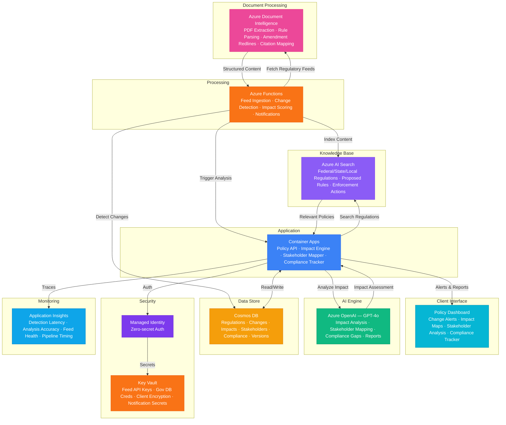

# Architecture — Play 85: Policy Impact Analyzer — Regulatory Change Detection & Cross-Sector Impact Assessment

## Overview

AI-powered regulatory intelligence platform that detects policy and regulatory changes, assesses their cross-sector impact, maps affected stakeholders, and generates compliance gap analysis. Azure OpenAI (GPT-4o) performs deep regulatory analysis — summarizing complex rule changes, identifying cascading impacts across industries, mapping stakeholder exposure, comparing proposed versus current regulations, and generating actionable compliance recommendations. Azure AI Search provides semantic retrieval over a comprehensive regulatory corpus: federal regulations (CFR, Federal Register), state statutes, local ordinances, proposed rules, enforcement actions, industry guidance documents, and historical policy amendments. Azure Document Intelligence extracts structured data from regulatory PDF filings — parsing rule text, amendment redlines, effective dates, compliance deadlines, and cross-reference citations. Azure Functions orchestrate the regulatory monitoring pipeline: feed ingestion from government sources, change detection via diff analysis, impact scoring triggers, and stakeholder notification dispatch. Cosmos DB stores regulatory change records, impact assessments, stakeholder maps, compliance tracking, and policy version history with cross-reference graph. Designed for compliance departments, government affairs teams, regulatory consulting firms, law firms, trade associations, and public policy research organizations.

## Architecture Diagram

## Data Flow

1. **Regulatory Feed Ingestion**: Azure Functions poll regulatory data sources on configurable schedules: Federal Register API (daily), state gazette RSS feeds (daily), regulatory agency dockets (hourly for comment periods), legislative tracking services (real-time for active sessions), international regulatory bodies (weekly) → Raw documents (PDF rule filings, HTML notices, XML structured data) downloaded and queued for processing → Azure Document Intelligence extracts structured content: rule text, effective dates, comment deadlines, affected CFR sections, cross-references, and amendment redline markup → Extracted content indexed in Azure AI Search with metadata: jurisdiction, agency, topic taxonomy, affected industries, regulatory type (proposed/final/interim), and effective timeline
2. **Change Detection & Diff Analysis**: When new regulatory content is indexed, Azure Functions compare against the existing regulatory corpus → Textual diff analysis identifies specific changes: new sections added, existing language modified, sections repealed, definitions changed, threshold values adjusted → GPT-4o-mini performs initial triage: classifying change significance (minor editorial, substantive, major restructuring) and assigning preliminary topic tags → High-significance changes flagged for detailed impact assessment → Change records stored in Cosmos DB with version linkage: previous text → new text → diff summary → significance score → affected entities
3. **Cross-Sector Impact Assessment**: For flagged regulatory changes, GPT-4o performs deep impact analysis → AI Search retrieves related regulations across jurisdictions: "This EPA emission standard change also affects state implementation plans in 23 states, FDA food safety rules via shared facility standards, and OSHA workplace exposure limits" → Impact scored across dimensions: compliance cost (estimated implementation burden), operational impact (process changes required), timeline urgency (days to effective date), scope breadth (number of affected entities), legal risk (enforcement penalties) → Stakeholder mapping: identifies affected parties (industry sectors, company sizes, geographic regions, workforce segments) and their specific exposure → Cascading impact chains traced: primary regulatory change → secondary regulatory responses → market effects → competitive implications
4. **Compliance Gap Analysis**: For each regulatory change affecting the organization, GPT-4o generates a compliance gap assessment → Current state evaluated: existing policies, procedures, and controls mapped against new requirements → Gap identification: specific areas where current practices fall short of new requirements, ranked by risk severity and compliance deadline → Action plan generated: recommended steps to close each gap, estimated effort and cost, responsible departments, and milestone timeline → Cross-reference with existing compliance programs: ISO 27001, SOC 2, HIPAA, SOX — identifying where existing controls partially satisfy new requirements and where incremental work is needed → Compliance tracking dashboard shows gap closure progress against regulatory deadlines
5. **Reporting & Intelligence**: Automated regulatory intelligence reports generated on configurable schedules (daily digest, weekly summary, monthly analysis) → Regulatory landscape visualization: heat maps showing regulatory activity by jurisdiction, agency, and topic — trending areas highlighted → Predictive regulatory intelligence: GPT-4o analyzes patterns in proposed rules, congressional hearings, agency strategic plans, and enforcement trends to forecast likely future regulatory directions → Custom alerts: stakeholders subscribe to specific topics, jurisdictions, or agencies — receiving targeted notifications when relevant changes are detected → Export capabilities: regulatory change briefs for board reporting, compliance matrices for audit, and policy comparison tables for government affairs

## Service Roles

| Service | Layer | Role |
|---------|-------|------|
| Azure OpenAI (GPT-4o) | Intelligence | Regulatory change summarization, cross-sector impact analysis, stakeholder mapping, compliance gap narratives, policy comparison |
| Azure AI Search | Retrieval | Semantic search over regulatory corpus — federal/state/local regulations, proposed rules, enforcement actions, industry guidance |
| Azure Document Intelligence | Extraction | Structured data extraction from regulatory PDFs — rule text, amendment redlines, citations, effective dates, compliance deadlines |
| Cosmos DB | Persistence | Regulatory change records, impact assessments, stakeholder maps, compliance tracking, policy version history, cross-reference graph |
| Azure Functions | Processing | Regulatory feed ingestion, change detection pipeline, impact scoring triggers, notification dispatch, scheduled compliance scans |
| Container Apps | Compute | Policy analysis API — impact assessment engine, stakeholder mapper, compliance gap tracker, report generator, dashboard backend |
| Key Vault | Security | Regulatory feed API keys, government database credentials, client data encryption keys, notification service secrets |
| Application Insights | Monitoring | Change detection latency, impact assessment accuracy, regulatory feed health, API throughput, analysis pipeline timing |

## Security Architecture

- **Client Confidentiality**: Compliance gap assessments and organizational exposure data are attorney-client privileged in many contexts — stored with customer-managed encryption keys and strict access controls
- **Regulatory Data Integrity**: All indexed regulations maintain cryptographic hash verification against source — ensuring no tampering between government publication and analysis
- **Managed Identity**: All service-to-service auth via managed identity — zero credentials in code for OpenAI, AI Search, Document Intelligence, Cosmos DB
- **Data Classification**: Regulatory content classified by sensitivity: public regulations (open), organizational compliance gaps (confidential), strategic regulatory intelligence (restricted)
- **RBAC**: Compliance officers access full gap analysis and action plans; government affairs teams access regulatory intelligence and impact maps; executives access summary dashboards; analysts access search and research tools
- **Encryption**: All data encrypted at rest (AES-256) and in transit (TLS 1.2+) — organizational compliance data treated as confidential business information
- **Retention Policies**: Regulatory change history retained indefinitely for compliance audit trail; impact assessments retained per industry-specific requirements (SOX: 7 years, HIPAA: 6 years)
- **Audit Trail**: Every regulatory analysis, impact assessment, compliance decision, and stakeholder notification logged with timestamps and authorization chain

## Scaling

| Metric | Dev | Production | Enterprise |
|--------|-----|-----------|------------|
| Regulatory sources monitored | 5 | 50-200 | 500-2,000 |
| Documents processed/month | 100 | 5,000-20,000 | 100,000-500,000 |
| Regulations in corpus | 1K | 50K-200K | 1M+ |
| Impact assessments/month | 10 | 200-1,000 | 5,000-20,000 |
| Stakeholder alerts/day | 5 | 100-500 | 2,000-10,000 |
| Concurrent analysts | 3 | 20-50 | 200-500 |
| Container replicas | 1 | 2-4 | 6-12 |
| P95 change detection latency | 1h | 15min | 5min |
