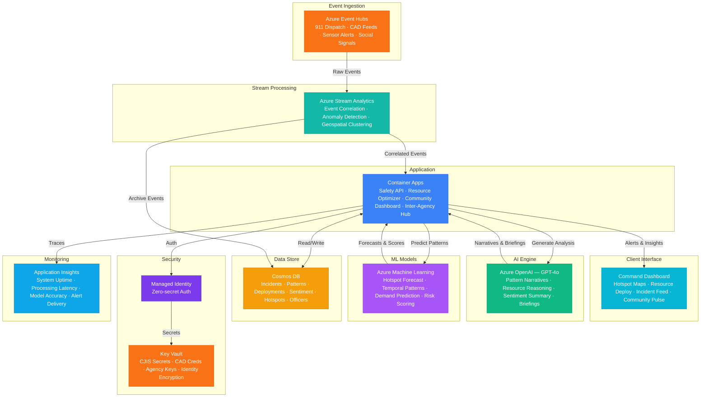

# Architecture — Play 86: Public Safety Analytics — Crime Pattern Prediction & Resource Allocation

## Overview

AI-powered public safety analytics platform that predicts crime patterns, optimizes law enforcement resource allocation, and analyzes community sentiment to support data-driven policing strategies. Azure OpenAI (GPT-4o) generates incident analysis narratives — correlating multi-source intelligence into crime pattern reports, explaining resource allocation recommendations in natural language, summarizing community sentiment trends, and drafting cross-agency intelligence briefings. Azure Machine Learning trains and serves predictive models for crime hotspot forecasting, temporal pattern detection, resource demand prediction, and risk scoring using historical incident data, demographic indicators, environmental factors, and seasonal patterns. Azure Event Hubs provides real-time ingestion of 911 dispatch events, CAD (Computer-Aided Dispatch) system feeds, sensor alerts, social media signals, and inter-agency data streams. Azure Stream Analytics performs real-time event correlation — sliding window anomaly detection, geospatial clustering of concurrent incidents, and pattern matching across multiple event sources. Cosmos DB stores incident records, crime patterns, resource deployment history, community sentiment data, and geospatial hotspot information. Designed for police departments, sheriff's offices, emergency management agencies, fusion centers, and public safety research organizations.

## Architecture Diagram

## Data Flow

1. **Multi-Source Event Ingestion**: Azure Event Hubs receives real-time feeds from: 911/CAD dispatch systems (call type, location, priority, unit assignment, disposition), ShotSpotter-style acoustic sensors (gunfire detection with triangulated location), environmental sensors (streetlight outages, traffic anomalies, weather stations), community tip lines and non-emergency reports, inter-agency intelligence feeds (neighboring jurisdictions, federal alerts) → Social media signals processed through content safety filters — extracting geotagged public safety mentions (traffic incidents, crowd events, emergency reports) without surveillance of protected speech → Event Hubs partitions by geographic beat/district for ordered processing within patrol areas
2. **Real-Time Event Correlation**: Azure Stream Analytics processes incoming event streams through temporal and spatial correlation rules → Sliding window analysis (5-minute, 15-minute, 1-hour windows): detects clusters of related incidents (e.g., 3+ vehicle break-ins within 1 mile in 30 minutes) → Geospatial clustering: identifies emerging hotspots where current incident density significantly exceeds historical baseline for that time/day/location → Anomaly scoring: events rated by how unusual they are compared to historical patterns — a burglary in a typically zero-crime area scores higher than the same crime in a known hotspot → Correlated events pushed to Container Apps for ML-enhanced analysis and command dashboard display → Raw events archived to Cosmos DB for historical pattern training
3. **Predictive Crime Pattern Analysis**: Azure ML serves ensemble prediction models trained on historical incident data (3-5 years), enriched with contextual features → Temporal patterns: day-of-week, hour-of-day, payday cycles, holiday effects, school schedule, seasonal trends, event calendar (concerts, sports games) → Spatial patterns: land use types, commercial density, transit proximity, lighting conditions, vacancy rates, demographic indicators → Environmental factors: weather (temperature, precipitation, visibility), daylight hours, moon phase → Models produce 4-hour-ahead predictions at beat/sector level: predicted incident types, volumes, and confidence intervals → Hotspot maps generated with transparent methodology: every prediction includes the top contributing factors so officers and commanders understand the reasoning
4. **Resource Allocation Optimization**: Based on predicted demand and current active incidents, optimization engine recommends patrol deployment → Constraint-based optimization: minimum coverage per beat, response time targets (Priority 1 <5 minutes), shift coverage requirements, officer workload balancing → GPT-4o generates natural language deployment recommendations: "Shift evening patrol emphasis to Beat 7 — model predicts elevated property crime risk (confidence 78%) due to construction-site vacancy + shortened daylight + payday weekend pattern" → What-if scenarios: commanders can model "what happens if I move 2 units from District A to District B?" with predicted impact on response times and coverage gaps → Historical deployment effectiveness tracked: comparing predicted versus actual incidents for each deployment decision, feeding back into model improvement
5. **Community Engagement & Transparency**: Community sentiment analysis processes 311 calls, community meeting transcripts, public comment submissions, and anonymized social media trends → GPT-4o summarizes sentiment themes: safety concerns by neighborhood, trust indicators, service quality perceptions, emerging community issues → Public-facing transparency dashboard (anonymized): crime statistics, response time metrics, resource allocation visualization, and community safety trends → CompStat-style reports auto-generated weekly: precinct-by-precinct performance, trend arrows, notable patterns, and commander talking points → All AI predictions and resource recommendations include explainability documentation — no "black box" decisions; every recommendation traces to data sources and model factors

## Service Roles

| Service | Layer | Role |
|---------|-------|------|
| Azure OpenAI (GPT-4o) | Intelligence | Crime pattern narratives, resource allocation reasoning, community sentiment summaries, cross-agency intelligence briefings |
| Azure Machine Learning | Prediction | Crime hotspot forecasting, temporal pattern detection, resource demand prediction, risk scoring, model explainability |
| Azure Event Hubs | Ingestion | Real-time 911/CAD events, sensor alerts, social media signals, inter-agency data streams — ordered by geographic partition |
| Azure Stream Analytics | Processing | Real-time event correlation, sliding window anomaly detection, geospatial incident clustering, emerging hotspot identification |
| Cosmos DB | Persistence | Incident records, crime patterns, resource deployment history, community sentiment, geospatial hotspots, officer activity logs |
| Container Apps | Compute | Public safety API — resource optimizer, community dashboard backend, inter-agency data sharing hub, reporting engine |
| Key Vault | Security | CJIS-compliant secret management — CAD credentials, inter-agency API keys, officer identity encryption, evidence chain keys |
| Application Insights | Monitoring | System uptime (mission-critical 99.9%+), event processing latency, model prediction accuracy, API availability, alert delivery |

## Security Architecture

- **CJIS Compliance**: Entire platform deployed on Azure Government with CJIS Security Policy compliance — encryption in transit and at rest, personnel background checks, audit logging, session management
- **Criminal Justice Data Protection**: All incident data encrypted with customer-managed keys; CJIS-compliant access controls with multi-factor authentication for all law enforcement personnel
- **Managed Identity**: All service-to-service auth via managed identity — zero credentials in code for OpenAI, ML endpoints, Event Hubs, Cosmos DB, Stream Analytics
- **Data Minimization**: Predictive models use aggregated statistical patterns, not individual-level data — no personal information in prediction inputs; social media analysis restricted to public safety-relevant geotagged posts
- **Bias Mitigation**: ML models audited quarterly for geographic and demographic bias — predictions must not disproportionately target protected communities; fairness metrics included in model evaluation pipeline
- **RBAC**: Patrol officers access beat-level predictions and active incidents; watch commanders access district-level resources and deployment tools; analysts access pattern investigation; chiefs access strategic dashboards; community liaison accesses public transparency data
- **Encryption**: All data encrypted at rest (AES-256 with CJIS-compliant key management) and in transit (TLS 1.2+ with FIPS 140-2 validated modules)
- **Audit Trail**: Every prediction viewed, resource recommendation made, deployment decision executed, and data access event logged — CJIS-compliant audit trail with 365-day minimum retention

## Scaling

| Metric | Dev | Production | Enterprise |
|--------|-----|-----------|------------|
| 911/CAD events/day | 100 | 2,000-10,000 | 50,000-200,000 |
| Prediction refreshes/day | 6 | 24-48 (every 30-60min) | 96+ (every 15min) |
| Hotspot zones tracked | 10 | 100-500 | 2,000-10,000 |
| Officers/units tracked | 10 | 100-500 | 2,000-10,000 |
| Historical incidents in corpus | 5K | 500K-2M | 10M+ |
| Concurrent dashboard users | 3 | 20-50 | 200-1,000 |
| Container replicas | 1 | 3-5 | 8-16 |
| P95 event-to-insight latency | 60s | 15s | 5s |
