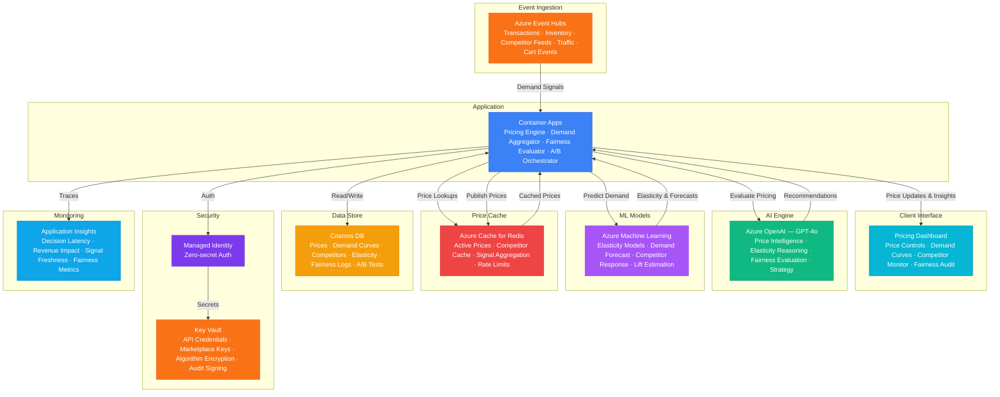

# Architecture — Play 87: Dynamic Pricing Engine — Real-Time Price Optimization with Demand Signals & Fairness Guardrails

## Overview

AI-powered dynamic pricing platform that optimizes product and service prices in real time based on demand signals, competitor pricing, inventory levels, and customer segments while enforcing fairness guardrails to prevent discriminatory pricing. Azure OpenAI (GPT-4o) provides pricing intelligence — interpreting complex demand signals, generating competitor analysis narratives, evaluating price elasticity reasoning, assessing fairness constraint compliance, and recommending promotional strategies. Azure Event Hubs ingests real-time demand signals: transaction streams, inventory level changes, competitor price feeds, web traffic patterns, cart abandonment events, and seasonal trend triggers. Azure Machine Learning trains and serves price elasticity models, demand forecasting, competitor response prediction, optimal price point calculation, and promotional lift estimation. Azure Cache for Redis provides sub-millisecond active price lookups, competitor price caching, demand signal aggregation, and pricing session consistency. Cosmos DB stores price records, demand curves, competitor snapshots, elasticity models, fairness audit logs, and A/B test results. Designed for e-commerce platforms, airlines, hotels, ride-sharing services, retail chains, SaaS companies, and any business requiring dynamic pricing with regulatory compliance.

## Architecture Diagram

## Data Flow

1. **Demand Signal Ingestion**: Azure Event Hubs receives real-time feeds from multiple demand indicators: point-of-sale transaction streams (product, quantity, price, location, time), inventory management systems (stock levels, replenishment schedules, warehouse transfers), competitor price monitoring services (scraped prices, promotional alerts, stock availability), web analytics (product page views, search volume, wishlist additions, cart events), external signals (weather forecasts, event calendars, social media trends, economic indicators) → Events partitioned by product category for ordered processing within pricing domains → Demand signal aggregation windows (1-minute, 5-minute, 1-hour) compute rolling statistics: transaction velocity, price-to-demand correlation, competitor price deltas, and inventory burn rates
2. **Demand Forecasting & Elasticity Modeling**: Azure ML serves ensemble models trained on historical transaction data (12-24 months), enriched with contextual features → Price elasticity estimation: how demand changes for each 1% price adjustment, segmented by customer tier, time of day, day of week, and seasonal context → Demand forecasting: predicted unit sales at various price points for the next 1-hour, 4-hour, and 24-hour windows → Competitor response prediction: likelihood and magnitude of competitor price matching within specific timeframes based on historical patterns → Cannibalization analysis: how pricing one product affects demand for substitute and complementary products → Models retrained daily with sliding window data; real-time inference via managed endpoints with sub-100ms latency
3. **Dynamic Price Calculation**: Container Apps pricing engine combines ML predictions with business rules to calculate optimal prices → Objective function optimization: maximize revenue, margin, or unit volume (configurable per product/category) subject to constraints → Price bounds enforcement: minimum margin floors, maximum markup ceilings, price change rate limits (no more than X% change per hour), and competitor price parity rules → Segment-aware pricing: different optimal prices for loyalty tiers, geographic regions, channels (web vs. mobile vs. in-store), and volume brackets → A/B price testing: randomized controlled experiments to validate elasticity model predictions — statistical significance testing before rolling out new price strategies → GPT-4o generates natural language pricing rationale: "Recommended 8% price increase for Widget-X based on 23% demand surge (concert weekend), competitor stock-out at Store-B, and historical elasticity of -0.6 at current price point"
4. **Fairness Guardrail Enforcement**: Before any price is published, the fairness evaluation layer applies regulatory and ethical constraints → Anti-discrimination checks: prices must not systematically vary by protected characteristics (race, gender, age, zip-code as proxy for demographics) — statistical tests run on price distributions across segments → Price gouging protection: automated detection of emergency/crisis conditions triggers price ceiling enforcement per applicable regulations (state anti-gouging laws) → Transparency requirements: every price decision logged with full reasoning chain — demand signals, model inputs, optimization objective, constraints applied, and final price rationale → Audit trail: regulators and internal compliance can reconstruct any pricing decision from signals → inputs → model → constraints → output → GPT-4o evaluates edge cases: "Price increase flagged — 15% surge pricing in Zone-3 during severe weather event may trigger anti-gouging regulation in [State]. Recommend capping at 10% per statute §XX-XXX"
5. **Price Publication & Monitoring**: Approved prices published to Redis cache for sub-millisecond retrieval by storefront and API consumers → Price change events propagated via Cosmos DB change feed to downstream systems: e-commerce platforms, POS systems, price tag APIs, marketplace integrations → Revenue impact tracking: real-time comparison of actual revenue versus predicted revenue at each price point, feeding back into model accuracy metrics → Competitive position monitoring: continuous tracking of price position relative to competitors (premium, parity, discount) by product and category → Dashboard visualization: price trend charts, demand curve overlays, revenue heatmaps, fairness compliance scorecards, and A/B test results

## Service Roles

| Service | Layer | Role |
|---------|-------|------|
| Azure OpenAI (GPT-4o) | Intelligence | Demand signal interpretation, pricing rationale generation, fairness constraint evaluation, competitive strategy recommendations |
| Azure Event Hubs | Ingestion | Real-time demand signals — transactions, inventory, competitor prices, web traffic, cart events, external factors |
| Azure Machine Learning | Prediction | Price elasticity models, demand forecasting, competitor response prediction, cannibalization analysis, promotional lift estimation |
| Azure Cache for Redis | Caching | Sub-millisecond active price lookups, competitor price cache, demand signal aggregation, rate limiting, pricing session consistency |
| Cosmos DB | Persistence | Price records, demand curves, competitor snapshots, elasticity models, fairness audit logs, A/B test results, pricing rule configs |
| Container Apps | Compute | Pricing engine API — price calculation, demand aggregation, fairness evaluation, A/B test orchestration, competitor monitoring |
| Key Vault | Security | Competitor API credentials, marketplace integration keys, pricing algorithm encryption, audit trail signing keys |
| Application Insights | Monitoring | Price decision latency, revenue impact tracking, demand signal freshness, model accuracy, fairness compliance metrics |

## Security Architecture

- **Pricing Algorithm Protection**: Proprietary pricing algorithms and elasticity models encrypted at rest with customer-managed keys — competitive advantage protected from insider and external threats
- **Competitor Data Compliance**: Competitor price data collected only from publicly available sources; no price-fixing communication channels; antitrust compliance verified by legal review
- **Managed Identity**: All service-to-service auth via managed identity — zero credentials in code for OpenAI, ML endpoints, Event Hubs, Redis, Cosmos DB
- **Fairness Audit Trail**: Every pricing decision logged with complete reasoning chain — demand signals, model inputs, constraints applied, fairness evaluation result, and final price; immutable audit log for regulatory review
- **RBAC**: Pricing analysts access price recommendations and A/B results; revenue managers approve pricing strategies; compliance officers access fairness audits; executives access revenue dashboards; developers access model metrics
- **Encryption**: All data encrypted at rest (AES-256) and in transit (TLS 1.2+) — pricing strategy data treated as confidential business intelligence
- **Anti-Gaming**: Rate limiting and anomaly detection prevent competitors from reverse-engineering pricing algorithms through systematic price probing
- **PCI Awareness**: Transaction data used for demand signals stripped of payment card information before ingestion — only product, quantity, price, and anonymized customer segment retained

## Scaling

| Metric | Dev | Production | Enterprise |
|--------|-----|-----------|------------|
| Price decisions/hour | 100 | 10,000-100,000 | 1M-10M |
| Products actively priced | 50 | 5,000-50,000 | 500,000-5M |
| Demand signals/second | 10 | 500-5,000 | 50,000-500,000 |
| Competitor prices tracked | 20 | 1,000-10,000 | 100,000-1M |
| A/B experiments active | 2 | 20-50 | 200-1,000 |
| Concurrent API consumers | 3 | 50-200 | 1,000-10,000 |
| Container replicas | 1 | 3-6 | 10-20 |
| P95 price decision latency | 500ms | 100ms | 25ms |
