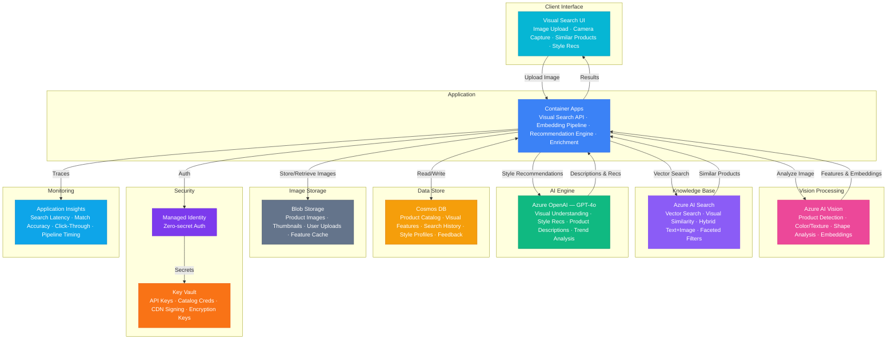

# Architecture — Play 88: Visual Product Search — Image-Based Product Discovery with Visual Similarity & Style Recommendations

## Overview

AI-powered visual product search platform that enables customers to discover products by uploading images, finding visually similar items, receiving style recommendations, and exploring product catalogs through natural visual interaction. Azure AI Vision performs image analysis and visual feature extraction — product detection, color and texture analysis, shape recognition, scene understanding, and image embedding generation for similarity search. Azure OpenAI (GPT-4o) provides visual understanding — generating image-to-text product descriptions, crafting style recommendation narratives, reasoning about cross-sell opportunities, interpreting natural language product queries, and identifying visual trends. Azure AI Search enables vector search over product image embeddings — visual similarity retrieval, hybrid text-plus-image search, faceted filtering by visual attributes (color, pattern, shape), and semantic product ranking. Container Apps hosts the visual search API orchestrating image processing, embedding generation, similarity retrieval, and recommendation serving. Cosmos DB stores product catalog metadata, visual feature vectors, user search history, style preference profiles, and recommendation feedback. Designed for e-commerce platforms, fashion retailers, home décor marketplaces, automotive parts suppliers, art galleries, and any business where visual product discovery drives conversion.

## Architecture Diagram

## Data Flow

1. **Image Upload & Preprocessing**: Customer uploads a product image via camera capture, file upload, or screenshot paste → Container Apps receives the image and stores it in Blob Storage (resized variants generated: 256×256 thumbnail for embedding, 512×512 for display, original preserved) → Image validated: format check (JPEG, PNG, WebP), size limits (max 20MB), content safety screening via Azure AI Content Safety → Preprocessing pipeline: background removal for product isolation, auto-rotation, color normalization, and quality assessment → If image quality is too low or no product detected, user receives guidance: "Try a closer photo with better lighting" with example comparison
2. **Visual Feature Extraction**: Azure AI Vision processes the uploaded image through multiple analysis pipelines → Object detection: identifies product category (clothing, furniture, electronics, accessories) and bounding box isolation → Visual attributes: dominant colors (hex values), texture patterns (solid, striped, plaid, floral), material appearance (leather, cotton, metal, wood), shape descriptors → Scene context: indoor/outdoor, lifestyle setting, complementary items visible → Image embedding: 1024-dimensional vector representation capturing visual semantics — products that look similar produce nearby vectors → All extracted features stored in Cosmos DB linked to the search session; embedding vector indexed in AI Search for real-time similarity queries
3. **Visual Similarity Search**: AI Search performs vector similarity search using the uploaded image's embedding → k-NN search returns top-50 visually similar products from the catalog, ranked by cosine similarity → Hybrid search combines visual similarity with text metadata: if the user added text like "red leather bag," both visual features and text relevance contribute to ranking → Faceted filtering: users refine results by extracted visual attributes (color family, pattern type, material, price range, brand) → Visual diversity injection: results de-duplicated to avoid showing 10 identical black t-shirts — ensures variety across styles, brands, and price points while maintaining visual relevance → Results enriched with product metadata from Cosmos DB: pricing, availability, ratings, and merchant information
4. **Style Recommendations**: GPT-4o analyzes the search context to generate personalized style recommendations → "Complete the look" suggestions: based on the searched product, recommend complementary items (matching shoes for a dress, throw pillows for a sofa, accessories for an outfit) → Style narrative: natural language explanation of why products match — "This cognac leather tote pairs well with your searched boots — matching leather grain and hardware finish create a coordinated look" → Trend context: relates searched items to current style trends — seasonal relevance, trending colors, popular combinations → User style profile builds over time: search history, click patterns, and purchase feedback refine future recommendations → Cross-category discovery: "Customers who searched for similar mid-century chairs also explored these pendant lights and area rugs"
5. **Feedback Loop & Catalog Enrichment**: User interactions feed back into search quality improvement → Click-through tracking: which visual matches users actually click, view, and purchase — positive signal for future ranking → Negative feedback: "not similar" button allows users to flag poor matches, creating training data for embedding model fine-tuning → Product catalog enrichment: AI Vision automatically generates visual attributes for catalog products that lack structured metadata — color tags, pattern descriptions, material labels → Search analytics dashboard: popular search categories, conversion rates by visual match quality, trending product styles, and catalog coverage gaps → A/B testing of ranking algorithms: compare visual-only, hybrid, and personalized ranking strategies with conversion as the optimization metric

## Service Roles

| Service | Layer | Role |
|---------|-------|------|
| Azure AI Vision | Perception | Product detection, color/texture/shape analysis, scene understanding, image embedding generation for visual similarity |
| Azure OpenAI (GPT-4o) | Intelligence | Visual understanding, style recommendation narratives, product description generation, trend interpretation, cross-sell reasoning |
| Azure AI Search | Retrieval | Vector similarity search over product embeddings, hybrid text+image ranking, faceted visual filtering, semantic product ranking |
| Container Apps | Compute | Visual search API — image processing pipeline, embedding orchestration, recommendation engine, product enrichment |
| Cosmos DB | Persistence | Product catalog metadata, visual feature vectors, user search history, style preference profiles, recommendation feedback |
| Blob Storage | Storage | Product images (originals + resized variants), user-uploaded search images, thumbnail cache, visual feature extraction results |
| Key Vault | Security | Image processing API keys, catalog integration credentials, CDN signing keys, user data encryption keys |
| Application Insights | Monitoring | Search latency, visual match accuracy, recommendation click-through rates, API throughput, image processing pipeline timing |

## Security Architecture

- **User Privacy**: User-uploaded search images deleted after 24 hours unless explicitly saved; search history anonymized after 90 days; no facial recognition or biometric analysis on uploaded images
- **Content Safety**: All uploaded images screened through Azure AI Content Safety before processing — inappropriate content blocked with user notification
- **Managed Identity**: All service-to-service auth via managed identity — zero credentials in code for Vision, OpenAI, AI Search, Cosmos DB, Blob Storage
- **Image Access Control**: Product images served via CDN with signed URLs (time-limited access tokens); user-uploaded images accessible only to the uploading session
- **RBAC**: Customers access search and recommendations; merchandising teams access catalog enrichment tools; data scientists access search analytics and model metrics; administrators access system configuration
- **Encryption**: All data encrypted at rest (AES-256) and in transit (TLS 1.2+) — product catalog data treated as merchant confidential information
- **Rate Limiting**: Per-user and per-IP rate limits on image uploads prevent abuse and cost overruns; progressive rate limits: 10 searches/minute free, higher for authenticated users
- **DMCA Compliance**: Reverse image search results include only products from authorized catalog partners; no unauthorized reproduction of copyrighted product imagery

## Scaling

| Metric | Dev | Production | Enterprise |
|--------|-----|-----------|------------|
| Image searches/day | 100 | 50,000-200,000 | 1M-10M |
| Products in visual index | 500 | 100,000-500,000 | 5M-50M |
| Image embeddings stored | 500 | 500,000-2M | 10M-100M |
| Style recommendations/day | 50 | 20,000-100,000 | 500,000-5M |
| Product images in storage | 2K | 500K-2M | 10M-100M |
| Concurrent search users | 5 | 200-1,000 | 5,000-50,000 |
| Container replicas | 1 | 3-6 | 8-20 |
| P95 search latency | 3s | 800ms | 300ms |
