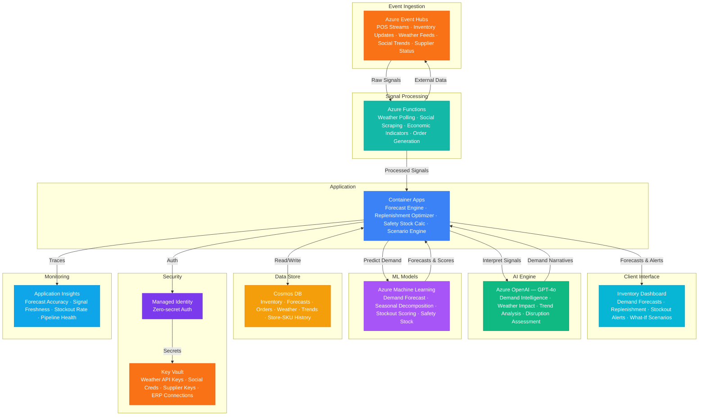

# Play 89 — Retail Inventory Predictor 📦

> AI demand forecasting — SKU-level prediction, dynamic safety stock, promotion modeling, automated replenishment, stockout prevention.

Build a retail inventory prediction system. LightGBM forecasts demand per SKU × store with promotion/weather/event features, dynamic safety stock adapts to demand variability, Croston handles slow movers, and event-driven replenishment triggers purchase orders before stockout.

## Quick Start
```bash
cd solution-plays/89-retail-inventory-predictor
az deployment group create -g $RG -f infra/main.bicep -p infra/parameters.json
code .
# Use @builder to implement, @reviewer to audit, @tuner to optimize
```

## Architecture



📐 [Full architecture details](architecture.md)

## Pre-Tuned Defaults
- Forecast: LightGBM · 14-day horizon · daily updates · 20+ features · Croston for slow movers
- Safety Stock: Dynamic · z-score based · 95% service level default · category overrides
- Promotions: 5 promo types with lift + post-promo dip · cannibalization modeling
- Reorder: Event-driven · per-supplier lead time · 20% promo buffer · emergency supplier

## DevKit (AI-Assisted Development)
| Primitive | What It Does |
|-----------|-------------|
| `agent.md` | Root orchestrator with builder→reviewer→tuner handoffs |
| `copilot-instructions.md` | Inventory domain (demand forecasting, safety stock, promotion effects) |
| 3 agents | Builder (gpt-4o), Reviewer (gpt-4o-mini), Tuner (gpt-4o-mini) |
| 3 skills | Deploy (220+ lines), Evaluate (115+ lines), Tune (235+ lines) |
| 4 prompts | `/deploy`, `/test`, `/review`, `/evaluate` with agent routing |

## Cost Estimate

| Service | Dev/Test | Production | Enterprise |
|---------|----------|------------|------------|
| Azure OpenAI | $25 (PAYG) | $300 (PAYG) | $1,100 (PTU Reserved) |
| Azure Machine Learning | $15 (Basic) | $350 (Standard) | $1,000 (Standard GPU) |
| Cosmos DB | $3 (Serverless) | $120 (2000 RU/s) | $450 (8000 RU/s) |
| Azure Event Hubs | $12 (Basic) | $150 (Standard) | $600 (Premium) |
| Azure Functions | $0 (Consumption) | $180 (Premium EP2) | $450 (Premium EP3) |
| Container Apps | $10 (Consumption) | $150 (Dedicated) | $400 (Dedicated HA) |
| Key Vault | $1 (Standard) | $5 (Standard) | $15 (Premium HSM) |
| Application Insights | $0 (Free) | $35 (Pay-per-GB) | $120 (Pay-per-GB) |
| **Total** | **$66/mo** | **$1,290/mo** | **$4,135/mo** |

💰 [Full cost breakdown](cost.json)

## vs. Play 87 (Dynamic Pricing Engine)
| Aspect | Play 87 | Play 89 |
|--------|---------|---------|
| Focus | Price optimization | Inventory replenishment |
| Model | Elasticity (price↔demand) | Demand forecasting (time-series) |
| Output | Optimal price per product | Reorder point + order quantity |
| Promotion | Price point A/B testing | Demand lift + post-promo dip |

📖 [Full documentation](spec/README.md) · 🌐 [frootai.dev/solution-plays/89-retail-inventory-predictor](https://frootai.dev/solution-plays/89-retail-inventory-predictor) · 📦 [FAI Protocol](spec/fai-manifest.json)
