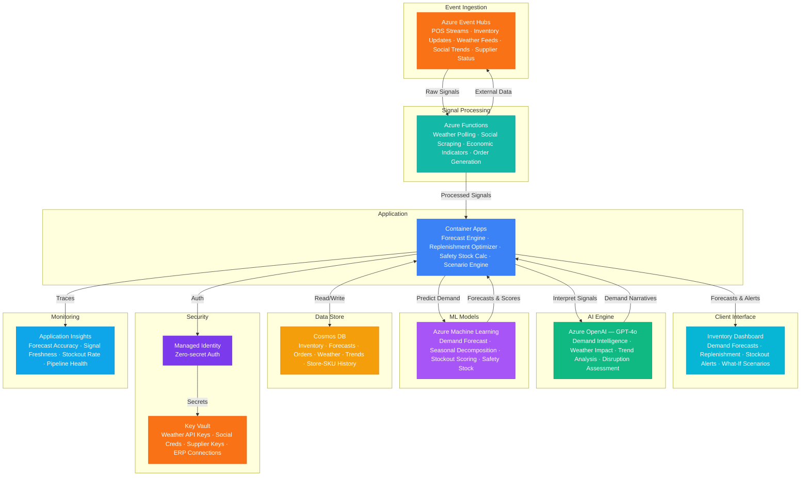

# Architecture — Play 89: Retail Inventory Predictor — Demand Forecasting with Weather, Social Trends & Economic Indicators

## Overview

AI-powered demand forecasting platform that predicts retail inventory needs by correlating point-of-sale data with external signals including weather patterns, social media trends, economic indicators, and promotional calendars to optimize replenishment, reduce stockouts, and minimize overstock waste. Azure OpenAI (GPT-4o) provides demand intelligence — interpreting weather impact on product categories, analyzing social trend momentum, assessing economic indicator implications, reasoning about promotional lift effects, and generating natural language demand narratives for merchandising teams. Azure Machine Learning trains and serves demand forecasting models: time-series prediction, weather-demand correlation, promotional lift estimation, seasonal decomposition, stockout probability scoring, and safety stock optimization at store-SKU granularity. Azure Event Hubs ingests real-time signals: POS transaction streams, inventory level updates, weather data feeds, social media trend triggers, supplier status notifications, and promotional event signals. Azure Functions orchestrate signal processing: weather API polling, social trend scraping, economic indicator ingestion, and forecast-to-replenishment order conversion. Cosmos DB stores inventory snapshots, demand forecasts, replenishment orders, weather correlations, and store-SKU performance history. Designed for retail chains, grocery stores, fashion retailers, convenience stores, warehouse distributors, and e-commerce fulfillment centers.

## Architecture Diagram

## Data Flow

1. **Multi-Signal Data Ingestion**: Azure Event Hubs receives real-time feeds from internal and external sources: POS transaction streams (product, quantity, price, store, timestamp — every transaction across all locations), inventory management system updates (on-hand counts, receiving, transfers, shrinkage), weather services (hourly forecasts, severe weather alerts, temperature and precipitation for each store's trade area), social media trend APIs (trending products, viral mentions, influencer endorsements, hashtag velocity), economic indicators (consumer confidence index, unemployment rates, gas prices, commodity costs), promotional calendar events (planned markdowns, circular items, loyalty program offers) → Azure Functions poll external APIs on configurable schedules: weather (hourly), social trends (every 15 minutes), economic indicators (daily) → All signals timestamped and partitioned by retail region for ordered processing
2. **Demand Signal Correlation & Feature Engineering**: Azure Functions process raw signals into ML-ready features → Weather features: temperature delta from seasonal norm, precipitation probability, severe weather warnings, "weather-appropriate product" scoring (e.g., hot chocolate demand correlates with temperature drop below 40°F) → Social trend features: product mention velocity, sentiment score, influencer reach multiplier, trend lifecycle stage (emerging, peaking, declining) → Economic features: consumer confidence trend direction, gas price impact on store traffic, commodity cost impact on product pricing → Promotional features: markdown depth, circular page position, loyalty point multiplier, competitive promotion overlap → Historical demand patterns: same-day-last-year, trailing 4-week average, day-of-week index, holiday proximity weighting → Engineered features stored in Cosmos DB as forecast input vectors linked to store-SKU-date combinations
3. **Demand Forecasting**: Azure ML serves ensemble forecasting models at store-SKU granularity → Base forecast: time-series models (Prophet, LightGBM, DeepAR) trained on 2-3 years of POS history, producing point forecasts and prediction intervals for 1-day, 7-day, and 28-day horizons → Weather adjustment layer: learned correlations between weather patterns and category demand — rain increases umbrella demand 340%, heatwaves increase beverage demand 180%, snow events suppress store traffic 40% but increase delivery orders 200% → Social trend overlay: when a product trends on social media, the model applies a trend multiplier calibrated on historical social-to-sales conversion rates with decay curves → Promotional lift model: separate model estimates incremental units from each promotion type, calibrated on historical promotion response by product category, price point, and market → GPT-4o generates merchandiser-facing forecast narratives: "Widget-X demand expected to surge 45% next Tuesday — driven by cold front (20°F below normal) plus TikTok viral trend (850K views, engagement rising). Recommend increasing order by 200 units at Distribution Center East"
4. **Replenishment Optimization**: Forecast-to-order conversion engine translates demand predictions into replenishment actions → Safety stock calculation: dynamic safety stock levels computed from forecast uncertainty intervals, supplier lead time variability, and target service level (95-99% fill rate) → Economic order quantity: optimal order sizes balancing carrying costs, ordering costs, and volume discounts from suppliers → Distribution network optimization: which distribution center should fulfill each store's order based on current inventory levels, transit times, and warehouse capacity → Automated replenishment orders generated for review: high-confidence forecasts (narrow prediction intervals) auto-approved and sent to suppliers; low-confidence forecasts flagged for merchandiser review → What-if scenario engine: merchandisers can model "what if we run a 30% off promotion next week?" or "what if the cold snap lasts 3 extra days?" with updated forecasts and replenishment recommendations
5. **Performance Monitoring & Continuous Learning**: Forecast accuracy continuously measured and fed back into model improvement → Accuracy metrics: MAPE (Mean Absolute Percentage Error), WMAPE (Weighted MAPE), stockout rate, overstock rate, forecast bias direction → Automated model retraining triggered when accuracy drops below thresholds — sliding window retraining incorporating latest POS data and signal correlations → Signal value assessment: each external signal (weather, social, economic) evaluated for its marginal forecast improvement contribution — signals that don't improve accuracy can be deprioritized to save ingestion costs → Exception reporting: products with consistently poor forecast accuracy flagged for manual review — often indicates data quality issues, new product launch patterns, or structural demand shifts → Dashboard for merchandising teams: store-level forecast accuracy, replenishment fulfillment rates, waste reduction metrics, and revenue impact from improved stocking

## Service Roles

| Service | Layer | Role |
|---------|-------|------|
| Azure OpenAI (GPT-4o) | Intelligence | Demand signal interpretation, weather impact narratives, social trend analysis, supply chain disruption assessment, merchandiser-facing explanations |
| Azure Machine Learning | Prediction | Demand forecasting (Prophet/LightGBM/DeepAR), weather-demand correlation, promotional lift, stockout probability, safety stock optimization |
| Azure Event Hubs | Ingestion | Real-time POS transaction streams, inventory updates, weather feeds, social trend triggers, supplier notifications, promotional signals |
| Azure Functions | Processing | External API polling (weather, social, economic), signal feature engineering, forecast-to-order conversion, supplier notification dispatch |
| Cosmos DB | Persistence | Inventory snapshots, demand forecasts, replenishment orders, weather correlations, social trend data, store-SKU history, supplier lead times |
| Container Apps | Compute | Forecast engine API — demand prediction, replenishment optimization, safety stock calculation, what-if scenario modeling, dashboard backend |
| Key Vault | Security | Weather API keys, social media API credentials, supplier system integration keys, ERP connection strings, inventory data encryption keys |
| Application Insights | Monitoring | Forecast accuracy (MAPE/WMAPE), signal freshness, replenishment timing, stockout prediction success, API latency, pipeline health |

## Security Architecture

- **Competitive Intelligence Protection**: Demand forecasts and inventory position data are competitively sensitive — encrypted at rest with customer-managed keys; access restricted to authorized merchandising and supply chain roles
- **Supplier Data Isolation**: Each supplier sees only their own products' replenishment orders; no cross-supplier demand data or competitive positioning information shared
- **Managed Identity**: All service-to-service auth via managed identity — zero credentials in code for OpenAI, ML endpoints, Event Hubs, Functions, Cosmos DB
- **Data Minimization**: Social media signals processed as aggregated trend scores, not individual user data; weather data is publicly available; POS data anonymized (no customer identity in demand signals)
- **RBAC**: Store managers access store-level forecasts and replenishment status; category merchandisers access category-wide demand insights and order approvals; supply chain planners access distribution network optimization; executives access aggregate demand and waste reduction dashboards
- **Encryption**: All data encrypted at rest (AES-256) and in transit (TLS 1.2+) — inventory position data treated as confidential business intelligence
- **API Security**: External data source APIs accessed through Key Vault-managed credentials; rate-limited and monitored for anomalous access patterns
- **Audit Trail**: Every replenishment order, forecast override, and manual adjustment logged with authorization chain — supports inventory accounting and supplier dispute resolution

## Scaling

| Metric | Dev | Production | Enterprise |
|--------|-----|-----------|------------|
| Store-SKU combinations | 500 | 50,000-500,000 | 5M-50M |
| POS transactions/day | 500 | 100,000-1M | 10M-100M |
| Forecast refreshes/day | 2 | 24 (hourly) | 96 (every 15min) |
| External signals tracked | 5 | 20-50 | 100-500 |
| Replenishment orders/day | 10 | 1,000-10,000 | 50,000-500,000 |
| Concurrent dashboard users | 3 | 30-100 | 500-2,000 |
| Container replicas | 1 | 2-4 | 6-12 |
| P95 forecast latency | 5s | 1s | 200ms |
