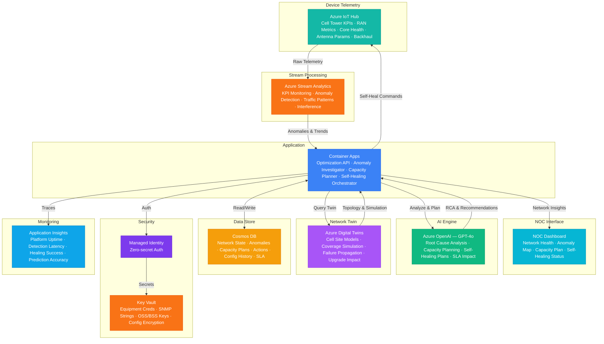

# Play 90 — Network Optimization Agent 📡

> AI telecom network optimization — traffic forecasting, dynamic routing, predictive maintenance, 5G resource allocation, SLA compliance.

Build a telecom network optimization agent. LSTM forecasts traffic per link 4 hours ahead, NetworkX-based routing balances utilization while maintaining redundancy, predictive maintenance catches equipment failures 7+ days early, and 5G network slicing allocates resources per URLLC/eMBB/mMTC slice SLAs.

## Quick Start
```bash
cd solution-plays/90-network-optimization-agent
az deployment group create -g $RG -f infra/main.bicep -p infra/parameters.json
code .
# Use @builder to implement, @reviewer to audit, @tuner to optimize
```

## Architecture



📐 [Full architecture details](architecture.md)

## Pre-Tuned Defaults
- Utilization: Max 80% per link · 20% headroom for bursts · ≥2 redundant paths
- SLA: URLLC < 1ms · Real-time < 20ms · Best-effort < 100ms · 99.95% availability
- Routing: Multi-objective (utilization 40% / latency 35% / redundancy 25%) · ECMP
- Maintenance: Alert at 70% failure probability · auto-failover on critical · 14-day scheduling

## DevKit (AI-Assisted Development)
| Primitive | What It Does |
|-----------|-------------|
| `agent.md` | Root orchestrator with builder→reviewer→tuner handoffs |
| `copilot-instructions.md` | Network domain (traffic forecasting, routing, 5G slicing, maintenance) |
| 3 agents | Builder (gpt-4o), Reviewer (gpt-4o-mini), Tuner (gpt-4o-mini) |
| 3 skills | Deploy (215+ lines), Evaluate (110+ lines), Tune (240+ lines) |
| 4 prompts | `/deploy`, `/test`, `/review`, `/evaluate` with agent routing |

## Cost Estimate

| Service | Dev/Test | Production | Enterprise |
|---------|----------|------------|------------|
| Azure OpenAI | $30 (PAYG) | $400 (PAYG) | $1,500 (PTU Reserved) |
| Azure IoT Hub | $0 (Free) | $250 (Standard S2) | $1,250 (Standard S3) |
| Azure Stream Analytics | $80 (Standard) | $400 (Standard) | $1,200 (Standard) |
| Azure Digital Twins | $20 (Standard) | $200 (Standard) | $800 (Standard) |
| Cosmos DB | $5 (Serverless) | $180 (3000 RU/s) | $700 (12000 RU/s) |
| Container Apps | $10 (Consumption) | $250 (Dedicated) | $650 (Dedicated HA) |
| Key Vault | $1 (Standard) | $15 (Premium HSM) | $30 (Premium HSM) |
| Application Insights | $0 (Free) | $60 (Pay-per-GB) | $200 (Pay-per-GB) |
| **Total** | **$146/mo** | **$1,755/mo** | **$6,330/mo** |

💰 [Full cost breakdown](cost.json)

## vs. Play 71 (Smart Energy Grid AI)
| Aspect | Play 71 | Play 90 |
|--------|---------|---------|
| Focus | Energy grid operations | Telecom network operations |
| Optimization | Renewable dispatch + demand response | Traffic routing + capacity planning |
| Prediction | Load forecasting (kW) | Traffic forecasting (Gbps) |
| Slicing | N/A | 5G URLLC/eMBB/mMTC slices |

📖 [Full documentation](spec/README.md) · 🌐 [frootai.dev/solution-plays/90-network-optimization-agent](https://frootai.dev/solution-plays/90-network-optimization-agent) · 📦 [FAI Protocol](spec/fai-manifest.json)
