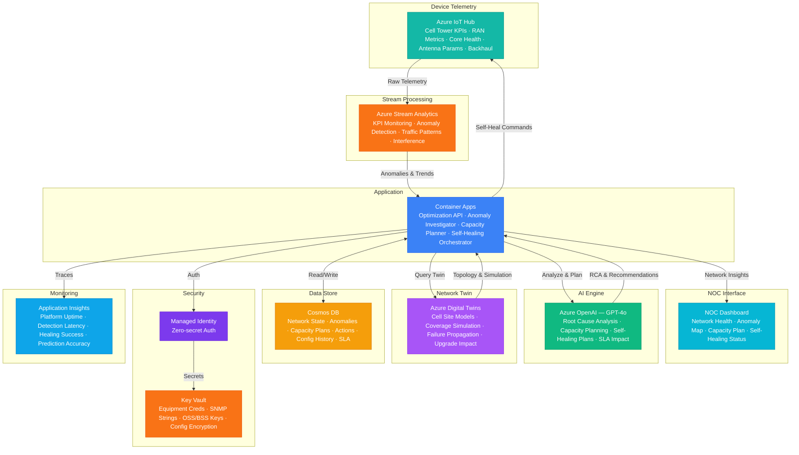

# Architecture — Play 90: Network Optimization Agent — 5G/LTE Capacity Planning with Anomaly Detection & Self-Healing

## Overview

AI-powered network optimization platform for telecommunications operators that performs real-time 5G/LTE network capacity planning, detects performance anomalies, and orchestrates self-healing actions to maintain service quality. Azure OpenAI (GPT-4o) provides network intelligence — generating anomaly root cause analysis narratives, producing capacity planning recommendations, creating self-healing action plans, reasoning about performance degradation chains, and assessing SLA impact from network events. Azure IoT Hub ingests telemetry from network equipment: cell tower KPIs (throughput, latency, packet loss, handover success), RAN metrics (PRB utilization, CQI distribution, RSRP/RSRQ), core network health (MME/AMF load, bearer setup success), antenna parameters (tilt, azimuth, power), and backhaul utilization. Azure Stream Analytics performs real-time KPI threshold monitoring, anomaly detection on signal quality metrics, traffic pattern analysis, interference correlation, and capacity utilization trending. Azure Digital Twins maintains a network topology digital twin — cell site models, coverage area simulation, capacity planning scenarios, failure propagation modeling, and upgrade impact prediction. Cosmos DB stores network state records, anomaly events, capacity plans, self-healing action logs, and SLA compliance tracking. Designed for mobile network operators, tower companies, managed network service providers, enterprise private 5G deployments, and telecom equipment vendors.

## Architecture Diagram

## Data Flow

1. **Network Telemetry Collection**: Azure IoT Hub receives continuous telemetry from 5G/LTE network infrastructure: cell sites report KPIs every 15 seconds (throughput per cell, active UE count, PRB utilization, CQI distribution, RSRP/RSRQ statistics, handover success rates, RRC connection setup success), core network elements report every 30 seconds (MME/AMF session load, bearer setup/teardown rates, paging success, S1/N2 interface utilization), transport/backhaul metrics (fiber/microwave link utilization, latency, jitter, packet loss), antenna configuration state (electrical tilt, mechanical tilt, azimuth, transmit power, MIMO configuration) → IoT Hub device twins maintain last-known configuration state for every network element → Telemetry partitioned by geographic cluster (market/region) for parallel processing
2. **Real-Time Anomaly Detection**: Azure Stream Analytics processes telemetry streams through multi-layered anomaly detection → Static threshold monitoring: KPIs compared against vendor-defined and operator-tuned thresholds (e.g., handover success <95%, PRB utilization >85%, latency >20ms for 5G) → Statistical anomaly detection: sliding window z-score analysis identifies KPIs deviating >2σ from their rolling baseline, accounting for time-of-day and day-of-week seasonality → Correlation analysis: concurrent anomalies across neighboring cells detected — if 5 adjacent cells show simultaneous throughput drops, this indicates a shared root cause (backhaul failure, core network issue, interference event) rather than individual cell problems → Anomaly events enriched with context: affected cell list, subscriber impact estimate, severity classification (P1-P4), historical occurrence frequency → Enriched anomaly events pushed to Container Apps for investigation and to Cosmos DB for historical analysis
3. **Digital Twin Network Analysis**: Azure Digital Twins maintains a live topology model of the entire network → Cell site models include: geographic location, antenna height and configuration, coverage footprint polygons, frequency band assignments, neighbor cell relationships, capacity specifications → When anomalies are detected, the digital twin provides topology context: which cells are affected, what is their coverage overlap, which subscribers would be impacted if a cell fails, what are the alternative coverage options → Capacity planning simulations: model what happens if traffic grows 20% next quarter — which cells hit capacity first, where should new sites be deployed, what frequency refarming would provide the most capacity relief → Failure propagation modeling: if Cell-A goes offline, the twin simulates the traffic redistribution to neighbors — identifying which neighbor cells would become overloaded and which subscribers would lose coverage → Upgrade impact prediction: model the coverage and capacity effect of adding a 5G carrier to an existing site, deploying massive MIMO, or activating carrier aggregation
4. **AI-Powered Root Cause Analysis & Self-Healing**: Container Apps orchestrates the investigation and response workflow → GPT-4o analyzes correlated anomaly events with digital twin topology context to generate root cause analysis: "Throughput degradation on cells B12-Alpha, B12-Beta, and B12-Gamma correlates with 92% backhaul utilization on MWL-B12 microwave link since 14:30 UTC. Historical pattern: this microwave link shows rain-fade sensitivity — current weather radar confirms heavy precipitation in the beam path. Expected resolution: 2-4 hours as storm cell passes. Mitigation: reduce per-cell throughput caps by 15% to prevent buffer overflow, prioritize voice and emergency services traffic" → Self-healing action catalog: predefined, operator-approved remediation actions ranked by confidence and risk — parameter changes (tilt, power, neighbor list), traffic steering (load balancing, carrier redirection), capacity actions (activating spare carriers, enabling MIMO modes) → Automated self-healing for high-confidence, low-risk actions: the system adjusts antenna tilt by 1° to reduce interference, rebalances traffic between co-located carriers, or activates a spare backhaul path — all within operator-defined guardrails → Human-in-the-loop for impactful actions: major configuration changes, site outage responses, and actions affecting >1000 subscribers require NOC engineer approval with GPT-4o providing the recommendation rationale
5. **Capacity Planning & Optimization**: Continuous capacity analysis identifies future network investment needs → Traffic growth forecasting: per-cell, per-technology (4G/5G) demand prediction using historical growth trends, planned events (concerts, stadiums), and market-level subscriber forecasts → Bottleneck identification: cells chronically operating above 70% PRB utilization during busy hour flagged for capacity enhancement — ranked by subscriber impact and revenue density → Solution recommendation engine: for each bottleneck, GPT-4o evaluates options — add a new 5G carrier (cost, timeline, coverage gain), deploy small cells (cost, site acquisition complexity), activate carrier aggregation (software-only, fast deployment), or refarm spectrum from underutilized 3G → CapEx optimization: recommended network investments ranked by cost-per-GB-improvement and subscriber-experience-impact — ensuring maximum ROI from network modernization budget → NOC dashboard: real-time network health map with anomaly overlay, self-healing action log with success rates, capacity utilization heatmaps, and investment planning prioritization

## Service Roles

| Service | Layer | Role |
|---------|-------|------|
| Azure OpenAI (GPT-4o) | Intelligence | Anomaly root cause analysis, capacity planning recommendations, self-healing action plans, performance degradation reasoning, SLA impact assessment |
| Azure IoT Hub | Ingestion | Cell tower telemetry (KPIs, RAN, antenna), core network health, backhaul metrics, device twin state management, cloud-to-device commands |
| Azure Stream Analytics | Processing | Real-time KPI threshold monitoring, statistical anomaly detection, multi-cell correlation analysis, traffic pattern trending |
| Azure Digital Twins | Modeling | Network topology twin — cell site models, coverage simulation, failure propagation, capacity planning scenarios, upgrade impact prediction |
| Cosmos DB | Persistence | Network state, anomaly events, capacity plans, self-healing action logs, configuration history, SLA compliance tracking |
| Container Apps | Compute | Network optimization API — anomaly investigation, capacity planning, self-healing orchestration, what-if simulation, NOC dashboard |
| Key Vault | Security | Network equipment credentials, SNMP community strings, OSS/BSS integration keys, configuration encryption, audit signing |
| Application Insights | Monitoring | Platform uptime (99.99%+ target), anomaly detection latency, self-healing success rate, capacity prediction accuracy |

## Security Architecture

- **Telecom-Grade Security**: Platform deployed on Azure with ISO 27001, SOC 2 Type II, and telecom-specific security certifications; network equipment credentials rotated per operator security policies
- **Network Configuration Protection**: Cell site configurations and optimization parameters are operationally critical — encrypted at rest with HSM-backed keys; configuration change approval requires multi-party authorization
- **Managed Identity**: All service-to-service auth via managed identity — zero credentials in code for OpenAI, IoT Hub, Stream Analytics, Digital Twins, Cosmos DB
- **Self-Healing Guardrails**: Automated remediation actions constrained by operator-defined limits: maximum parameter change magnitude per action, maximum cells affected simultaneously, mandatory cool-down periods between actions, and hard blocks on actions during maintenance windows
- **RBAC**: NOC Tier-1 operators view alerts and approve basic remediations; NOC Tier-2 engineers approve complex multi-cell actions; RF engineers access antenna optimization and capacity planning; network planners access investment modeling; executives access SLA and capacity dashboards
- **Encryption**: All telemetry encrypted in transit (TLS 1.2+) and at rest (AES-256); subscriber-identifiable data (IMSI, MSISDN) never stored — only aggregated cell-level statistics used for optimization
- **Audit Trail**: Every self-healing action, configuration change, and capacity recommendation logged with full authorization chain — telecom regulatory compliance for network change management
- **Subscriber Privacy**: No subscriber-level data processed — all optimization operates on cell-level aggregate KPIs; traffic analytics use anonymized statistical distributions

## Scaling

| Metric | Dev | Production | Enterprise |
|--------|-----|-----------|------------|
| Cell sites monitored | 10 | 1,000-5,000 | 20,000-100,000 |
| Telemetry messages/second | 100 | 10,000-50,000 | 500,000-5M |
| Anomaly events/day | 10 | 500-2,000 | 10,000-50,000 |
| Self-healing actions/day | 2 | 50-200 | 1,000-10,000 |
| Digital twin entities | 50 | 5,000-25,000 | 100,000-500,000 |
| Concurrent NOC users | 3 | 20-50 | 200-500 |
| Container replicas | 1 | 3-6 | 10-20 |
| P95 anomaly-to-action latency | 5min | 30s | 10s |
