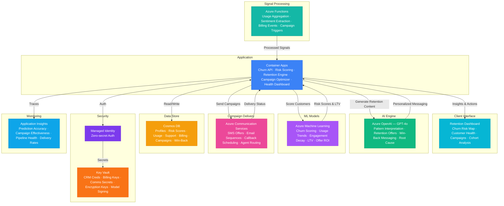

# Architecture — Play 91: Customer Churn Predictor — Multi-Signal Churn Scoring with Retention Campaigns

## Overview

AI-powered customer churn prediction platform that scores churn risk using multiple behavioral signals — usage patterns, billing history, support interactions, and engagement metrics — then orchestrates personalized retention campaigns to reduce attrition. Azure OpenAI (GPT-4o) provides churn intelligence — interpreting usage pattern shifts, synthesizing support ticket sentiment, analyzing billing dispute context, generating personalized retention offer narratives, and crafting win-back campaign messaging. Azure Machine Learning trains and serves churn prediction models: multi-signal risk scoring, usage trend analysis, engagement decay detection, customer lifetime value estimation, retention offer ROI optimization, and segment-level risk profiling. Azure Communication Services delivers retention campaigns across channels: personalized SMS offers, email win-back sequences, automated callback scheduling, and agent-assisted retention calls. Azure Functions orchestrate signal processing: usage telemetry aggregation, support ticket sentiment extraction, billing event processing, and retention campaign trigger evaluation. Cosmos DB stores customer profiles, churn risk scores, usage telemetry aggregates, support interaction history, billing records, and retention campaign results. Designed for SaaS companies, telecom operators, subscription services, insurance providers, banking/financial services, and any recurring-revenue business where customer retention directly impacts revenue.

## Architecture Diagram

## Data Flow

1. **Multi-Signal Data Collection**: Azure Functions aggregate churn signals from diverse business systems: usage telemetry (login frequency, feature adoption, session duration, usage depth, API call volume — tracked daily per customer with 90-day trailing windows), support interactions (ticket volume, severity distribution, resolution time satisfaction, NPS scores, escalation frequency, repeat contact rate), billing signals (payment delays, failed charges, plan downgrades, discount usage, billing dispute frequency, invoice amount trends), engagement metrics (email open rates, in-app notification interactions, community participation, training/webinar attendance, feature announcement clicks), contractual signals (contract renewal proximity, auto-renewal status, multi-year vs. month-to-month, expansion/contraction history) → Each signal source processed by dedicated Functions: usage aggregator computes daily/weekly/monthly rollups, support analyzer extracts sentiment scores via GPT-4o-mini, billing processor flags risk events → Aggregated signal vectors stored in Cosmos DB per customer with timestamp for temporal modeling
2. **Churn Risk Scoring**: Azure ML serves ensemble churn prediction models trained on historical customer data (churned vs. retained outcomes) → Feature engineering: usage trend slope (increasing/flat/declining over 30/60/90 days), support sentiment trajectory, billing health score, engagement decay rate, contractual risk factors → Multi-model ensemble: gradient boosted trees (XGBoost) for tabular features, recurrent neural networks for temporal usage sequences, and logistic regression for interpretable baseline → Output per customer: churn probability (0-100%), risk tier (Low/Medium/High/Critical), predicted churn timeframe (30/60/90 days), top contributing factors ranked by SHAP values → Customer Lifetime Value (LTV) estimation: predicted remaining revenue if retained, informing how much to invest in retention for each customer → Segment-level risk profiling: aggregate risk patterns by industry, company size, plan type, and acquisition cohort to identify systemic churn drivers → GPT-4o generates customer health narratives: "Acme Corp (Enterprise, $48K ARR) — CRITICAL churn risk (87%). Key signals: 45% usage decline over 60 days, 3 unresolved P1 support tickets, champion contact left the company (LinkedIn signal), contract renewal in 42 days. Recommended: executive sponsor outreach + dedicated success manager + 20% renewal discount"
3. **Retention Strategy Generation**: For customers above churn risk threshold, GPT-4o generates personalized retention strategies → Retention offer optimization: ML model predicts which offer type has highest save probability for each customer segment — discounts (price-sensitive), feature upgrades (power users), dedicated support (frustrated users), training (underutilizing), contract flexibility (commitment-averse) → Personalized messaging: GPT-4o crafts retention communications tailored to the specific churn drivers — "We noticed your team hasn't explored our new analytics dashboard — here's a personalized walkthrough session with our product expert" rather than generic "We miss you" emails → Multi-touch campaign design: escalating intervention sequence calibrated to risk level — Critical: immediate executive outreach + SDR call + personalized offer; High: CSM email + in-app notification + targeted content; Medium: automated email sequence + feature highlight; Low: periodic check-in email → Offer budget optimization: total retention budget allocated across customers based on (churn probability × LTV × save probability) — highest-value at-risk customers get the most investment
4. **Campaign Execution & Delivery**: Azure Communication Services executes retention campaigns across channels → SMS campaigns: personalized short messages with deep links to specific offers or features — timed based on customer timezone and historical engagement patterns → Email sequences: multi-step drip campaigns with personalized content blocks, dynamic offer insertion, and behavioral triggers (opens, clicks, conversions) → Callback scheduling: for high-value customers, automated scheduling of retention calls with customer success managers — calendar integration with CRM and call notes pre-populated with churn signals and recommended talking points → Agent-assisted calls: for Critical-risk customers, live agent routing with real-time GPT-4o coaching — agent sees churn risk factors, recommended offers, and conversation guides → Channel preference learning: track which channels each customer responds to most — future campaigns prioritize effective channels
5. **Retention Impact Measurement**: Closed-loop measurement connects retention actions to churn outcomes → Campaign effectiveness: save rate per campaign type, per channel, per customer segment — "Executive outreach saves 34% of Critical-risk enterprise customers vs. 12% for automated email alone" → ROI calculation: retention spend versus retained ARR — "Q3 retention campaigns cost $125K and saved $2.1M in at-risk ARR (16.8x ROI)" → Model accuracy tracking: churn prediction AUC, precision, and recall measured monthly against actual churn outcomes — models retrained when accuracy degrades → False positive analysis: customers predicted to churn who stayed without intervention — reducing false positives saves retention budget for truly at-risk customers → Cohort analysis dashboard: churn rates by acquisition channel, plan type, industry, company size, and tenure — identifying structural retention improvements beyond individual campaigns → A/B testing framework: randomized controlled experiments for retention strategies — holdout groups measure incremental impact of interventions versus natural retention

## Service Roles

| Service | Layer | Role |
|---------|-------|------|
| Azure OpenAI (GPT-4o) | Intelligence | Usage pattern interpretation, support sentiment synthesis, retention offer personalization, win-back messaging, churn root cause narratives |
| Azure Machine Learning | Prediction | Multi-signal churn scoring, usage trend analysis, engagement decay detection, LTV estimation, retention offer ROI optimization |
| Azure Communication Services | Delivery | Retention campaign execution — SMS offers, email sequences, callback scheduling, agent-assisted retention calls, multi-channel orchestration |
| Azure Functions | Processing | Usage telemetry aggregation, support ticket sentiment extraction, billing event processing, campaign trigger evaluation, workflow orchestration |
| Cosmos DB | Persistence | Customer profiles, churn risk scores, usage aggregates, support history, billing records, retention campaign results, win-back tracking |
| Container Apps | Compute | Churn prediction API — risk scoring engine, retention recommendation, campaign optimization, customer health dashboard backend |
| Key Vault | Security | CRM integration credentials, billing system API keys, communication service secrets, customer data encryption keys |
| Application Insights | Monitoring | Churn prediction accuracy (AUC/precision/recall), campaign effectiveness, signal pipeline health, delivery rates, retention ROI |

## Security Architecture

- **Customer Data Privacy**: All customer PII (names, contact info, usage data) encrypted at rest with customer-managed keys; GDPR/CCPA compliant data handling with right-to-deletion support
- **Communication Consent**: Retention campaigns honor customer communication preferences and opt-out status; CAN-SPAM, TCPA, and GDPR consent requirements enforced at the campaign execution layer
- **Managed Identity**: All service-to-service auth via managed identity — zero credentials in code for OpenAI, ML endpoints, Communication Services, Functions, Cosmos DB
- **Data Minimization**: Churn models trained on behavioral aggregates (usage trends, support sentiment scores), not raw PII; model features designed to be non-identifiable in isolation
- **RBAC**: Customer success managers access individual customer health and retention tools; retention marketing accesses campaign analytics and A/B tests; data scientists access model metrics and retraining; executives access aggregate churn and retention ROI dashboards
- **Encryption**: All data encrypted at rest (AES-256) and in transit (TLS 1.2+) — customer behavioral data treated as confidential personal information
- **Communication Audit**: Every retention message sent is logged with content, channel, timestamp, consent verification, and delivery status — supporting regulatory compliance and customer dispute resolution
- **Model Fairness**: Churn models audited for demographic bias — retention resources must not systematically disadvantage customers based on protected characteristics; fairness metrics reported alongside accuracy metrics

## Scaling

| Metric | Dev | Production | Enterprise |
|--------|-----|-----------|------------|
| Customers scored | 500 | 50,000-500,000 | 5M-50M |
| Churn signals/day | 1K | 500K-5M | 50M-500M |
| Retention campaigns/month | 50 | 5,000-50,000 | 500,000-5M |
| SMS + emails/month | 200 | 60,000-500,000 | 5M-50M |
| Callback sessions/month | 10 | 500-5,000 | 20,000-100,000 |
| Concurrent dashboard users | 3 | 20-50 | 200-500 |
| Container replicas | 1 | 2-4 | 6-12 |
| P95 churn score latency | 5s | 500ms | 100ms |
