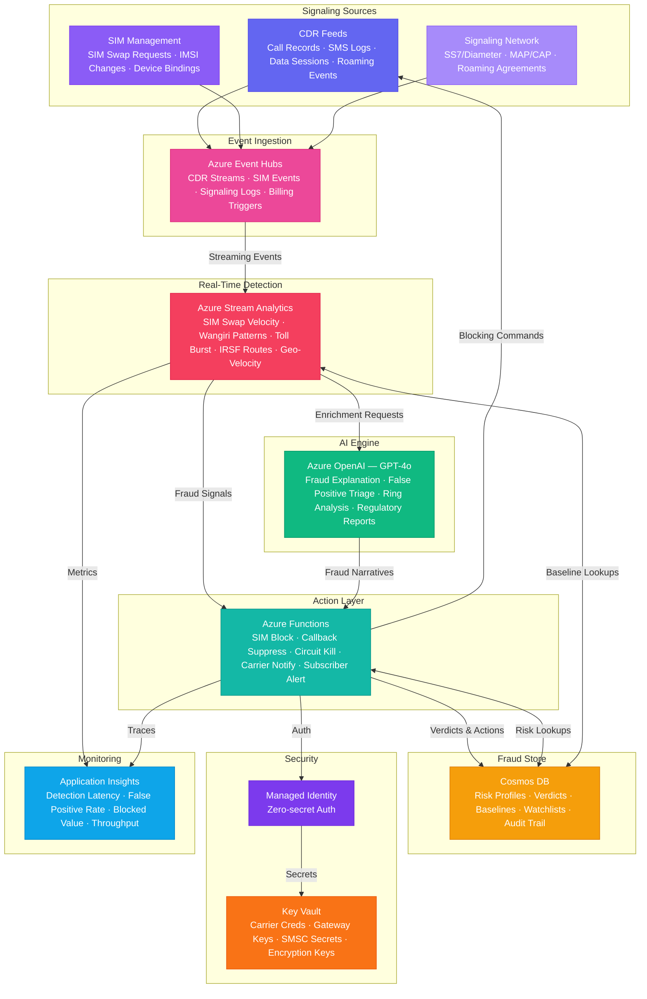

# Architecture — Play 92: Telecom Fraud Shield — Real-Time Telecom Fraud Detection with Sub-Second Blocking

## Overview

Real-time telecom fraud detection platform that identifies and blocks SIM swap fraud, revenue share fraud (IRSF), Wangiri callback schemes, toll fraud, and other telecom-specific attack vectors with sub-second response times. Azure Event Hubs ingests high-volume telecom signaling streams — call detail records, SIM swap requests, SMSC routing logs, SS7/Diameter signaling events, and roaming activity data — at carrier scale. Azure Stream Analytics performs real-time temporal pattern matching: SIM swap velocity anomalies, Wangiri callback chain detection, toll fraud burst identification, IRSF high-cost destination routing analysis, geo-velocity impossible travel detection, and simultaneous call anomaly scoring. Azure OpenAI (GPT-4o) provides fraud intelligence — explaining novel fraud patterns in human-readable narratives, disambiguating false positives with contextual reasoning, generating fraud ring analysis reports, and drafting regulatory notifications. Azure Functions execute blocking actions: SIM swap reversal, Wangiri callback suppression, toll fraud circuit termination, carrier interconnect notifications, and subscriber alerts. Cosmos DB stores subscriber risk profiles, fraud verdicts, call pattern baselines, blocked number registries, IRSF destination watchlists, and investigation audit trails. Designed for mobile network operators, MVNOs, carrier interconnect providers, telecom fraud management teams, and regulatory compliance departments.

## Architecture Diagram

## Data Flow

1. **Signaling Ingestion**: Azure Event Hubs ingests telecom signaling data from multiple carrier systems — call detail records (CDRs) containing originating/terminating numbers, call duration, cell tower IDs, IMSI/IMEI pairs, call forwarding status, and timestamps with millisecond precision; SIM management events including SIM swap requests, IMSI rebinding events, device association changes, and eSIM profile activations; SS7/Diameter signaling including MAP location updates, CAP charging events, roaming agreement triggers, and number portability notifications; billing system triggers for premium rate service charges, international call authorization requests, and reverse-charge events → Event Hubs partitioned by subscriber MSISDN hash for ordered per-subscriber processing with guaranteed sub-second ingestion latency at 100K+ events/sec
2. **Real-Time Pattern Detection**: Azure Stream Analytics applies temporal pattern matching across sliding windows — SIM swap velocity: flags when the same MSISDN has >1 SIM swap within 24 hours or >3 within 30 days, cross-referenced with account authentication method changes; Wangiri detection: identifies short-duration inbound calls (<3 seconds) from known premium-rate number ranges followed by outbound callback patterns, tracking callback chains across subscriber populations; toll fraud burst detection: flags sudden spikes in call volume (>5x baseline) to high-cost international destinations, especially during off-hours when legitimate business calling is minimal; IRSF routing analysis: detects call routing through known International Revenue Share Fraud destination prefixes with real-time updates from the GSMA fraud watchlist; geo-velocity impossible travel: correlates cell tower locations across consecutive calls to detect physically impossible movement patterns indicating cloned SIMs; simultaneous call anomaly: identifies the same MSISDN active on multiple calls or data sessions simultaneously, indicating SIM cloning or subscription fraud → Each detection rule outputs a fraud signal with confidence score (0-100), fraud type classification, affected MSISDN, and recommended action
3. **AI-Powered Fraud Intelligence**: Azure OpenAI enriches fraud signals with contextual analysis — novel pattern explanation: when Stream Analytics detects statistical anomalies that don't match known fraud signatures, GPT-4o analyzes the event sequence and generates hypotheses ("This pattern resembles a coordinated SIM swap ring targeting prepaid accounts during weekend hours when fraud desk staffing is reduced"); false positive disambiguation: for borderline fraud scores (40-70 confidence), GPT-4o reviews subscriber history and contextual factors to recommend block vs. monitor ("Subscriber has legitimate international travel history to this destination; call pattern consistent with business hours in destination timezone — recommend monitor, not block"); fraud ring analysis: when multiple correlated fraud signals are detected, GPT-4o maps relationships between affected subscribers, shared devices, common SIM swap agents, and temporal coordination patterns; regulatory report generation: automated drafting of fraud incident reports for national regulatory authorities with standardized formatting, evidence chains, and financial impact quantification
4. **Blocking & Remediation**: Azure Functions execute fraud response actions with sub-second latency — SIM swap blocking: sends reversal command to HLR/HSS via carrier API, restores original SIM binding, triggers subscriber notification via SMS to alternate registered number, and flags account for enhanced authentication; Wangiri suppression: adds identified premium-rate numbers to real-time call barring list, blocks outbound callbacks to flagged destinations for affected subscriber cohort, reports numbers to GSMA fraud intelligence sharing; toll fraud circuit termination: sends immediate call disconnect to switching infrastructure, applies temporary international call barring, notifies interconnect partner of suspected fraud traffic; carrier interconnect notification: automated alerts to peer operators when fraud traffic is detected originating from or terminating to their networks; subscriber alerting: sends multi-channel notifications (SMS, app push, email) warning of detected fraud attempts with instructions for account security verification
5. **Investigation & Analytics**: Cosmos DB maintains the complete fraud intelligence repository — subscriber risk profiles with rolling 90-day behavioral baselines, fraud verdict history with full evidence chains, blocked number registries synchronized across network elements, IRSF destination watchlists updated from GSMA feeds, and investigation audit trails for regulatory compliance → Fraud analysts access dashboards showing detection latency distributions, false positive rates by fraud type, total blocked fraud value, SIM swap interception success rate, and Wangiri suppression effectiveness → ML feedback loop: confirmed fraud verdicts and false positive corrections flow back to retrain Stream Analytics anomaly thresholds and GPT-4o few-shot examples, continuously improving detection accuracy

## Service Roles

| Service | Layer | Role |
|---------|-------|------|
| Azure Event Hubs | Ingestion | High-volume CDR, SIM swap, SS7/Diameter signaling ingestion at carrier scale with ordered per-subscriber processing |
| Azure Stream Analytics | Detection | Real-time temporal pattern matching — SIM swap velocity, Wangiri chains, toll fraud bursts, IRSF routing, geo-velocity |
| Azure OpenAI (GPT-4o) | Intelligence | Novel fraud pattern explanation, false positive disambiguation, fraud ring narrative analysis, regulatory report generation |
| Azure Functions | Action | Fraud response execution — SIM swap blocking, callback suppression, circuit termination, carrier notification, subscriber alerts |
| Cosmos DB | Persistence | Subscriber risk profiles, fraud verdicts, call baselines, blocked number registries, IRSF watchlists, investigation audit trails |
| Key Vault | Security | Carrier interconnect credentials, SS7/Diameter gateway keys, SMSC API secrets, fraud database encryption keys |
| Application Insights | Monitoring | Detection latency (<500ms target), false positive rate, blocked fraud value, SIM swap interception rate, system throughput |

## Security Architecture

- **Carrier-Grade Isolation**: All signaling data processed within private VNET with no public endpoints; Event Hubs and Stream Analytics communicate via private endpoints only
- **Managed Identity**: All service-to-service auth via managed identity — zero credentials in code for OpenAI, Cosmos DB, Event Hubs, Functions, Key Vault
- **Regulatory Compliance**: Full audit trail of every fraud detection, blocking action, and subscriber notification — meets GSMA fraud reporting requirements, national telecom regulator mandates, and GDPR subscriber data protection
- **Data Classification**: CDR data and subscriber identifiers classified as telecom-sensitive PII — encrypted at rest with customer-managed keys, access restricted to fraud operations team via RBAC
- **Encryption**: All data encrypted at rest (AES-256) and in transit (TLS 1.2+); SS7/Diameter signaling encrypted via IPsec tunnels to carrier gateways
- **Access Control**: Fraud analysts access investigation tools and case management; network operations access blocking action dashboards; regulatory compliance accesses audit reports; executive leadership accesses aggregate fraud loss metrics
- **Evidence Integrity**: Fraud verdicts and supporting evidence stored with immutable write patterns — no delete/update on audit trail documents; cryptographic hashing for evidence chain integrity

## Scaling

| Metric | Dev | Production | Enterprise |
|--------|-----|-----------|------------|
| Events ingested/sec | 100 | 50K-200K | 500K-2M |
| Fraud checks/sec | 50 | 25K-100K | 250K-1M |
| Blocking actions/hour | 10 | 500-5,000 | 10,000-100,000 |
| Subscribers monitored | 1K | 1M-10M | 50M-500M |
| SIM swap checks/day | 50 | 50K-500K | 2M-20M |
| Detection latency (P95) | 2s | 300ms | 100ms |
| Event Hubs throughput units | 1 | 8-16 | 16-64 |
| Stream Analytics SUs | 1 | 6-12 | 24-48 |
