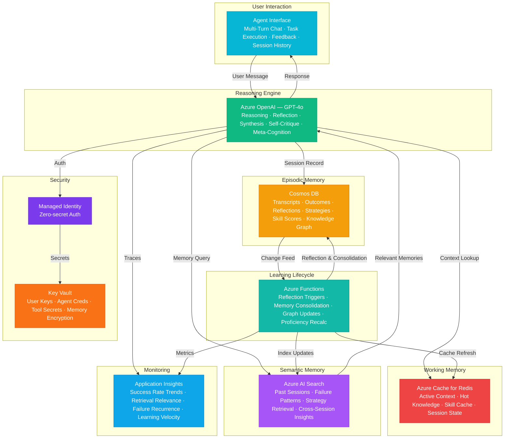

# Architecture — Play 93: Continual Learning Agent — Persistent Knowledge with Failure Reflection and Adaptive Improvement

## Overview

AI agent framework that persists knowledge across sessions, reflects on failures, learns from outcomes, and starts smarter every interaction — implementing true continual learning without model retraining. Azure OpenAI (GPT-4o) provides the agent's reasoning engine — multi-turn conversation, failure reflection with root cause analysis, knowledge synthesis from accumulated session history, strategy adaptation based on past outcomes, self-critique loops, and meta-cognitive reasoning about its own learning progress. Cosmos DB stores the agent's episodic memory — complete session transcripts, task outcomes with success/failure/partial classifications, failure reflections tagged with root causes, learned strategies indexed by task type, skill proficiency scores evolving over time, and knowledge graph edges connecting concepts discovered across sessions. Azure AI Search enables semantic memory retrieval — finding relevant past experiences by similarity rather than keyword, matching current tasks to historical failure patterns, retrieving proven strategies for analogous situations, and discovering cross-session insights that emerge from accumulated experience. Azure Cache for Redis provides working memory — active conversation context, recently retrieved memories for fast access, skill proficiency cache, hot knowledge facts, and cross-session continuation state. Azure Functions orchestrate the learning lifecycle — post-session reflection triggers, memory consolidation scheduling, knowledge graph maintenance, failure pattern aggregation, skill proficiency recalculation, and periodic memory compaction following forgetting curves. Designed for enterprise AI assistants, developer copilots, customer support agents, research assistants, tutoring systems, and any application where agent intelligence should compound over time.

## Architecture Diagram

## Data Flow

1. **Session Initialization & Memory Priming**: When a new session begins, the agent retrieves its accumulated knowledge — Redis cache checked first for hot knowledge: recent session summaries, current skill proficiency scores, user preference profile, and any continuation state from the previous session; if cache miss, Azure AI Search performs semantic retrieval: "What does this agent know about tasks similar to the current request?" returning the top-K most relevant episodic memories ranked by recency-weighted similarity; Cosmos DB provides structured lookups: user interaction history, task success rates by category, known failure modes for this task type, and learned strategies ranked by historical effectiveness → The agent's system prompt is dynamically assembled from: base instructions + retrieved relevant memories + applicable learned strategies + skill proficiency context + known failure modes to avoid → This "memory-augmented prompting" gives the agent access to its entire learning history without model retraining
2. **Task Execution with Awareness**: During task execution, GPT-4o reasons with full awareness of past experiences — before attempting a task, the agent checks: "Have I attempted similar tasks before? What worked? What failed?" → Retrieved strategies inform the approach: if a code generation task previously failed due to missing error handling, the agent proactively includes error handling this time; if a research task previously succeeded with a specific search strategy, the agent reuses that strategy → Real-time skill proficiency affects confidence calibration: the agent communicates uncertainty proportional to its track record — "I've successfully completed 14/16 similar tasks, so I'm confident in this approach" vs. "This is a new task type for me — I'll proceed carefully and verify each step" → Working memory in Redis maintains the active conversation context, recently retrieved memories, and intermediate reasoning state for multi-step tasks
3. **Post-Session Reflection**: After each session concludes (or at periodic checkpoints for long sessions), Azure Functions trigger the reflection pipeline — GPT-4o performs structured self-critique: "What was the task? What approach did I take? What was the outcome? If I failed, why? What would I do differently next time?" → Failure reflection generates root cause analysis: categorizes failures into taxonomy (knowledge gap, reasoning error, tool misuse, ambiguous instructions, external dependency failure) with specific lessons learned → Success reflection identifies reusable patterns: extracts generalizable strategies, notes which approaches worked for which task types, and updates skill proficiency scores → Reflection outputs stored as structured documents in Cosmos DB: task description, approach taken, outcome, root cause (if failure), lessons learned, strategy updates, skill proficiency deltas → Change feed triggers downstream consolidation
4. **Memory Consolidation & Knowledge Graph**: Azure Functions perform periodic memory consolidation following cognitive-science-inspired patterns — episodic-to-semantic consolidation: after accumulating 10+ similar experiences, individual episodic memories are compressed into semantic knowledge ("When users ask for API integration code, always check authentication requirements first — learned from 12 sessions, 3 failures without this step"); forgetting curves: memories accessed frequently maintain full fidelity while rarely-accessed memories are progressively summarized — 7 days: full transcript; 30 days: key events and outcomes; 90 days: lessons learned only; 365 days: merged into aggregate skill knowledge → Knowledge graph updates: new concept connections discovered across sessions are added as edges ("user authentication" → "API rate limiting" → "error handling" discovered through accumulated task experience); failure pattern aggregation: recurring failure modes across sessions are elevated to "known pitfalls" with proactive avoidance strategies → Consolidated knowledge re-indexed in Azure AI Search for efficient semantic retrieval
5. **Learning Analytics & Improvement Tracking**: Application Insights tracks the agent's learning trajectory over time — task success rate by category plotted over sessions (the "learning curve"); failure recurrence rate: how often the agent repeats the same mistake (should decrease toward zero for known failure modes); memory retrieval relevance: are retrieved memories actually useful for current tasks (measured by downstream task success correlation); knowledge coverage: what percentage of encountered task types have established strategies vs. require novel reasoning; skill acquisition velocity: how quickly the agent achieves proficiency in new task categories → Learning dashboards enable operators to identify: domains where the agent is struggling (intervention needed), domains where the agent has plateaued (may need architectural changes or new tool access), and domains where the agent excels (can be trusted with higher autonomy)

## Service Roles

| Service | Layer | Role |
|---------|-------|------|
| Azure OpenAI (GPT-4o) | Reasoning | Multi-turn conversation, failure reflection, knowledge synthesis, strategy adaptation, self-critique, meta-cognitive reasoning |
| Cosmos DB | Episodic Memory | Session transcripts, task outcomes, failure reflections, learned strategies, skill proficiency scores, knowledge graph |
| Azure AI Search | Semantic Memory | Past session similarity search, failure pattern matching, strategy retrieval, cross-session insight discovery |
| Azure Cache for Redis | Working Memory | Active context, hot knowledge cache, skill proficiency cache, session continuation state |
| Azure Functions | Lifecycle | Post-session reflection triggers, memory consolidation, knowledge graph updates, proficiency recalculation, forgetting curves |
| Key Vault | Security | User data encryption keys, agent identity credentials, external tool API keys, memory store encryption |
| Application Insights | Monitoring | Learning curve tracking, failure recurrence, retrieval relevance, knowledge coverage, skill acquisition velocity |

## Security Architecture

- **Memory Privacy**: Each user's episodic memories isolated via partition keys in Cosmos DB; cross-user memory leakage prevented at the data layer with row-level security
- **Managed Identity**: All service-to-service auth via managed identity — zero credentials in code for OpenAI, Cosmos DB, AI Search, Redis, Functions
- **Memory Encryption**: All episodic and semantic memories encrypted at rest with customer-managed keys; reflection documents containing user interaction details treated as sensitive PII
- **Right to Forget**: Users can request deletion of all their episodic memories — cascade delete across Cosmos DB, AI Search index, and Redis cache with verification audit trail
- **RBAC**: Agent operators access learning analytics and system health; data scientists access aggregate learning metrics; users access only their own session history and agent capabilities
- **Reflection Audit**: Every reflection cycle logged with inputs, reasoning chain, and outputs — enables debugging agent learning behavior and detecting knowledge corruption
- **Tool Access Control**: Agent's access to external tools gated by skill proficiency thresholds — new capabilities unlocked gradually as the agent demonstrates competence

## Scaling

| Metric | Dev | Production | Enterprise |
|--------|-----|-----------|------------|
| Concurrent agents | 1 | 50-200 | 1,000-10,000 |
| Sessions/day | 10 | 5,000-50,000 | 500,000-5M |
| Episodic memories stored | 500 | 500K-5M | 50M-500M |
| Memory retrievals/sec | 5 | 200-1,000 | 5,000-50,000 |
| Reflection cycles/day | 10 | 5,000-50,000 | 500,000-5M |
| Knowledge graph nodes | 100 | 50K-500K | 5M-50M |
| P95 memory retrieval latency | 500ms | 100ms | 50ms |
| Redis cache hit rate | 60% | 85% | 95% |
