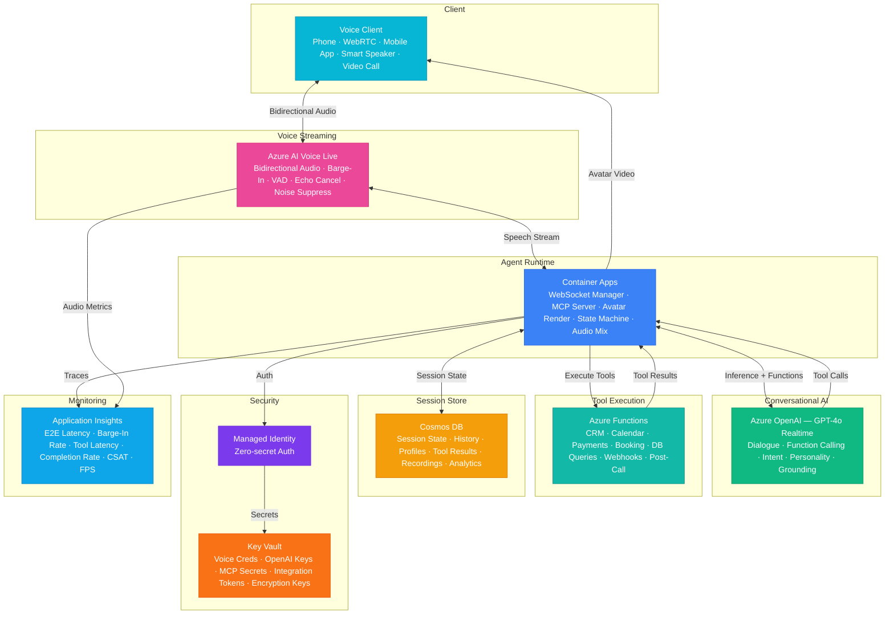

# Play 96 — Realtime Voice Agent V2 📞

> Next-gen voice AI — WebSocket streaming STT/TTS, function calling mid-conversation, barge-in detection, emotion analysis, multi-language switching.

Build a real-time voice agent with sub-500ms time-to-first-byte. GPT-4o Realtime API streams responses token-by-token, Azure Speech provides streaming STT/TTS with SSML, barge-in detection lets users interrupt naturally, prosody-based emotion analysis adapts agent tone to caller state, and 6-language live switching reconfigures STT/TTS per utterance.

## Quick Start
```bash
cd solution-plays/96-realtime-voice-agent-v2
az deployment group create -g $RG -f infra/main.bicep -p infra/parameters.json
code .
# Use @builder to implement, @reviewer to audit, @tuner to optimize
```

## Architecture



📐 [Full architecture details](architecture.md)

| Service | Purpose |
|---------|---------|
| Azure OpenAI (Realtime) | GPT-4o Realtime API for streaming conversation |
| Azure Speech Service | Streaming STT + Neural TTS with SSML |
| Azure Communication Services | Phone/PSTN integration |
| Azure Redis Cache | Session state + function call cache |
| Azure Content Safety | Real-time content moderation |
| Container Apps | WebSocket server (HTTP/2 + WS) |

## Pre-Tuned Defaults
- Latency: TTFT < 500ms · STT 200ms · LLM 200ms · TTS 100ms · phrase-level buffering
- Barge-in: VAD sensitivity 0.5 · 300ms min speech · escalate after 3 interruptions
- Functions: 4 tools · filler phrases during API calls · 3s timeout · 60s result cache
- Emotion: Prosody-based (pitch, rate, volume, pauses) · adapt tone on frustrated/confused/angry

## DevKit (AI-Assisted Development)
| Primitive | What It Does |
|-----------|-------------|
| `agent.md` | Root orchestrator with builder→reviewer→tuner handoffs |
| `copilot-instructions.md` | Voice V2 domain (streaming, barge-in, function calling, emotion) |
| 3 agents | Builder (gpt-4o), Reviewer (gpt-4o-mini), Tuner (gpt-4o-mini) |
| 3 skills | Deploy (230+ lines), Evaluate (115+ lines), Tune (240+ lines) |
| 4 prompts | `/deploy`, `/test`, `/review`, `/evaluate` with agent routing |

## Cost Estimate
| Service | Dev/mo | Prod/mo | Enterprise/mo |
|---------|--------|---------|---------------|
| Azure AI Voice Live | $30 (PAYG) | $400 (PAYG) | $1,500 (Committed) |
| Azure OpenAI | $35 (PAYG) | $500 (PAYG) | $1,800 (PTU Reserved) |
| Container Apps | $15 (Consumption) | $300 (Dedicated) | $900 (Dedicated HA) |
| Azure Functions | $0 (Consumption) | $200 (Premium EP2) | $500 (Premium EP3) |
| Cosmos DB | $5 (Serverless) | $280 (5000 RU/s) | $750 (15000 RU/s) |
| Key Vault | $1 (Standard) | $5 (Standard) | $20 (Premium HSM) |
| Application Insights | $0 (Free) | $50 (Pay-per-GB) | $160 (Pay-per-GB) |
| **Total** | **$86** | **$1,735** | **$5,630** |

💰 [Full cost breakdown](cost.json)

## vs. Play 04 (Call Center Voice AI)
| Aspect | Play 04 | Play 96 |
|--------|---------|---------|
| Architecture | Request-response STT→LLM→TTS | Full streaming WebSocket |
| Latency | 2-3s per turn | < 500ms TTFT |
| Barge-in | Not supported | Full duplex with VAD |
| Function calling | N/A | Mid-conversation API calls |
| Emotion | N/A | Prosody-based detection + adaptation |

📖 [Full documentation](spec/README.md) · 🌐 [frootai.dev/solution-plays/96-realtime-voice-agent-v2](https://frootai.dev/solution-plays/96-realtime-voice-agent-v2) · 📦 [FAI Protocol](spec/fai-manifest.json)
