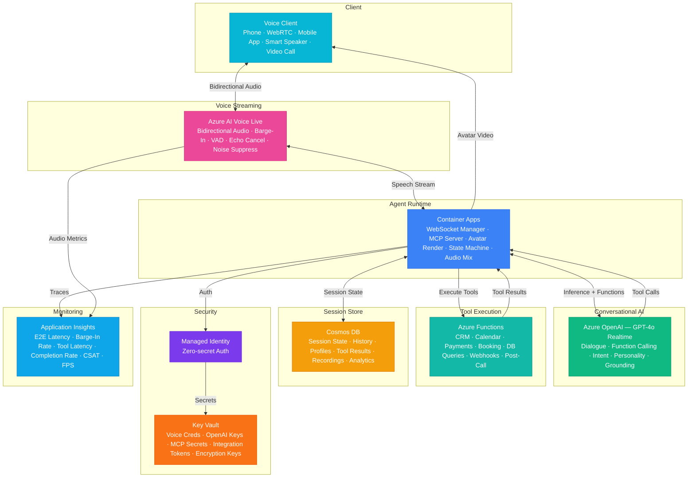

# Architecture — Play 96: Real-Time Voice Agent V2 — Next-Gen Bidirectional Voice Agent with Sub-200ms Latency, MCP Tools, and Avatar Rendering

## Overview

Next-generation bidirectional voice agent platform delivering sub-200ms end-to-end latency with full MCP tool integration and optional avatar rendering — enabling natural, human-like voice conversations where the AI agent can see, hear, think, act, and respond in real-time. Azure AI Voice Live provides the bidirectional voice streaming backbone — real-time speech-to-speech pipeline with barge-in detection for natural interruptions, voice activity detection, echo cancellation, noise suppression, and multi-language real-time switching without session restart. Azure OpenAI (GPT-4o Realtime) delivers conversational intelligence — function calling for MCP tool invocation mid-conversation, multi-turn dialogue management with full context awareness, personality and tone control matching brand voice, dynamic intent classification for routing, and knowledge base grounding for accurate domain-specific responses. Container Apps host the voice agent runtime — WebSocket session management for persistent bidirectional audio streams, MCP tool server hosting with sub-100ms tool execution, avatar rendering pipeline (2D/3D lip-synced avatars), session state machines, and multi-agent routing for complex scenarios. Azure Functions execute MCP tools — CRM lookups, calendar management, payment processing, booking systems, database queries, and webhook integrations all invocable via natural conversation ("Can you check my order status?" triggers MCP tool call to order management system). Cosmos DB maintains real-time session state — active conversation context, user profiles, tool execution results, call recording metadata, and analytics aggregates with sub-10ms read latency. Designed for customer service automation, virtual receptionists, healthcare triage, financial advisory, enterprise help desks, interactive voice assistants, and any scenario requiring human-quality voice interaction with system integration capabilities.

## Architecture Diagram

## Data Flow

1. **Voice Session Establishment**: Client connects via WebRTC, PSTN, SIP trunk, or native app SDK — Container Apps accept the incoming connection and establish a persistent WebSocket for bidirectional audio streaming → Azure AI Voice Live initializes the audio pipeline: echo cancellation removes speaker feedback from the microphone signal, noise suppression filters background noise (office, street, café), voice activity detection (VAD) distinguishes speech from silence to optimize processing, and automatic gain control normalizes volume across different microphone qualities and distances → Session state initialized in Cosmos DB: user profile loaded (if returning caller identified via phone number or authenticated session), conversation context initialized with system prompt defining agent persona, tone, and domain knowledge, available MCP tools registered based on the agent configuration, and avatar state initialized if video channel is active → Bidirectional streaming begins: client audio flows to Voice Live for speech recognition while agent responses flow back as synthesized speech — all within a persistent connection for minimal latency
2. **Real-Time Speech Processing & Understanding**: Azure AI Voice Live performs continuous speech-to-text on the incoming audio stream — streaming transcription delivers partial results every 100-200ms for real-time processing; barge-in detection: if the user starts speaking while the agent is responding, Voice Live immediately signals the interruption, the agent's current response is truncated, and the user's new input takes priority — this creates natural conversation dynamics where users don't have to wait for the agent to finish; endpointing: intelligent detection of when the user has finished speaking (not just paused) using prosodic cues, silence duration, and syntactic completeness — prevents premature agent responses during natural pauses while maintaining responsiveness → Transcribed text streams to GPT-4o Realtime with full conversation history: system prompt + user profile + previous turns + current utterance + available MCP tools → GPT-4o processes in streaming mode: begins generating response tokens while still receiving the final words of user input, achieving thought-to-speech latency of <100ms for the first response token
3. **Conversational AI with MCP Tool Integration**: GPT-4o Realtime processes the user's input and determines the appropriate response — direct response: for conversational exchanges, knowledge questions, and guided interactions, GPT-4o generates natural language responses streamed directly to Voice Live for synthesis; function calling (MCP tools): when the conversation requires external actions, GPT-4o emits structured function calls — "check_order_status(order_id='ORD-12345')" routed through the MCP protocol to Azure Functions → MCP tool execution flow: Container Apps receive the function call from GPT-4o, route to the appropriate MCP tool server hosted alongside the agent runtime, the tool executes via Azure Functions (CRM lookup, calendar query, payment processing, booking confirmation), and results return to GPT-4o within 100-500ms → GPT-4o incorporates tool results into natural conversation: "I found your order — it shipped yesterday via FedEx and is expected to arrive Thursday. Would you like me to send you the tracking link?" → Multi-step tool chains: complex requests may require sequential tool calls — "Book me a meeting with Dr. Smith next Tuesday" requires calendar availability check → slot selection → booking confirmation → calendar invite sending, all orchestrated through conversation
4. **Voice Synthesis & Avatar Rendering**: GPT-4o's streaming text response flows to Voice Live for real-time speech synthesis — neural voice rendering with consistent agent persona: warm, professional, empathetic, or energetic depending on configuration; SSML-level control: prosody adapts to content — slower and softer for delivering bad news, upbeat for confirmations, thoughtful pauses before complex explanations; streaming synthesis: audio output begins 50-100ms after first response token, providing continuous speech output without perceivable gaps → Optional avatar rendering pipeline in Container Apps: 2D avatar (lightweight): pre-rendered facial animations mapped to phoneme sequences from synthesized speech, lip-synced at 30fps, suitable for web and mobile; 3D avatar (GPU-accelerated): real-time facial mesh deformation, eye contact simulation, head movement, hand gestures, and emotional expressions synchronized with speech content and tone — rendered at 60fps using GPU workload profiles in Container Apps; avatar video stream delivered to client via WebRTC data channel alongside audio for synchronized audiovisual experience → Output audio normalization: consistent volume levels, comfortable speaking pace, and natural breathing patterns for extended conversations
5. **Session Management & Post-Call Analytics**: Cosmos DB maintains real-time session state throughout the conversation — conversation transcript updated with each turn (user utterance + agent response + tool calls + tool results), session duration and engagement metrics tracked, user satisfaction signals captured (explicit: "Was this helpful?" + implicit: conversation length, escalation requests, repeat calls) → Call recording: full audio stored (with consent) in Blob Storage via Cosmos DB metadata reference for compliance, training, and quality assurance → Post-call processing via Azure Functions: conversation summary generated by GPT-4o-mini (capturing key decisions, action items, tool outcomes), sentiment analysis across the conversation arc, CRM updates with call notes and follow-up items, analytics aggregation (call duration, resolution type, tools used, escalation status) → Real-time dashboards in Application Insights: end-to-end latency distribution (target: P95 <200ms), barge-in detection accuracy, tool invocation success rate and latency, conversation completion rate (resolved without escalation), user satisfaction scores (CSAT), concurrent session utilization, and avatar rendering performance (FPS, frame drops)

## Service Roles

| Service | Layer | Role |
|---------|-------|------|
| Azure AI Voice Live | Streaming | Bidirectional voice pipeline — STT/TTS streaming, barge-in, VAD, echo cancellation, noise suppression, multi-language |
| Azure OpenAI (GPT-4o Realtime) | Intelligence | Conversational reasoning, MCP function calling, dialogue management, personality control, knowledge grounding |
| Container Apps | Runtime | WebSocket session management, MCP tool server, avatar rendering, state machine, audio mixing, multi-agent routing |
| Azure Functions | Tools | MCP tool execution — CRM, calendar, payments, booking, database queries, webhooks, post-call summarization |
| Cosmos DB | State | Real-time session context, conversation history, user profiles, tool results, recording metadata, analytics |
| Key Vault | Security | Voice service credentials, OpenAI keys, MCP tool secrets, integration tokens, session encryption keys |
| Application Insights | Monitoring | E2E latency (<200ms), barge-in accuracy, tool latency, completion rate, CSAT, avatar FPS, concurrency |

## Security Architecture

- **Voice Data Privacy**: All voice audio encrypted in transit (SRTP for RTP, TLS 1.2+ for WebSocket); call recordings encrypted at rest with customer-managed keys; recordings retained per configurable policy (30/60/90 days) with automatic purge
- **Managed Identity**: All service-to-service auth via managed identity — zero credentials in code for Voice Live, OpenAI, Container Apps, Functions, Cosmos DB
- **MCP Tool Isolation**: Each MCP tool executes in isolated Function instances with least-privilege access; tool secrets stored in Key Vault and injected at runtime; tool execution sandboxed with timeout enforcement (500ms default, 5s max)
- **Caller Authentication**: Multi-factor voice verification: phone number matching, knowledge-based authentication questions, optional voice biometric verification for sensitive operations (payments, account changes)
- **RBAC**: Voice agents handle caller interactions; supervisors access live monitoring and intervention controls; quality analysts access call recordings and transcripts; administrators manage agent configurations and MCP tool registrations
- **Compliance**: Call recording consent management (announce-and-proceed or explicit opt-in depending on jurisdiction); PCI-DSS compliance for payment tool execution (no card numbers in conversation logs); HIPAA compliance mode for healthcare scenarios (PHI encryption and access controls)
- **Rate Limiting**: Per-caller session limits prevent abuse; concurrent session caps protect infrastructure; tool execution rate limits prevent downstream system overload

## Scaling

| Metric | Dev | Production | Enterprise |
|--------|-----|-----------|------------|
| Concurrent voice sessions | 2 | 100-500 | 2,000-10,000 |
| Calls/day | 20 | 2,000-10,000 | 50,000-500,000 |
| MCP tool calls/sec | 5 | 50-200 | 1,000-5,000 |
| Avg call duration | 3min | 4min | 5min |
| E2E latency (P95) | 500ms | 200ms | 150ms |
| Barge-in response time | 300ms | 150ms | 100ms |
| Avatar render FPS | 15 | 30 | 60 |
| Container replicas | 1 | 3-6 | 10-30 |
