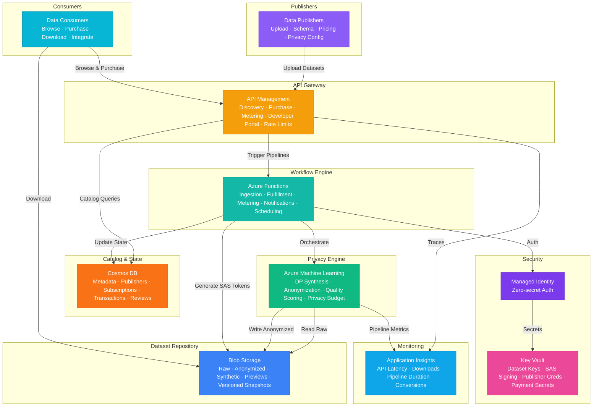

# Play 97 — AI Data Marketplace 📊

> Data commerce platform — dataset discovery with quality scoring, privacy-preserving sharing, synthetic data augmentation, license management, lineage tracking.

Build an AI data marketplace. 5-dimension quality scoring (completeness, consistency, accuracy, timeliness, uniqueness) grades every dataset, PII scanning + k-anonymity + differential privacy enable privacy-preserving sharing, Gaussian Copula generates synthetic data with verified zero real-record overlap, and Azure Purview tracks full data lineage.

## Quick Start
```bash
cd solution-plays/97-ai-data-marketplace
az deployment group create -g $RG -f infra/main.bicep -p infra/parameters.json
code .
# Use @builder to implement, @reviewer to audit, @tuner to optimize
```

## Architecture



📐 [Full architecture details](architecture.md)

| Service | Purpose |
|---------|---------|
| Azure OpenAI (gpt-4o) | Dataset description + semantic search |
| Azure AI Search (Standard) | Dataset catalog with vector + semantic search |
| Azure Purview | Data lineage tracking + governance |
| Cosmos DB (Serverless) | Listings, transactions, reviews |
| Azure Storage | Dataset files, samples, synthetic outputs |
| Azure Functions | Quality scoring + privacy scanning |

## Pre-Tuned Defaults
- Quality: 5 dimensions · weighted composite · auto-delist below 40 · weekly refresh
- Privacy: Presidio PII scan · k=5 anonymity · Gaussian Copula synthetic · ε=1.0 differential privacy
- Search: Vector + semantic · facets (category, privacy, license) · quality + freshness boost
- Licensing: 5 license types · attribution tracking · usage limits · 80/20 revenue split

## DevKit (AI-Assisted Development)
| Primitive | What It Does |
|-----------|-------------|
| `agent.md` | Root orchestrator with builder→reviewer→tuner handoffs |
| `copilot-instructions.md` | Data marketplace domain (quality, privacy, synthetic, lineage) |
| 3 agents | Builder (gpt-4o), Reviewer (gpt-4o-mini), Tuner (gpt-4o-mini) |
| 3 skills | Deploy (225+ lines), Evaluate (110+ lines), Tune (225+ lines) |
| 4 prompts | `/deploy`, `/test`, `/review`, `/evaluate` with agent routing |

## Cost Estimate
| Service | Dev/mo | Prod/mo | Enterprise/mo |
|---------|--------|---------|---------------|
| Azure Machine Learning | $0 (Basic) | $450 (Standard) | $1,400 (Standard HA) |
| Azure Blob Storage | $5 (LRS Hot) | $120 (ZRS Hot + Cool) | $400 (GRS Hot + Cool + Archive) |
| Azure API Management | $5 (Consumption) | $700 (Standard) | $2,800 (Premium) |
| Azure Cosmos DB | $5 (Serverless) | $230 (4000 RU/s) | $700 (12000 RU/s) |
| Azure Functions | $0 (Consumption) | $200 (Premium EP2) | $500 (Premium EP3) |
| Key Vault | $1 (Standard) | $5 (Standard) | $20 (Premium HSM) |
| Application Insights | $0 (Free) | $40 (Pay-per-GB) | $120 (Pay-per-GB) |
| **Total** | **$16** | **$1,745** | **$5,940** |

💰 [Full cost breakdown](cost.json)

## vs. Play 62 (Federated Learning Pipeline)
| Aspect | Play 62 | Play 97 |
|--------|---------|---------|
| Focus | Train models without sharing data | Share/sell datasets with privacy |
| Privacy | Federated (data stays local) | Anonymize/synthesize before sharing |
| Output | Trained model | Quality-scored dataset listing |
| Governance | Differential privacy on gradients | PII scanning + lineage tracking |

📖 [Full documentation](spec/README.md) · 🌐 [frootai.dev/solution-plays/97-ai-data-marketplace](https://frootai.dev/solution-plays/97-ai-data-marketplace) · 📦 [FAI Protocol](spec/fai-manifest.json)
