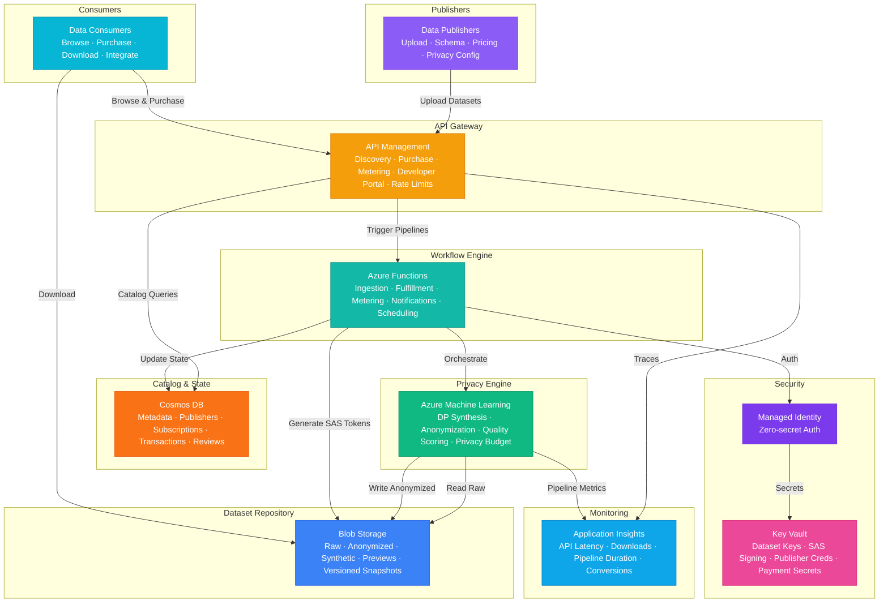

# Architecture — Play 97: AI Data Marketplace — Platform for Publishing, Discovering, and Monetizing Synthetic and Anonymized Datasets with Differential Privacy

## Overview

Enterprise data marketplace platform enabling organizations to publish, discover, and monetize datasets with built-in differential privacy guarantees — creating a trusted exchange for synthetic and anonymized data that preserves analytical utility while protecting individual privacy. Azure Machine Learning powers the privacy-preserving data pipelines — synthetic data generation using differentially private GANs and statistical models, anonymization workflows with configurable epsilon/delta privacy budgets, statistical disclosure control, dataset quality scoring against utility benchmarks, and federated processing that never exposes raw data to consumers. Blob Storage provides the dataset repository — versioned storage for raw ingestion staging, anonymized output, synthetic datasets, preview samples, schema documentation, and full audit trails with lifecycle policies for cost optimization across hot/cool/archive tiers. API Management delivers the marketplace gateway — RESTful APIs for dataset discovery with faceted search, purchase and licensing workflows with usage metering, download token management with time-limited SAS URLs, rate limiting per subscription tier, and a developer portal for data consumers to browse catalog, manage subscriptions, and access documentation. Cosmos DB maintains the marketplace catalog — dataset metadata (schema, lineage, quality scores, privacy parameters), publisher profiles and verification status, consumer subscriptions and entitlements, transaction records, access control policies, usage analytics, and community reviews and ratings. Azure Functions orchestrate marketplace workflows — dataset ingestion triggers that initiate anonymization pipelines, purchase fulfillment generating secure download tokens, usage metering for billing integration, webhook notifications to publishers on sales and reviews, scheduled quality re-scoring, and license expiry enforcement. Designed for enterprise data exchanges, healthcare data sharing (HIPAA-compliant synthetic data), financial services data monetization, research data repositories, government open data portals, and cross-organizational ML training data marketplaces.

## Architecture Diagram

## Data Flow

1. **Dataset Publishing & Ingestion**: Publisher uploads raw dataset via API Management with schema definition, pricing model, and privacy configuration (target epsilon, delta, anonymization method) → Azure Functions trigger ingestion pipeline: validate schema compliance, scan for PII columns, estimate privacy budget requirements → Raw dataset stored in Blob Storage staging container with encryption at rest → Publisher profile and dataset metadata registered in Cosmos DB: schema, column descriptions, sample statistics, data lineage, intended use cases, licensing terms
2. **Privacy-Preserving Transformation**: Azure Machine Learning pipeline processes the raw dataset — differential privacy engine applies configured privacy mechanism: Laplace or Gaussian noise injection for numerical data, exponential mechanism for categorical data, synthetic data generation via DP-GAN for complex distributions → Privacy budget tracking: each transformation consumes epsilon budget, cumulative spend tracked per dataset to prevent privacy degradation from repeated queries → Quality scoring: compare utility metrics (statistical fidelity, ML task accuracy, distribution similarity) between original and anonymized dataset — ensure privacy-utility tradeoff meets publisher's minimum quality threshold → Output anonymized/synthetic dataset written to Blob Storage production container with immutable versioning → Cosmos DB updated with quality scores, privacy parameters used, transformation audit trail
3. **Dataset Discovery & Purchase**: Consumer browses marketplace via API Management developer portal — faceted search by domain, schema type, privacy level, quality score, pricing tier, recency → Dataset detail pages show: schema preview, statistical summary, quality scores, privacy guarantees, sample rows (from pre-generated previews), publisher reputation, community reviews → Purchase flow: consumer selects licensing tier (single-use, subscription, enterprise), API Management validates payment via integration webhook, Azure Functions process fulfillment — generate time-limited SAS download tokens, register entitlement in Cosmos DB, notify publisher via webhook → Usage metering: API Management tracks API calls per consumer subscription, Functions aggregate download volume and query counts for billing
4. **Dataset Access & Integration**: Consumer downloads dataset using SAS token from Blob Storage — supports resumable downloads for large datasets, parallel chunk download for performance → API access for streaming consumption: paginated query API for consumers who need subset access without full download → Integration patterns: direct Blob mount for Azure ML workspaces, ADLS Gen2 integration for Synapse analytics, ADF copy activity for scheduled data refresh → Access control enforcement: Functions validate entitlement before every download, check license expiry, enforce concurrent download limits, log access for audit
5. **Marketplace Operations & Analytics**: Application Insights tracks marketplace health — API latency, dataset download throughput, anonymization pipeline duration, purchase conversion rates, publisher activity, consumer engagement → Cosmos DB analytics: popular datasets, trending categories, publisher leaderboard, revenue analytics, churn indicators → Scheduled maintenance via Functions: re-score dataset quality when new benchmarks are published, enforce license expiry and revoke access, send renewal reminders, clean up expired SAS tokens, archive unused datasets to cool/archive storage tiers

## Service Roles

| Service | Layer | Role |
|---------|-------|------|
| Azure Machine Learning | Privacy | Differential privacy pipelines, synthetic data generation, anonymization, quality scoring, privacy budget tracking |
| Blob Storage | Storage | Dataset repository — raw staging, anonymized output, synthetic datasets, previews, versioned snapshots, audit logs |
| API Management | Gateway | Marketplace APIs — discovery, purchase, metering, developer portal, rate limiting, subscription management |
| Cosmos DB | Catalog | Dataset metadata, publisher profiles, consumer subscriptions, transactions, access policies, reviews, analytics |
| Azure Functions | Workflow | Ingestion orchestration, purchase fulfillment, usage metering, notifications, scheduling, license enforcement |
| Key Vault | Security | Dataset encryption keys, SAS token signing, publisher credentials, payment gateway secrets |
| Application Insights | Monitoring | API latency, download throughput, pipeline duration, conversion rates, engagement metrics |

## Security Architecture

- **Data Privacy by Design**: All datasets undergo differential privacy transformation before marketplace listing; raw data never exposed to consumers; privacy budget (epsilon/delta) tracked and enforced per dataset to prevent cumulative privacy leakage
- **Managed Identity**: All service-to-service auth via managed identity — Functions to ML, Functions to Blob, APIM to Cosmos, zero credentials in code
- **Access Control**: Time-limited SAS tokens for dataset downloads with IP restrictions; entitlement validation on every access; download audit logging for compliance
- **Publisher Verification**: Publishers undergo identity verification and data provenance validation; uploaded datasets scanned for prohibited content, PII leakage, and licensing violations before listing
- **RBAC**: Publishers manage their datasets and view sales analytics; consumers browse catalog and access purchased datasets; marketplace administrators manage listings, resolve disputes, configure privacy policies; auditors access transaction logs and privacy compliance reports
- **Compliance**: GDPR-compliant data processing with right-to-deletion for publisher data; HIPAA-compatible synthetic data generation for healthcare datasets; SOC 2 audit trail for all marketplace transactions; data residency enforcement per regional regulations

## Scaling

| Metric | Dev | Production | Enterprise |
|--------|-----|-----------|------------|
| Listed datasets | 50 | 5,000 | 100,000 |
| Publishers | 5 | 500 | 10,000 |
| Consumers | 10 | 5,000 | 100,000 |
| API calls/day | 1,000 | 500,000 | 10,000,000 |
| Dataset downloads/day | 10 | 1,000 | 50,000 |
| Anonymization pipelines/day | 5 | 100 | 2,000 |
| Total storage | 100GB | 25TB | 120TB |
| Avg dataset size | 500MB | 2GB | 5GB |
