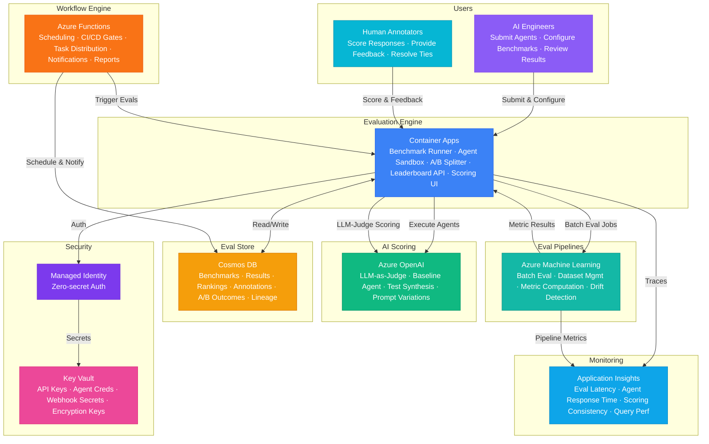

# Architecture — Play 98: Agent Evaluation Platform — Automated Evaluation Suite with Benchmarks, A/B Testing, Human Scoring, and Leaderboard Ranking

## Overview

Comprehensive agent evaluation platform providing automated benchmarks, A/B testing, human-in-the-loop scoring, and leaderboard ranking — enabling teams to objectively measure, compare, and improve AI agent performance across quality, safety, and reliability dimensions. Azure OpenAI powers evaluation inference — LLM-as-judge scoring for groundedness, relevance, coherence, fluency, and safety using configurable rubrics; baseline agent execution for benchmark comparisons; prompt variation generation for systematic A/B testing; automated test case synthesis from evaluation criteria and failure patterns. Container Apps host the evaluation runtime — benchmark execution engine that sandboxes agent runs for isolation, A/B test traffic splitting with statistical significance tracking, leaderboard API serving real-time rankings, human scoring UI backend distributing annotation tasks, evaluation pipeline orchestration managing concurrent runs, and result aggregation workers computing composite scores. Cosmos DB stores all evaluation data — benchmark definitions and versioned test suites, evaluation run results with per-metric breakdowns, agent configurations and version history, leaderboard rankings with historical tracking and trend analysis, human scoring annotations with inter-rater reliability metrics, A/B test configurations and statistical outcomes, and complete evaluation lineage for reproducibility. Azure Machine Learning provides evaluation pipelines — batch orchestration for large-scale benchmark runs, dataset management for test suites, statistical analysis of results, computation of NLP metrics (BLEU, ROUGE, BERTScore), custom domain-specific metrics, and drift detection across evaluation runs to catch performance regressions. Azure Functions handle event-driven workflows — scheduled benchmark runs, CI/CD pipeline evaluation gates (block deployment if scores drop below thresholds), human scoring task distribution, leaderboard recalculation, notification delivery, and evaluation report generation. Designed for AI platform teams, MLOps engineers, prompt engineers, research teams, and any organization that needs systematic evaluation of LLM-powered agents before production deployment.

## Architecture Diagram

## Data Flow

1. **Benchmark Definition & Agent Registration**: AI engineer defines benchmark via evaluation platform UI or API — specifies evaluation dimensions (groundedness, relevance, coherence, fluency, safety, custom metrics), test dataset with ground-truth labels, scoring rubrics for LLM-judge, pass/fail thresholds per metric, and weighting for composite scoring → Agent registration: engineer submits agent configuration (endpoint URL, authentication method, model version, system prompt, tool definitions) with version tag for tracking → Benchmark and agent metadata stored in Cosmos DB with full versioning — enabling reproducible comparisons across agent iterations → Evaluation pipeline template created in Azure Machine Learning referencing the benchmark definition
2. **Automated Benchmark Execution**: Evaluation triggered via schedule (nightly), CI/CD webhook (on PR merge), or manual request → Container Apps benchmark runner creates isolated sandbox for each agent under test — prevents cross-contamination between concurrent evaluations → For each test case in the benchmark dataset: agent receives input, generates response within configurable timeout, response captured with latency and token usage metadata → LLM-as-judge evaluation via Azure OpenAI: each response scored against rubric using structured output (JSON schema enforcing 1-5 scale per metric with justification) — GPT-4o-mini for high-volume metrics (format, length, coherence), GPT-4o for nuanced metrics (groundedness, safety, reasoning) → NLP metrics computed via Azure ML pipeline: BLEU, ROUGE-L, BERTScore for reference-based evaluation; perplexity, diversity, and novelty for open-ended generation → All scores, raw responses, judge explanations, and metadata stored in Cosmos DB with evaluation run ID for complete lineage
3. **A/B Testing & Statistical Analysis**: A/B test configured with two or more agent variants (different models, prompts, tool configurations) and a shared test dataset → Container Apps A/B splitter distributes test cases across variants with configurable allocation (50/50, 80/20 for challenger tests) → Each variant evaluated independently using the same benchmark pipeline → Statistical analysis: paired t-tests for metric comparisons, bootstrap confidence intervals for score distributions, effect size calculation (Cohen's d), and minimum detectable effect estimation → Results include: per-metric comparison with p-values, aggregate winner determination, sample size sufficiency check, and recommendation (ship variant A, extend test, or reject variant B) → A/B outcomes stored in Cosmos DB with statistical artifacts for audit trail
4. **Human Scoring & Annotation**: For evaluations requiring human judgment (nuanced safety assessment, brand voice alignment, subjective quality) → Azure Functions distribute annotation tasks to human scorer pool — round-robin assignment with expertise matching (domain experts for technical content, safety reviewers for content moderation) → Annotators access scoring UI via Container Apps — see agent response, evaluation context, scoring rubric, and input interface for ratings and free-text feedback → Inter-rater reliability computed: Cohen's kappa for categorical judgments, ICC for continuous scores, Krippendorff's alpha for mixed annotation types → Disagreements routed to senior reviewer for adjudication → Human scores merged with automated scores using configurable weighting (e.g., 70% automated + 30% human for safety-critical evaluations) → Annotation data stored in Cosmos DB with annotator metadata for bias detection and calibration
5. **Leaderboard & Reporting**: Cosmos DB leaderboard collection maintains real-time rankings — composite scores computed from weighted metric averages, ranked by overall score with breakdown by dimension → Leaderboard API served by Container Apps — filterable by benchmark, date range, agent category, model family; supports historical trend views showing performance trajectory over time → Azure Functions generate evaluation reports: executive summary (top agents, biggest improvements, regressions detected), detailed per-agent scorecards, metric trend charts, and CI/CD gate decisions → Notifications: Slack/Teams messages on evaluation completion, email alerts on score regressions exceeding threshold, CI/CD pipeline status updates → Drift detection via Azure ML: compare current evaluation distributions against historical baselines, alert when metrics shift beyond statistical control limits

## Service Roles

| Service | Layer | Role |
|---------|-------|------|
| Azure OpenAI | Scoring | LLM-as-judge evaluation, baseline agent execution, test case synthesis, prompt variation generation |
| Container Apps | Runtime | Benchmark execution engine, agent sandboxing, A/B traffic splitting, leaderboard API, human scoring UI |
| Cosmos DB | Store | Benchmarks, evaluation results, rankings, annotations, A/B outcomes, agent versions, evaluation lineage |
| Azure Machine Learning | Pipelines | Batch evaluation orchestration, NLP metric computation, statistical analysis, drift detection |
| Azure Functions | Workflow | Scheduled triggers, CI/CD gates, annotation distribution, leaderboard recalculation, notifications, reports |
| Key Vault | Security | API keys, agent credentials, webhook secrets, dataset encryption keys |
| Application Insights | Monitoring | Evaluation latency, agent response times, scoring consistency, leaderboard query performance |

## Security Architecture

- **Agent Isolation**: Each agent under test executes in an isolated Container Apps sandbox — no shared state, network isolation, resource limits enforced; prevents malicious or buggy agents from affecting platform stability or other evaluations
- **Managed Identity**: All service-to-service auth via managed identity — Container Apps to OpenAI, Functions to Cosmos DB, ML to Blob Storage; zero credentials in application code
- **Evaluation Integrity**: Benchmark test cases encrypted at rest; evaluation results immutable once written (append-only Cosmos DB change feed); judge model prompts version-controlled to prevent tampering; audit trail for all evaluation configuration changes
- **RBAC**: AI engineers submit agents and view their own results; evaluation administrators manage benchmarks and configure scoring rubrics; human annotators access only assigned scoring tasks; platform operators manage infrastructure and monitor system health; auditors access evaluation lineage and compliance reports
- **Data Protection**: Evaluation datasets may contain sensitive test cases — encrypted at rest, access-controlled per benchmark; PII in agent responses detected and masked before logging; evaluation results retained per configurable policy with automatic purge

## Scaling

| Metric | Dev | Production | Enterprise |
|--------|-----|-----------|------------|
| Agents under evaluation | 5 | 50 | 500 |
| Benchmark test cases | 100 | 5,000 | 100,000 |
| Evaluation runs/day | 5 | 50 | 500 |
| A/B tests active | 1 | 10 | 100 |
| Human annotations/day | 20 | 500 | 10,000 |
| LLM-judge calls/day | 500 | 50,000 | 1,000,000 |
| Leaderboard queries/day | 100 | 10,000 | 200,000 |
| Concurrent evaluations | 1 | 5 | 50 |
