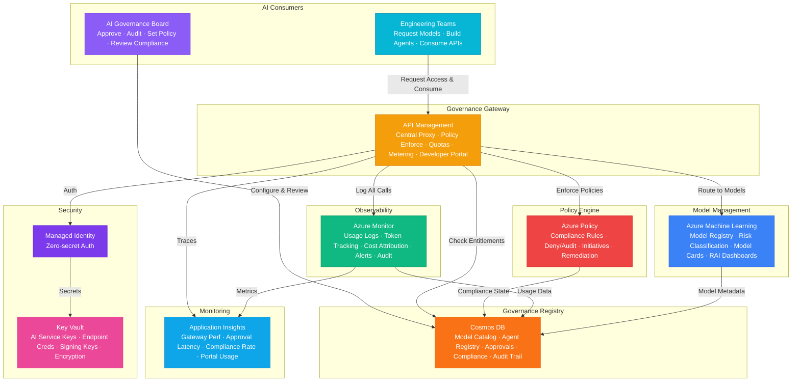

# Play 99 — Enterprise AI Governance Hub 🏛️

> Centralized AI governance — system registry, EU AI Act risk classification, model lifecycle management, policy enforcement gates, compliance dashboard.

Build an enterprise AI governance hub. Centralized registry tracks every AI system with risk level, owner, and compliance status. EU AI Act 4-tier risk classification (unacceptable→high→limited→minimal) auto-assigns regulatory requirements. Policy enforcement gates block non-compliant deployments. Scheduled reviews keep compliance current.

## Quick Start
```bash
cd solution-plays/99-enterprise-ai-governance-hub
az deployment group create -g $RG -f infra/main.bicep -p infra/parameters.json
code .
# Use @builder to implement, @reviewer to audit, @tuner to optimize
```

## Architecture



📐 [Full architecture details](architecture.md)

| Service | Purpose |
|---------|---------|
| Azure OpenAI (gpt-4o) | Risk classification + compliance reporting |
| Cosmos DB (Serverless) | AI system registry, assessments, policies, audit log |
| Azure AD / Entra ID | RBAC (governance admin, assessor, viewer) |
| Azure Functions | Policy enforcement gates + review scheduling |
| Container Apps | Governance dashboard API |

## Pre-Tuned Defaults
- Risk: EU AI Act 4-tier · rules-first + LLM fallback · population boost for vulnerable/children
- Reviews: High=quarterly (full) · Limited=annual (standard) · Minimal=biannual (light)
- Policies: Registration gate · high-risk oversight plan · 90-day deprecation · 72h incident reporting
- Regulations: EU AI Act + GDPR + NIST AI RMF (ISO 42001 optional)

## DevKit (AI-Assisted Development)
| Primitive | What It Does |
|-----------|-------------|
| `agent.md` | Root orchestrator with builder→reviewer→tuner handoffs |
| `copilot-instructions.md` | Governance domain (EU AI Act, risk classification, lifecycle, policies) |
| 3 agents | Builder (gpt-4o), Reviewer (gpt-4o-mini), Tuner (gpt-4o-mini) |
| 3 skills | Deploy (230+ lines), Evaluate (105+ lines), Tune (235+ lines) |
| 4 prompts | `/deploy`, `/test`, `/review`, `/evaluate` with agent routing |

## Cost Estimate
| Service | Dev/mo | Prod/mo | Enterprise/mo |
|---------|--------|---------|---------------|
| Azure API Management | $5 (Consumption) | $700 (Standard) | $2,800 (Premium) |
| Azure Policy | $0 (Free) | $0 (Free) | $0 (Free) |
| Azure Monitor | $5 (Free tier) | $200 (Pay-per-GB) | $600 (Pay-per-GB + Commitment) |
| Azure Cosmos DB | $5 (Serverless) | $280 (5000 RU/s) | $750 (15000 RU/s) |
| Azure Machine Learning | $0 (Basic) | $350 (Standard) | $1,000 (Standard HA) |
| Key Vault | $1 (Standard) | $10 (Standard) | $40 (Premium HSM) |
| Application Insights | $0 (Free) | $50 (Pay-per-GB) | $160 (Pay-per-GB) |
| **Total** | **$16** | **$1,590** | **$5,350** |

💰 [Full cost breakdown](cost.json)

## vs. Play 35 (Compliance Expert)
| Aspect | Play 35 | Play 99 |
|--------|---------|---------|
| Focus | GDPR/HIPAA compliance checking | Organization-wide AI governance |
| Scope | Per-system compliance | Central registry + all regulations |
| Output | Compliance report | Dashboard + policy enforcement gates |
| Regulation | Single (GDPR/HIPAA/SOC2) | Multi (EU AI Act + GDPR + NIST + ISO) |

📖 [Full documentation](spec/README.md) · 🌐 [frootai.dev/solution-plays/99-enterprise-ai-governance-hub](https://frootai.dev/solution-plays/99-enterprise-ai-governance-hub) · 📦 [FAI Protocol](spec/fai-manifest.json)
