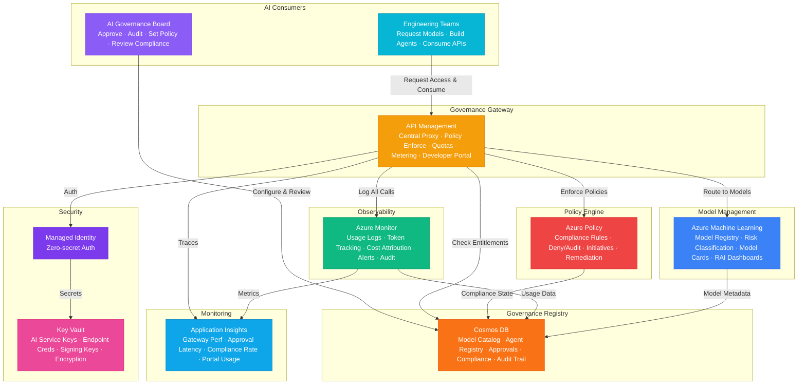

# Architecture — Play 99: Enterprise AI Governance Hub — Central Control Plane for AI Models, Agents, and APIs with Approval Gates, Policy Enforcement, and Compliance Tracking

## Overview

Enterprise-grade AI governance hub providing a centralized control plane for managing all AI models, agents, and APIs across an organization — with approval workflows, policy enforcement, compliance tracking, and cost attribution aligned to regulatory frameworks including EU AI Act, NIST AI RMF, and ISO 42001. Azure API Management serves as the governance gateway — centralized proxy intercepting all AI model and agent API calls across the enterprise, enforcing rate limits, content filtering policies, and usage quotas per team/project; managing approval gate workflows for new model deployments and version upgrades; API versioning with graceful deprecation management; a developer portal for AI consumers to discover approved models, understand usage policies, and manage their allocations; real-time usage analytics with chargeback metering enabling FinOps visibility. Azure Policy provides compliance enforcement — built-in and custom policy definitions ensuring AI resource configurations meet organizational standards; deny/audit/modify effects preventing non-compliant deployments from reaching production; initiative assignments mapping to regulatory frameworks; continuous compliance state tracking with remediation automation. Azure Monitor delivers AI observability — centralized logging for all AI model invocations with correlation across services, token usage tracking per model/team/project for cost attribution, latency and error rate monitoring, compliance audit log aggregation, and alert rules for policy violations and anomalous usage patterns. Cosmos DB maintains the governance registry — AI model catalog with versions, capabilities, risk classifications, and owners; agent registry with deployment status and health; approval workflow state machines; compliance assessment records; policy violation history; team entitlements and quota allocations; and immutable audit trail. Azure Machine Learning provides model management — centralized model registry with risk classification (high/medium/low per EU AI Act), model card generation, evaluation pipeline integration for pre-deployment quality gates, responsible AI dashboards tracking fairness, interpretability, and error analysis. Key Vault centralizes secret management — all AI service API keys managed through governance-controlled Key Vault with RBAC, ensuring no team directly holds production AI credentials. Designed for enterprise AI platform teams, CISOs, compliance officers, AI ethics boards, and CTOs who need visibility and control over organization-wide AI adoption.

## Architecture Diagram

## Data Flow

1. **Model & Agent Registration with Risk Classification**: AI team submits new model or agent for governance approval via developer portal — includes model card (capabilities, limitations, training data provenance, intended use cases), technical specification (API contract, authentication method, SLA requirements), risk assessment questionnaire → Cosmos DB registers the submission with pending status and assigns risk tier based on classification rules: High Risk (autonomous decision-making, regulated domains like healthcare/finance, PII processing), Limited Risk (content generation, recommendation systems), Minimal Risk (embeddings, text classification, translation) → Azure Machine Learning validates model card completeness, runs automated responsible AI checks (fairness across demographics, interpretability scores, error analysis across slices), generates evaluation report → Risk tier determines approval workflow: Minimal Risk = auto-approve with audit log, Limited Risk = team lead approval, High Risk = governance board review with mandatory responsible AI dashboard review
2. **Approval Gate Workflows**: Approval request routes to designated approvers based on risk tier — Cosmos DB state machine tracks workflow progression: Submitted → Under Review → Approved/Rejected/Requires Changes → Deployed → Monitored → Deprecated → Retired → Notification system alerts approvers via Teams/email with approval dashboard link → Approvers review: model card, responsible AI report, evaluation scores against benchmarks, cost projections, compliance mapping (which regulations apply, which controls satisfied), security review (data handling, access patterns, threat model) → Approval decisions recorded immutably in Cosmos DB with approver identity, timestamp, rationale, and any conditions (e.g., "approved for internal use only" or "approved with monthly bias review required") → On approval: Azure Policy updated to allow the model/agent resource configuration, API Management registers the new endpoint with appropriate policies (rate limits, content filtering, usage quotas), Key Vault provisions access credentials with RBAC scoped to the requesting team
3. **Policy Enforcement & Compliance Monitoring**: Azure Policy continuously evaluates AI resource configurations — custom policy definitions enforce governance rules: all AI deployments must use managed identity (deny if service key auth detected), content safety filters must be enabled on all GPT endpoints (audit and alert), model deployments must reference an approved model version in the governance registry (deny unapproved), AI resources must have cost center and owner tags (deny if missing) → Compliance state flows to Cosmos DB via change feed — real-time compliance dashboard shows: percentage of compliant resources, non-compliant resources with remediation steps, policy violation trends, regulatory mapping coverage → Automated remediation for correctable violations: Azure Policy modify effects add missing tags, enable diagnostic logging, configure network restrictions → Non-auto-remediable violations generate tickets for responsible teams with SLA for resolution
4. **Usage Monitoring, Cost Attribution & Chargeback**: API Management logs every AI API call — request metadata (team, project, model, operation), token counts (input + output), latency, status code, content safety filter actions → Azure Monitor aggregates usage data with 1-minute granularity — per-team token consumption, per-model cost attribution using Azure pricing data, per-project budget tracking against allocated quotas → Cost dashboards: real-time spend by team/project/model, forecast based on trailing 7-day average, budget utilization percentage with alerts at 50/80/100%, model-level unit economics (cost per request, cost per 1K tokens) → Chargeback reports generated monthly — each team's AI consumption valued at internal transfer pricing, exported to finance systems → Anomaly detection: sudden usage spikes, unusual model access patterns, after-hours usage of high-risk models → Alerts trigger investigation workflow in Cosmos DB
5. **Compliance Reporting & Regulatory Audit**: Scheduled reporting pipeline aggregates governance data from all sources — model inventory with risk classifications and approval status, agent inventory with deployment topology and health status, usage statistics per regulatory domain, policy compliance rates with trend analysis, incident history (policy violations, security events, model performance degradations) → Regulatory framework mapping: EU AI Act (high-risk AI system register, conformity assessments, transparency obligations), NIST AI RMF (govern, map, measure, manage categories), ISO 42001 (AI management system controls) → Reports exportable in auditor-friendly formats (PDF with executive summary, CSV for detailed data, JSON for automated compliance tools) → Immutable audit trail in Cosmos DB with cryptographic verification — every governance action (approval, policy change, access grant, configuration modification) recorded with who/what/when/why for regulatory defensibility

## Service Roles

| Service | Layer | Role |
|---------|-------|------|
| API Management | Gateway | Centralized AI proxy, policy enforcement, quotas, metering, developer portal, approval gate integration |
| Azure Policy | Compliance | Configuration compliance rules, deny/audit/modify effects, regulatory initiatives, remediation automation |
| Azure Monitor | Observability | Usage logging, token tracking, cost attribution, anomaly detection, compliance audit aggregation |
| Cosmos DB | Registry | Model catalog, agent registry, approval workflows, compliance records, entitlements, immutable audit trail |
| Azure Machine Learning | Models | Model registry, risk classification, model cards, responsible AI dashboards, evaluation gates |
| Key Vault | Security | Centralized AI key management, endpoint credentials, governance signing keys, audit log encryption |
| Application Insights | Monitoring | Gateway performance, approval workflow latency, compliance rates, portal engagement |

## Security Architecture

- **Zero-Trust AI Access**: No team directly holds production AI credentials — all access mediated through API Management with identity-based authentication; Key Vault RBAC ensures only governance-approved teams access specific model endpoints
- **Managed Identity**: All service-to-service auth via managed identity — API Management to AI endpoints, Monitor to Cosmos DB, Policy to resource providers; zero credentials in application code
- **Immutable Audit Trail**: All governance actions recorded in Cosmos DB with append-only change feed — approvals, policy changes, access grants, configuration modifications; cryptographically verifiable for regulatory audit; retention configurable per compliance requirement (7 years for financial regulations)
- **Separation of Duties**: Governance board members cannot self-approve their own model submissions; policy authors cannot bypass policy enforcement; compliance reporters have read-only access to governance data; platform operators manage infrastructure but cannot modify governance rules
- **RBAC**: AI consumers request and use approved models; team leads approve limited-risk submissions; governance board reviews high-risk submissions; compliance officers access audit reports; CTO/CISO view enterprise dashboards; platform operators manage infrastructure
- **Data Sovereignty**: Governance hub enforces data residency — models processing EU citizen data must deploy to EU regions; API Management routes requests to region-appropriate endpoints; Monitor logs stored in compliant regions

## Scaling

| Metric | Dev | Production | Enterprise |
|--------|-----|-----------|------------|
| Registered AI models | 10 | 100 | 1,000 |
| Registered agents | 5 | 50 | 500 |
| Teams consuming AI | 3 | 30 | 300 |
| API calls/day (via gateway) | 5,000 | 500,000 | 50,000,000 |
| Approval workflows/month | 5 | 50 | 500 |
| Policy evaluations/day | 100 | 10,000 | 1,000,000 |
| Compliance reports/month | 1 | 4 | 30 |
| Audit trail entries/day | 100 | 10,000 | 500,000 |
