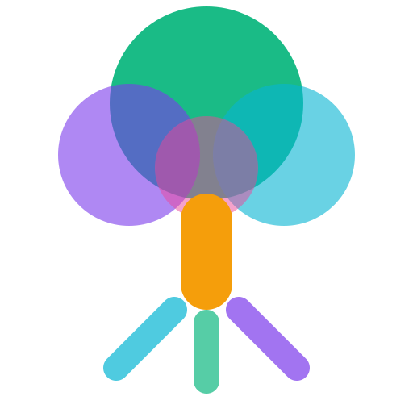
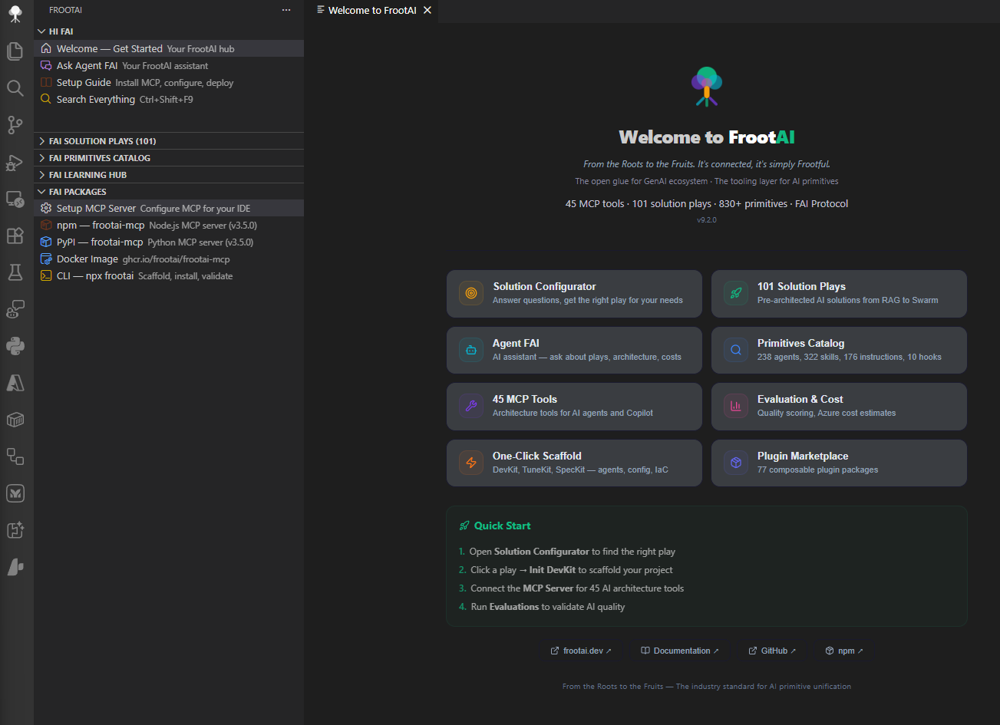
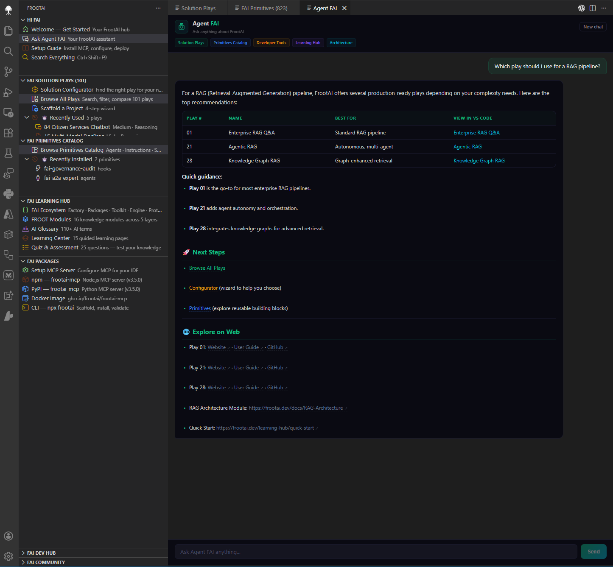
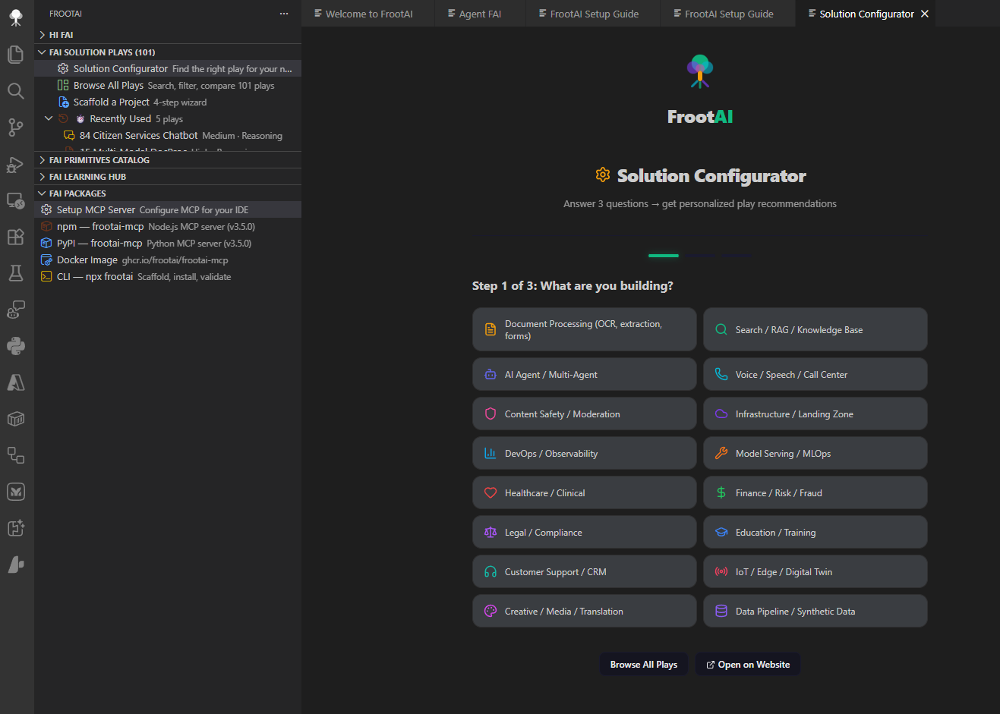
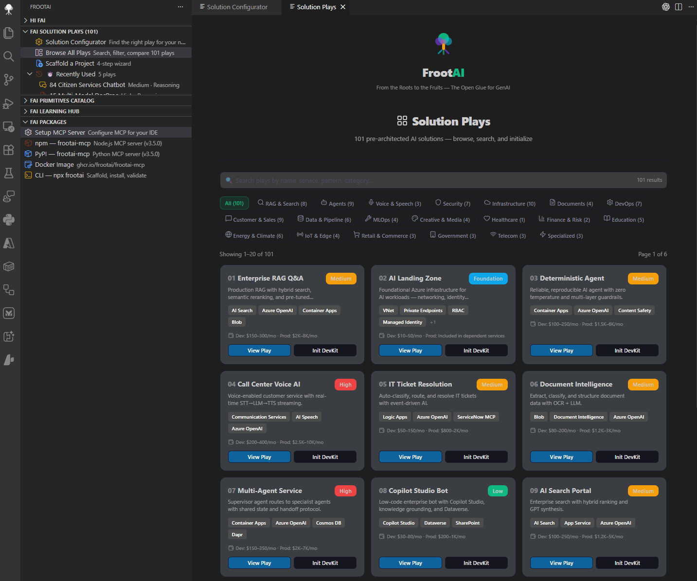
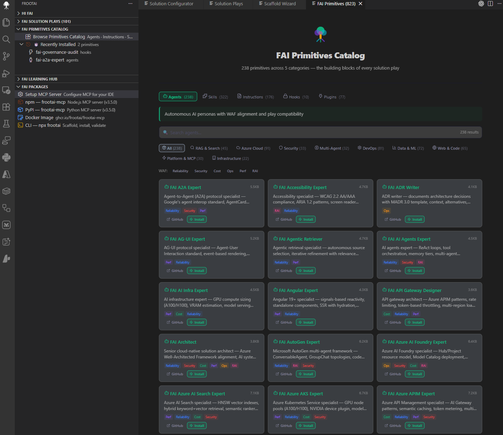
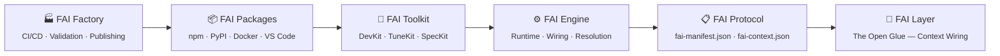

<p align="center">
  
</p>

<h1 align="center">FrootAI — VS Code Extension</h1>

<p align="center">
  <strong>From the Roots to the Fruits. It's connected, it's simply Frootful.</strong><br>
  <em>The Open Glue for GenAI Ecosystem</em>
</p>

<p align="center">
  <a href="https://marketplace.visualstudio.com/items?itemName=frootai.frootai-vscode"></a>
  <a href="https://marketplace.visualstudio.com/items?itemName=frootai.frootai-vscode"></a>
  <a href="https://marketplace.visualstudio.com/items?itemName=frootai.frootai-vscode"></a>
  <a href="https://github.com/frootai/frootai/blob/main/LICENSE"></a>
</p>

<p align="center">
  <strong>101 Solution Plays</strong> · <strong>830+ Primitives</strong> · <strong>45 MCP Tools</strong> · <strong>16 Knowledge Modules</strong> · <strong>200+ Glossary Terms</strong>
</p>

---

## 🖼️ Screenshots

<p align="center">
  <br>
  <em>Welcome — Your FrootAI hub with quick-start actions and ecosystem links</em>
</p>

<br>

<p align="center">
  <br>
  <em>Agent FAI — Streaming AI assistant with full ecosystem knowledge</em>
</p>

<br>

<p align="center">
  <br>
  <em>Solution Configurator — 5-question wizard to find the right play for your scenario</em>
</p>

<br>

<p align="center">
  <br>
  <em>Solution Play Browser — Browse, search, and explore 101 deployable AI architectures</em>
</p>

<br>

<p align="center">
  <br>
  <em>Primitives Catalog — 830+ agents, instructions, skills, hooks, and plugins</em>
</p>

---

## 📦 What's Inside

The extension adds a **FrootAI** icon to your activity bar with **7 sidebar sections**:

| Section | What You Get |
|---------|-------------|
| **Hi FAI** | Welcome hub, Agent FAI chat, Setup Guide, Global Search (`Ctrl+Shift+F9`) |
| **FAI Solution Plays** | Configurator wizard, browse 101 plays, scaffold projects, recently used |
| **FAI Primitives Catalog** | 238 agents · 176 instructions · 322 skills · 10 hooks · 77 plugins |
| **FAI Learning Hub** | FAI Ecosystem explorer, 16 FROOT modules, AI Glossary, Learning Center, Quizzes |
| **FAI Packages** | MCP server setup, npm/PyPI/Docker distribution, CLI tools |
| **FAI Dev Hub** | Admin guide, user guide, API reference, changelog, architecture docs |
| **FAI Community** | Community showcase, contribution guide, GitHub links |

> **Works standalone** — no need to clone the FrootAI repo. Install the extension and go.

---

## 🏠 Welcome & Agent FAI

<p align="center">
  
</p>

The **Welcome** panel is your starting point — quick-start actions, feature overview, and ecosystem links all in one place. Open it anytime with `Ctrl+Shift+F11`.

<p align="center">
  
</p>

**Agent FAI** is your AI-powered assistant that knows the entire FrootAI ecosystem. Ask about solution plays, architecture patterns, Azure best practices, primitives — anything. Responses stream in real-time with full context awareness.

---

## 🎯 Solution Plays

<p align="center">
  
</p>

The **Solution Configurator** walks you through 5 questions to recommend the best play for your scenario — industry, complexity, team size, and more.

<p align="center">
  
</p>

**Browse All Plays** gives you a searchable, filterable catalog of all 101 solution plays. Click any play for a rich detail panel with WAF checklist, Azure services grid, tuning parameters, and cost breakdown.

Each play ships as a **4-kit structure**:

```
solution-play/
├── .github/           DevKit — agents, instructions, skills, hooks, prompts
├── config/            TuneKit — AI parameters, guardrails, model routing
├── evaluation/        eval.py + test sets + quality scoring
├── infra/             Bicep IaC (Azure plays) or Docker Compose
└── spec/              SpecKit — architecture spec + WAF alignment
```

**Play actions** — Init DevKit · Init TuneKit · Init SpecKit · Estimate Cost · Run Evaluation · User Guide

---

## 🧩 Primitives Catalog

<p align="center">
  
</p>

Browse **830+ reusable AI primitives** across 5 tabs with search, WAF pillar filters, and domain filters:

| Primitive | Count | What They Do |
|-----------|:-----:|-------------|
| **Agents** | 238 | Specialized `.agent.md` files — RAG, security, DevOps, per-play builder/reviewer/tuner |
| **Instructions** | 176 | Coding standards, WAF guidelines, domain patterns (`.instructions.md`) |
| **Skills** | 322 | Actionable recipes — deploy, evaluate, tune, scaffold (`SKILL.md`) |
| **Hooks** | 10 | Policy gates — secrets scanning, guardrails, session validation |
| **Plugins** | 77 | Themed bundles of agents + instructions + skills + hooks |

One-click install for any primitive — agents use the `vscode://github.copilot-chat/createAgent` protocol.

---

## 📚 Learning Hub

Explore the **FROOT Framework** — 16 knowledge modules across 5 layers:

| Layer | Modules |
|:-----:|---------|
| **F**oundations | GenAI Foundations · LLMs · Glossary · Agentic OS |
| **R**easoning | Prompts · RAG · Deterministic AI |
| **O**rchestration | Semantic Kernel · Agents · MCP & Tools |
| **O**perations | Azure AI · GPU Infrastructure · Copilot Ecosystem |
| **T**ransformation | Fine-Tuning · Responsible AI · Production Patterns |

Also includes:
- **FAI Ecosystem** — 6-tab explorer: Factory · Packages · Toolkit · Engine · Protocol · Layer
- **AI Glossary** — 200+ terms with definitions and context
- **Learning Center** — 15 guided learning pages on frootai.dev
- **Quiz & Assessment** — 25 questions to test your knowledge

---

## 📡 Packages & Distribution

Set up the FAI ecosystem in your preferred format:

| Channel | Package | Install |
|---------|---------|---------|
| **npm** | `frootai-mcp` v3.5.0 | `npx frootai-mcp@latest` |
| **PyPI** | `frootai-mcp` v3.5.0 | `uvx frootai-mcp` |
| **Docker** | `ghcr.io/frootai/frootai-mcp` | `docker pull ghcr.io/frootai/frootai-mcp` |
| **CLI** | `frootai` | `npx frootai` |
| **VS Code** | This extension | `code --install-extension frootai.frootai-vscode` |
| **Website** | frootai.dev | [frootai.dev](https://frootai.dev) |

All channels ship the same 101 plays, 830+ primitives, and 45 MCP tools.

---

## 🚀 Installation

**Option 1 — VS Code Marketplace** (recommended):

```
Ctrl+Shift+X → Search "FrootAI" → Install
```

**Option 2 — Terminal:**

```bash
code --install-extension frootai.frootai-vscode
```

---

## ⚡ Quick Start

```
1. Install   →  Ctrl+Shift+X → "FrootAI" → Install
2. Setup MCP →  Sidebar → FAI Packages → Setup MCP Server
3. Build     →  Sidebar → Solution Configurator → pick a play → Scaffold
```

That's it — you're ready to build AI solutions with FrootAI.

---

## ⌨️ Keyboard Shortcuts

| Shortcut | Action |
|----------|--------|
| `Ctrl+Shift+F9` | Search Everything — plays, tools, glossary, modules |
| `Ctrl+Shift+F10` | Browse All Plays — filterable catalog |
| `Ctrl+Shift+F11` | Welcome — feature overview and quick start |

---

<details>
<summary><strong>🎛️ Commands</strong> (<code>Ctrl+Shift+P</code>) — click to expand</summary>
<br>

| Command | Description |
|---------|-------------|
| `FrootAI: Search Everything` | Global search across plays, tools, glossary, modules |
| `FrootAI: Browse All Plays` | Full catalog with categories, search, pagination |
| `FrootAI: Solution Configurator` | 5-question wizard → personalized recommendation |
| `FrootAI: Welcome` | Feature overview, quick start, ecosystem links |
| `FrootAI: Agent FAI` | Streaming AI chat — ask anything about FrootAI |
| `FrootAI: Plugin Marketplace` | Browse 77 FAI plugins with search and filters |
| `FrootAI: FAI Ecosystem` | Interactive 6-tab ecosystem explorer |
| `FrootAI: Open Primitives Catalog` | 830+ primitives across 5 tabs with filters |
| `FrootAI: Open Evaluation` | 3-mode dashboard: guide, demo, real workspace data |
| `FrootAI: Open Scaffold Wizard` | 4-step wizard to bootstrap a play |
| `FrootAI: Initialize DevKit` | .github Agentic OS files |
| `FrootAI: Initialize TuneKit` | AI config + evaluation files |
| `FrootAI: Initialize SpecKit` | Architecture spec + WAF alignment |
| `FrootAI: Initialize Hooks` | guardrails.json |
| `FrootAI: Initialize Prompts` | Slash commands |
| `FrootAI: Install Agent` | Install FAI agent via QuickPick |
| `FrootAI: Install Instruction` | Install FAI instruction via QuickPick |
| `FrootAI: Setup MCP Server` | npm / pip / Docker / .vscode config |
| `FrootAI: Quick Cost Estimate` | Azure cost breakdown by tier |
| `FrootAI: Run Evaluation` | Auto-run eval.py + quality dashboard |
| `FrootAI: Auto-Chain Agents` | Build → Review → Tune workflow |
| `FrootAI: Validate Config` | Check config/*.json |
| `FrootAI: Validate Manifest` | Schema-validate fai-manifest.json with diagnostics |
| `FrootAI: Open Play from Manifest` | Detect play ID → open detail |
| `FrootAI: Look Up AI Term` | AI glossary search |
| `FrootAI: Search Knowledge Base` | Full-text search across modules |
| `FrootAI: Architecture Patterns` | Decision guides |

</details>

---

## 🔬 FAI Ecosystem Architecture



---

## 🔌 Distribution Channels

| Channel | Package | Version |
|---------|---------|---------|
| **VS Code** | `frootai.frootai-vscode` | v9.3.0 |
| **npm** | `frootai-mcp` | v3.5.0 |
| **PyPI** | `frootai-mcp` | v3.5.0 |
| **Docker** | `ghcr.io/frootai/frootai-mcp` | v3.5.0 |
| **CLI** | `npx frootai` | v5.4.0 |
| **Website** | [frootai.dev](https://frootai.dev) | — |

---

## 🔗 Links

| | |
|---|---|
| 🌐 **Website** | [frootai.dev](https://frootai.dev) |
| 📦 **npm** | [npmjs.com/package/frootai-mcp](https://www.npmjs.com/package/frootai-mcp) |
| 🐍 **PyPI** | [pypi.org/project/frootai-mcp](https://pypi.org/project/frootai-mcp/) |
| 🐳 **Docker** | [ghcr.io/frootai/frootai-mcp](https://github.com/frootai/frootai/pkgs/container/frootai-mcp) |
| 💻 **GitHub** | [github.com/frootai/frootai](https://github.com/frootai/frootai) |
| 🤝 **Community** | [frootai.dev/community](https://frootai.dev/community) |
| 📖 **Contribute** | [frootai.dev/contribute](https://frootai.dev/contribute) |
| 📚 **Learning Hub** | [frootai.dev/learning-hub](https://frootai.dev/learning-hub) |

---

<p align="center">
  <br>
  <strong>From the Roots to the Fruits.</strong><br>
  <em>It's connected, it's simply Frootful.</em><br><br>
  <sub>MIT License · © 2026 FrootAI</sub>
</p>

    A --> B --> C --> D --> E --> F
```

The FAI ecosystem is a **6-layer stack**: Factory builds and validates → Packages distribute across channels → Toolkit equips developers (DevKit + TuneKit + SpecKit) → Engine wires primitives at runtime → Protocol defines the manifest schema → Layer is the conceptual glue that connects everything.

---

## 🗂️ Solution Plays at a Glance

<details>
<summary><strong>First 23 Plays</strong> — click to expand (101 total)</summary>
<br>

| # | Play | What It Deploys |
|:-:|------|----------------|
| 01 | Enterprise RAG Q&A | AI Search + OpenAI + Container App |
| 02 | AI Landing Zone | VNet + Private Endpoints + RBAC + GPU |
| 03 | Deterministic Agent | Reliable agent with guardrails + eval |
| 04 | Call Center Voice AI | Real-time speech + sentiment |
| 05 | IT Ticket Resolution | Auto-triage + KB resolution |
| 06 | Document Intelligence | PDF/image extraction pipeline |
| 07 | Multi-Agent Service | Orchestrated agent collaboration |
| 08 | Copilot Studio Bot | Low-code conversational AI |
| 09 | AI Search Portal | Enterprise search with facets |
| 10 | Content Moderation | Safety filters + classification |
| 11 | Landing Zone Advanced | Multi-region + DR + compliance |
| 12 | Model Serving AKS | GPU clusters + model endpoints |
| 13 | Fine-Tuning Workflow | Data prep → train → eval → deploy |
| 14 | Cost-Optimized Gateway | Smart routing + token budgets |
| 15 | Multi-Modal DocProc | Images + tables + handwriting |
| 16 | Copilot Teams Extension | Teams bot with AI backend |
| 17 | AI Observability | Tracing + metrics + alerting |
| 18 | Prompt Management | Versioning + A/B testing |
| 19 | Edge AI Phi-4 | On-device inference, no cloud |
| 20 | Anomaly Detection | Time-series + pattern recognition |
| 21 | Agentic RAG | Autonomous retrieval + self-evaluation |
| 22 | Multi-Agent Swarm | Supervisor, pipeline, debate patterns |
| 23 | Browser Automation | Vision + Playwright web navigation |

Browse all 101 plays in the extension sidebar or at [frootai.dev/solution-plays](https://frootai.dev/solution-plays).

</details>

---

## 🌐 Distribution Channels

| Channel | Package | Version | Link |
|---------|---------|:-------:|------|
| **VS Code** | `frootai.frootai-vscode` | 9.3.0 | [Marketplace](https://marketplace.visualstudio.com/items?itemName=frootai.frootai-vscode) |
| **npm** | `frootai-mcp` | 3.5.0 | [npmjs.com](https://www.npmjs.com/package/frootai-mcp) |
| **PyPI** | `frootai-mcp` | 3.5.0 | [pypi.org](https://pypi.org/project/frootai-mcp/) |
| **Docker** | `ghcr.io/frootai/frootai-mcp` | 3.5.0 | [GitHub Packages](https://github.com/frootai/frootai/pkgs/container/frootai-mcp) |
| **CLI** | `frootai` | latest | `npx frootai` |
| **Website** | frootai.dev | — | [frootai.dev](https://frootai.dev) |

---

## 🔗 Links

| Resource | URL |
|----------|-----|
| **Website** | [frootai.dev](https://frootai.dev) |
| **GitHub** | [github.com/frootai/frootai](https://github.com/frootai/frootai) |
| **Solution Plays** | [frootai.dev/solution-plays](https://frootai.dev/solution-plays) |
| **Primitives** | [frootai.dev/primitives](https://frootai.dev/primitives) |
| **MCP Server** | [frootai.dev/mcp-tooling](https://frootai.dev/mcp-tooling) |
| **Setup Guide** | [frootai.dev/setup-guide](https://frootai.dev/setup-guide) |
| **Python SDK** | [frootai.dev/python](https://frootai.dev/python) |
| **CLI** | [frootai.dev/cli](https://frootai.dev/cli) |
| **Community** | [frootai.dev/community](https://frootai.dev/community) |
| **npm** | [npmjs.com/package/frootai-mcp](https://www.npmjs.com/package/frootai-mcp) |
| **PyPI** | [pypi.org/project/frootai-mcp](https://pypi.org/project/frootai-mcp/) |
| **Contact** | [info@frootai.dev](mailto:info@frootai.dev) |

---

<p align="center">
  
</p>

<p align="center">
  <strong>From the Roots to the Fruits. It's connected, it's simply Frootful.</strong><br>
  <sub>The Open Glue for GenAI Ecosystem</sub>
</p>

<p align="center">
  <sub>© 2026 FrootAI — MIT License</sub>
</p>